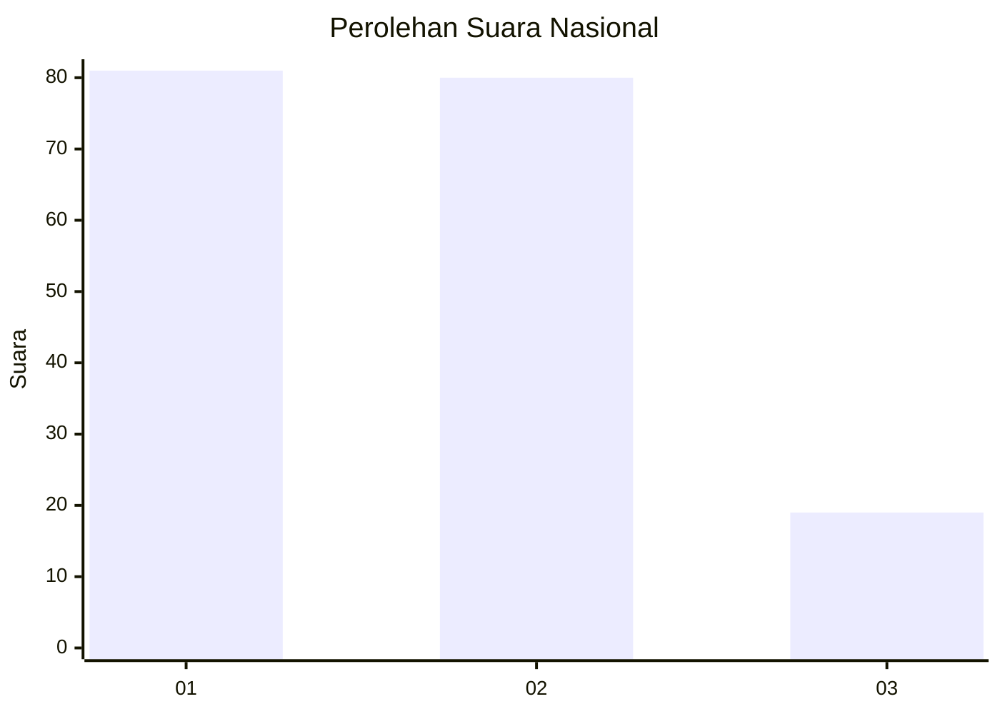
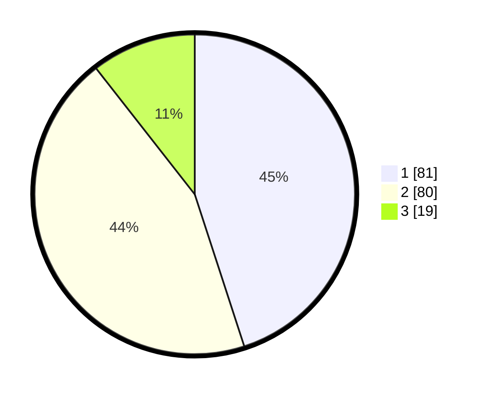

# Hasil

## Grafik

## Tabel

| No.    | Nama Paslon    | Suara | Suara (raw) | Persentase |
|:------ |:-------------- | -----:| -----------:| ----------:|
| 100025 | ANIES MUHAIMIN | 81    | [81][p-1]   | 45,00      |
| 100026 | PRABOWO GIBRAN | 80    | [80][p-2]   | 44,44      |
| 100027 | GANJAR MAHFUD  | 19    | [19][p-3]   | 10,56      |

[p-1]: https://github.com/gigit-pemilu/pemilu-2024/blob/main/pilpres/hitung-suara/sub/31-dki-jakarta/sub/74-jakarta-selatan/sub/10-pesanggrahan/sub/1003-petukangan-utara/sub/066-tps/sub/paslon-1.txt
[p-2]: https://github.com/gigit-pemilu/pemilu-2024/blob/main/pilpres/hitung-suara/sub/31-dki-jakarta/sub/74-jakarta-selatan/sub/10-pesanggrahan/sub/1003-petukangan-utara/sub/066-tps/sub/paslon-2.txt
[p-3]: https://github.com/gigit-pemilu/pemilu-2024/blob/main/pilpres/hitung-suara/sub/31-dki-jakarta/sub/74-jakarta-selatan/sub/10-pesanggrahan/sub/1003-petukangan-utara/sub/066-tps/sub/paslon-3.txt

## Foto C Plano

https://sirekap-obj-formc.kpu.go.id/2b09/pemilu/ppwp/31/74/10/10/03/3174101003066-20240214-213944--05521a1b-875f-49eb-bd5e-176c6bbc36cf.jpg

https://sirekap-obj-formc.kpu.go.id/2b09/pemilu/ppwp/31/74/10/10/03/3174101003066-20240214-195751--aa301366-5ed4-479b-b17c-6e575e87f6c3.jpg

https://sirekap-obj-formc.kpu.go.id/2b09/pemilu/ppwp/31/74/10/10/03/3174101003066-20240214-214827--dd75a539-541a-421d-aeb9-d2387e60f091.jpg

## Metadata

| Key        | Value               |
| ---------- | ------------------- |
| Time Stamp | 2024-02-15 15:00:29 |

