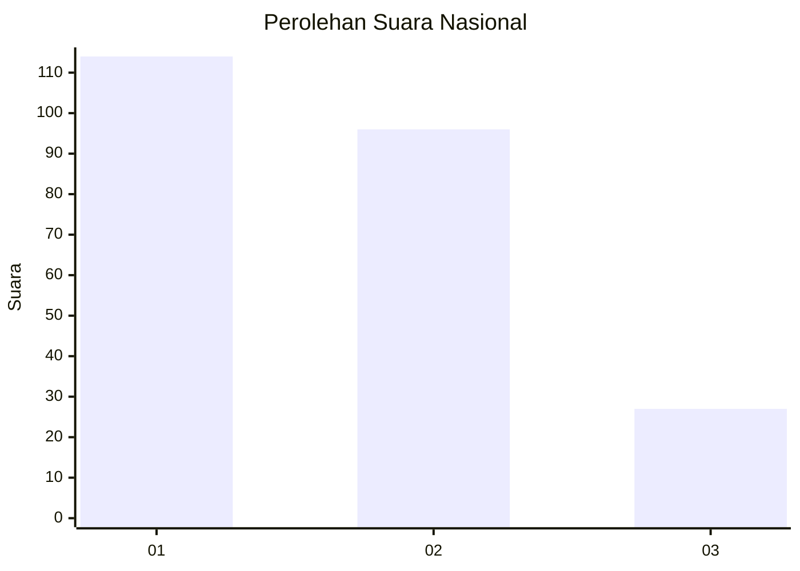
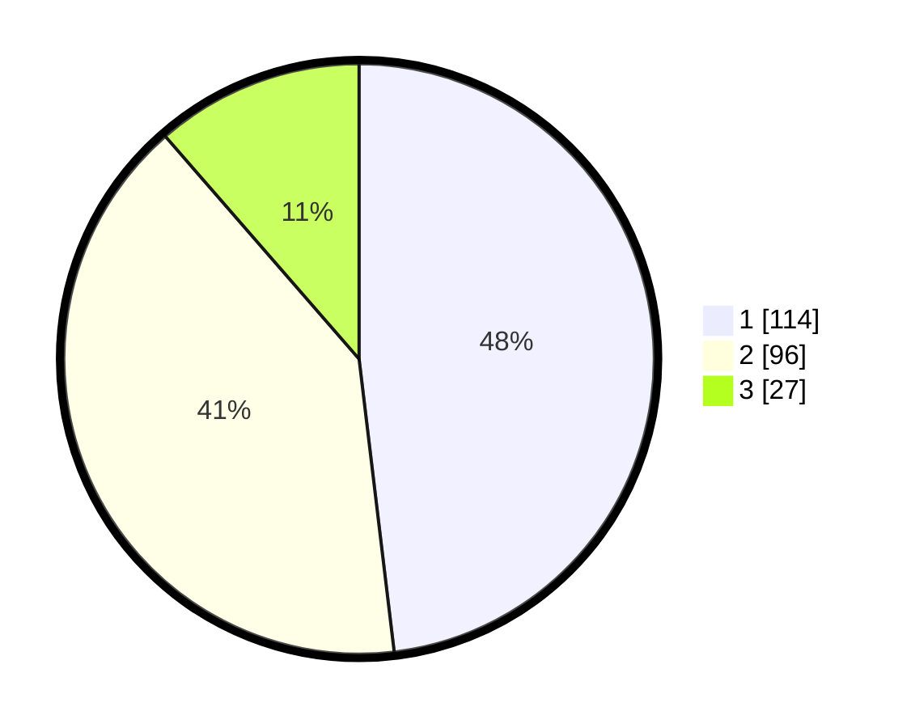

# Hasil

## Grafik

## Tabel

| No.    | Nama Paslon    | Suara | Suara (raw) | Persentase |
|:------ |:-------------- | -----:| -----------:| ----------:|
| 100025 | ANIES MUHAIMIN | 114   | [114][p-1]  | 48,10      |
| 100026 | PRABOWO GIBRAN | 96    | [96][p-2]   | 40,51      |
| 100027 | GANJAR MAHFUD  | 27    | [27][p-3]   | 11,39      |

[p-1]: https://github.com/gigit-pemilu/pemilu-2024/blob/main/pilpres/hitung-suara/sub/31-dki-jakarta/sub/74-jakarta-selatan/sub/10-pesanggrahan/sub/1003-petukangan-utara/sub/078-tps/sub/paslon-1.txt
[p-2]: https://github.com/gigit-pemilu/pemilu-2024/blob/main/pilpres/hitung-suara/sub/31-dki-jakarta/sub/74-jakarta-selatan/sub/10-pesanggrahan/sub/1003-petukangan-utara/sub/078-tps/sub/paslon-2.txt
[p-3]: https://github.com/gigit-pemilu/pemilu-2024/blob/main/pilpres/hitung-suara/sub/31-dki-jakarta/sub/74-jakarta-selatan/sub/10-pesanggrahan/sub/1003-petukangan-utara/sub/078-tps/sub/paslon-3.txt

## Foto C Plano

https://sirekap-obj-formc.kpu.go.id/b19f/pemilu/ppwp/31/74/10/10/03/3174101003078-20240215-003118--3a0d0598-c400-4a07-bf5b-965b0cac6ff9.jpg

https://sirekap-obj-formc.kpu.go.id/b19f/pemilu/ppwp/31/74/10/10/03/3174101003078-20240215-003215--233d7d92-b8aa-4e0f-aeff-70e95894c0ba.jpg

https://sirekap-obj-formc.kpu.go.id/b19f/pemilu/ppwp/31/74/10/10/03/3174101003078-20240215-003307--a2ea9d0e-05fc-4af3-aefd-5b037dd926d1.jpg

## Metadata

| Key        | Value               |
| ---------- | ------------------- |
| Time Stamp | 2024-02-15 16:30:25 |

