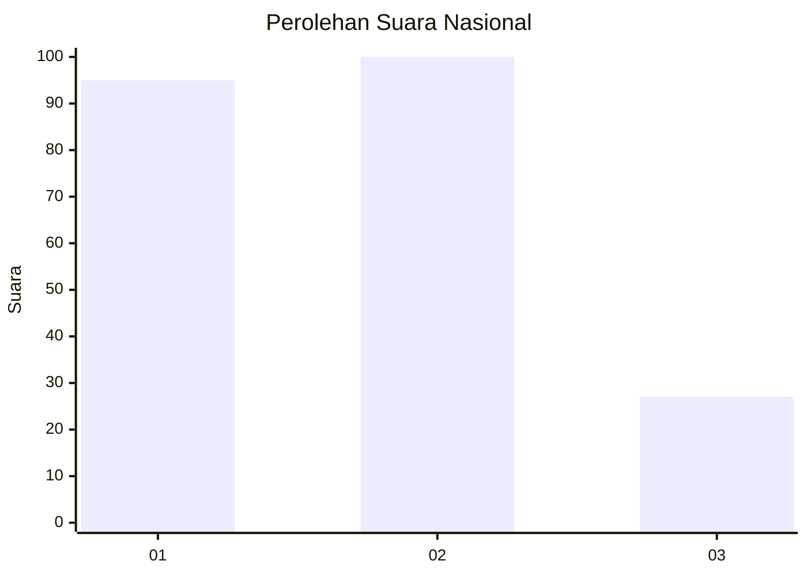
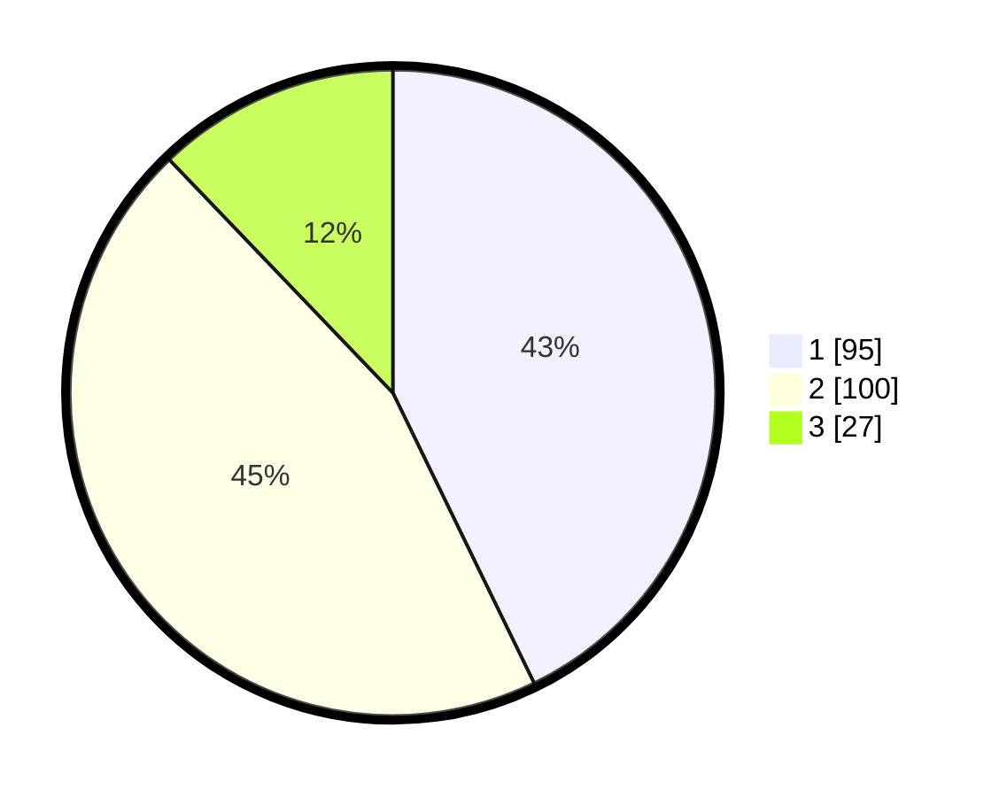

# Hasil

## Grafik

## Tabel

| No.    | Nama Paslon    | Suara | Suara (raw) | Persentase |
|:------ |:-------------- | -----:| -----------:| ----------:|
| 100025 | ANIES MUHAIMIN | 95    | [95][p-1]   | 42,79      |
| 100026 | PRABOWO GIBRAN | 100   | [100][p-2]  | 45,05      |
| 100027 | GANJAR MAHFUD  | 27    | [27][p-3]   | 12,16      |

[p-1]: https://github.com/gigit-pemilu/pemilu-2024/blob/main/pilpres/hitung-suara/sub/31-dki-jakarta/sub/74-jakarta-selatan/sub/10-pesanggrahan/sub/1003-petukangan-utara/sub/086-tps/sub/paslon-1.txt
[p-2]: https://github.com/gigit-pemilu/pemilu-2024/blob/main/pilpres/hitung-suara/sub/31-dki-jakarta/sub/74-jakarta-selatan/sub/10-pesanggrahan/sub/1003-petukangan-utara/sub/086-tps/sub/paslon-2.txt
[p-3]: https://github.com/gigit-pemilu/pemilu-2024/blob/main/pilpres/hitung-suara/sub/31-dki-jakarta/sub/74-jakarta-selatan/sub/10-pesanggrahan/sub/1003-petukangan-utara/sub/086-tps/sub/paslon-3.txt

## Foto C Plano

https://sirekap-obj-formc.kpu.go.id/7573/pemilu/ppwp/31/74/10/10/03/3174101003086-20240214-155641--0e3a11c5-f56b-4130-ab88-d458ff62e1d2.jpg

https://sirekap-obj-formc.kpu.go.id/7573/pemilu/ppwp/31/74/10/10/03/3174101003086-20240214-155919--c0eee23f-3eb4-4cf1-a883-35a2e146dbcc.jpg

https://sirekap-obj-formc.kpu.go.id/7573/pemilu/ppwp/31/74/10/10/03/3174101003086-20240214-155821--fe84a3e7-a79a-4c44-972d-b52ac1c29ad2.jpg

## Metadata

| Key        | Value               |
| ---------- | ------------------- |
| Time Stamp | 2024-02-25 15:00:00 |

