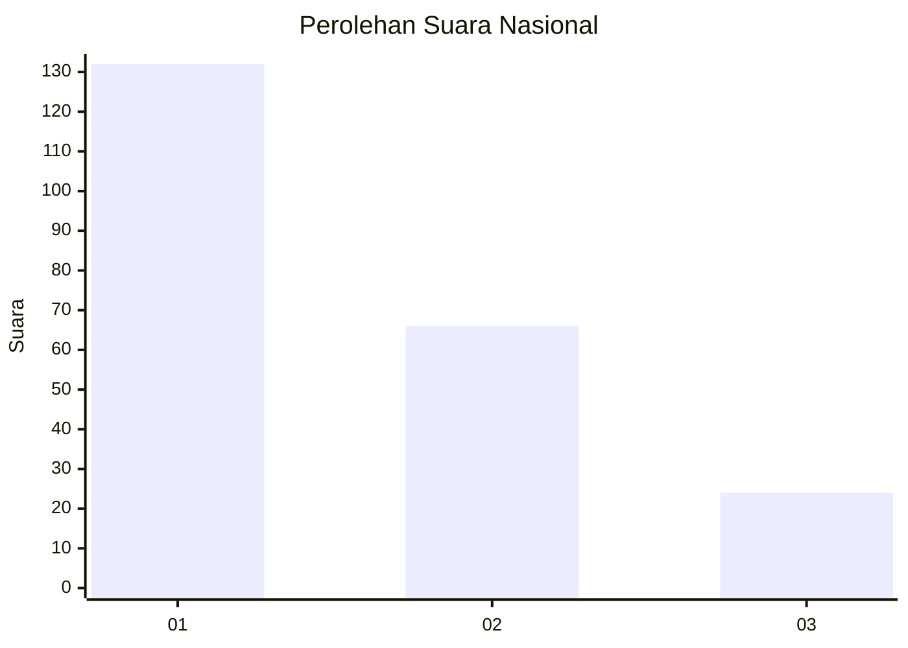
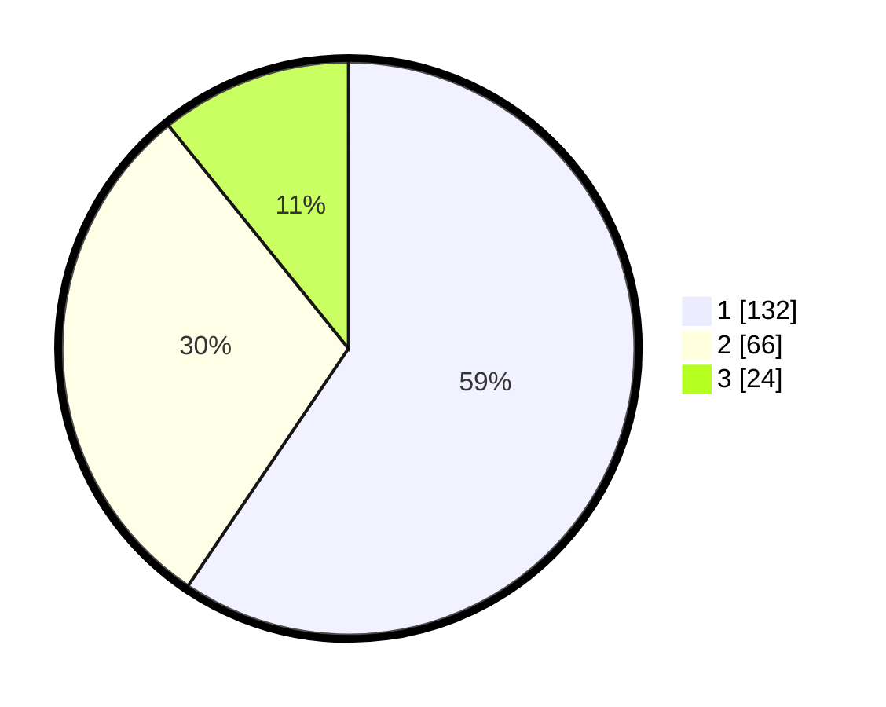

# Hasil

## Grafik

## Tabel

| No.    | Nama Paslon    | Suara | Suara (raw) | Persentase |
|:------ |:-------------- | -----:| -----------:| ----------:|
| 100025 | ANIES MUHAIMIN | 132   | [132][p-1]  | 59,46      |
| 100026 | PRABOWO GIBRAN | 66    | [66][p-2]   | 29,73      |
| 100027 | GANJAR MAHFUD  | 24    | [24][p-3]   | 10,81      |

[p-1]: https://github.com/gigit-pemilu/pemilu-2024/blob/main/pilpres/hitung-suara/sub/31-dki-jakarta/sub/74-jakarta-selatan/sub/10-pesanggrahan/sub/1003-petukangan-utara/sub/090-tps/sub/paslon-1.txt
[p-2]: https://github.com/gigit-pemilu/pemilu-2024/blob/main/pilpres/hitung-suara/sub/31-dki-jakarta/sub/74-jakarta-selatan/sub/10-pesanggrahan/sub/1003-petukangan-utara/sub/090-tps/sub/paslon-2.txt
[p-3]: https://github.com/gigit-pemilu/pemilu-2024/blob/main/pilpres/hitung-suara/sub/31-dki-jakarta/sub/74-jakarta-selatan/sub/10-pesanggrahan/sub/1003-petukangan-utara/sub/090-tps/sub/paslon-3.txt

## Foto C Plano

https://sirekap-obj-formc.kpu.go.id/081a/pemilu/ppwp/31/74/10/10/03/3174101003090-20240214-211153--f54520bf-76c8-460e-81a4-9d9fd52ed764.jpg

https://sirekap-obj-formc.kpu.go.id/081a/pemilu/ppwp/31/74/10/10/03/3174101003090-20240214-195054--15d14625-1357-49dd-afb8-c89a83a98d19.jpg

https://sirekap-obj-formc.kpu.go.id/081a/pemilu/ppwp/31/74/10/10/03/3174101003090-20240214-195259--912d7f7c-bc33-4358-b407-ed02348fcde4.jpg

## Metadata

| Key        | Value               |
| ---------- | ------------------- |
| Time Stamp | 2024-02-24 22:31:28 |

