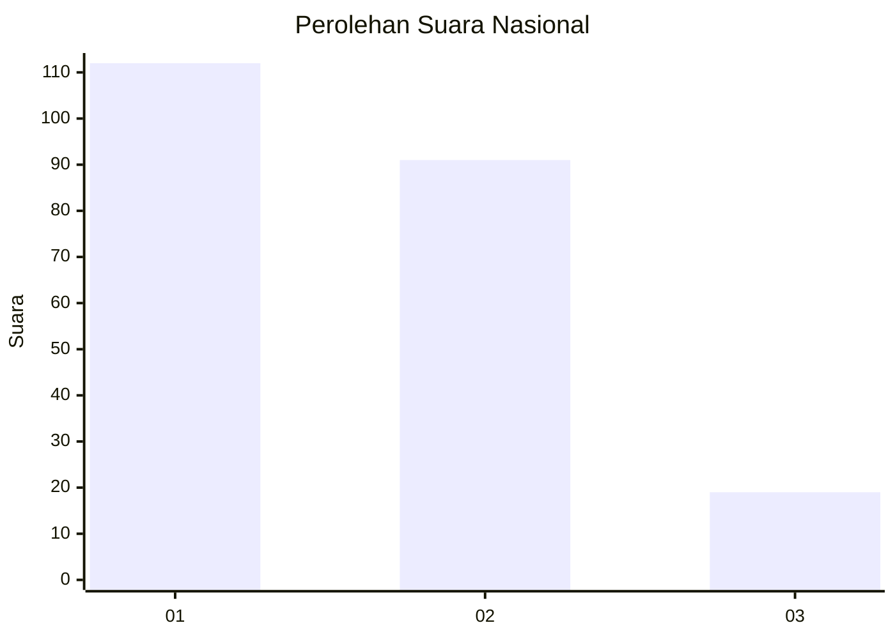
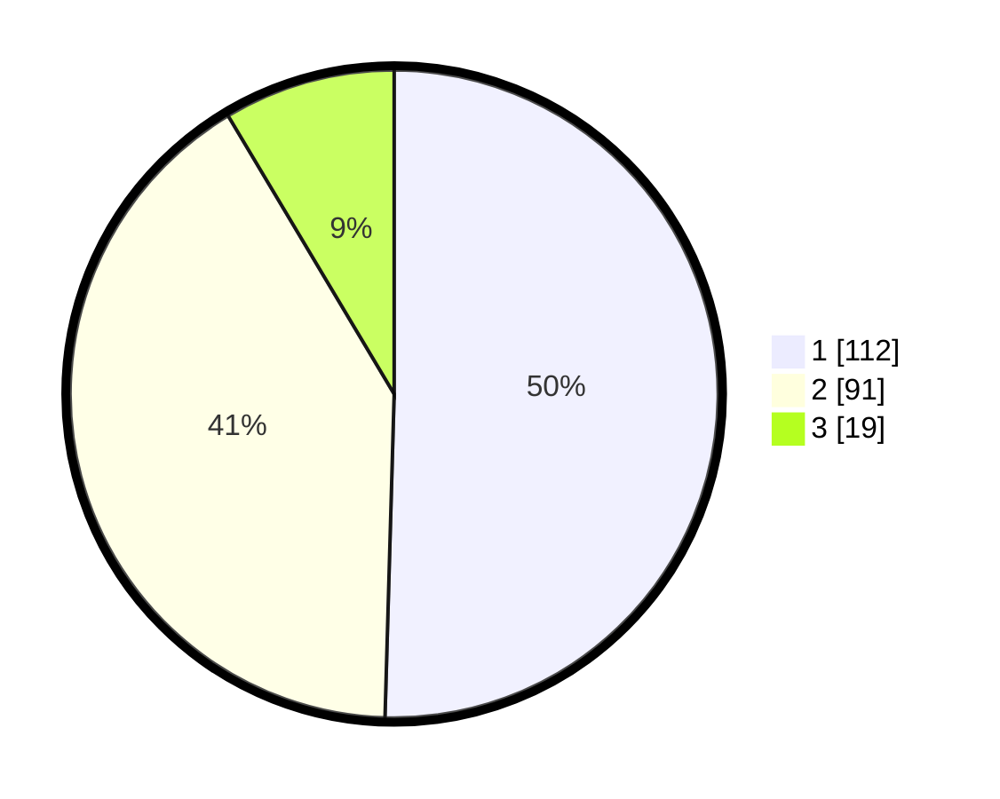

# Hasil

## Grafik

## Tabel

| No.    | Nama Paslon    | Suara | Suara (raw) | Persentase |
|:------ |:-------------- | -----:| -----------:| ----------:|
| 100025 | ANIES MUHAIMIN | 112   | [112][p-1]  | 50,45      |
| 100026 | PRABOWO GIBRAN | 91    | [91][p-2]   | 40,99      |
| 100027 | GANJAR MAHFUD  | 19    | [19][p-3]   | 8,56       |

[p-1]: https://github.com/gigit-pemilu/pemilu-2024/blob/main/pilpres/hitung-suara/sub/31-dki-jakarta/sub/74-jakarta-selatan/sub/10-pesanggrahan/sub/1003-petukangan-utara/sub/091-tps/sub/paslon-1.txt
[p-2]: https://github.com/gigit-pemilu/pemilu-2024/blob/main/pilpres/hitung-suara/sub/31-dki-jakarta/sub/74-jakarta-selatan/sub/10-pesanggrahan/sub/1003-petukangan-utara/sub/091-tps/sub/paslon-2.txt
[p-3]: https://github.com/gigit-pemilu/pemilu-2024/blob/main/pilpres/hitung-suara/sub/31-dki-jakarta/sub/74-jakarta-selatan/sub/10-pesanggrahan/sub/1003-petukangan-utara/sub/091-tps/sub/paslon-3.txt

## Foto C Plano

https://sirekap-obj-formc.kpu.go.id/ad59/pemilu/ppwp/31/74/10/10/03/3174101003091-20240214-215152--a4032d84-9b7f-47ae-9fff-28bf30111efc.jpg

https://sirekap-obj-formc.kpu.go.id/ad59/pemilu/ppwp/31/74/10/10/03/3174101003091-20240214-214707--7dd69f1d-511c-4242-bd22-9ee3725998d0.jpg

https://sirekap-obj-formc.kpu.go.id/ad59/pemilu/ppwp/31/74/10/10/03/3174101003091-20240214-214905--c2b010c0-c790-48b1-9662-60621e3f0ff1.jpg

## Metadata

| Key        | Value               |
| ---------- | ------------------- |
| Time Stamp | 2024-02-24 22:31:28 |

