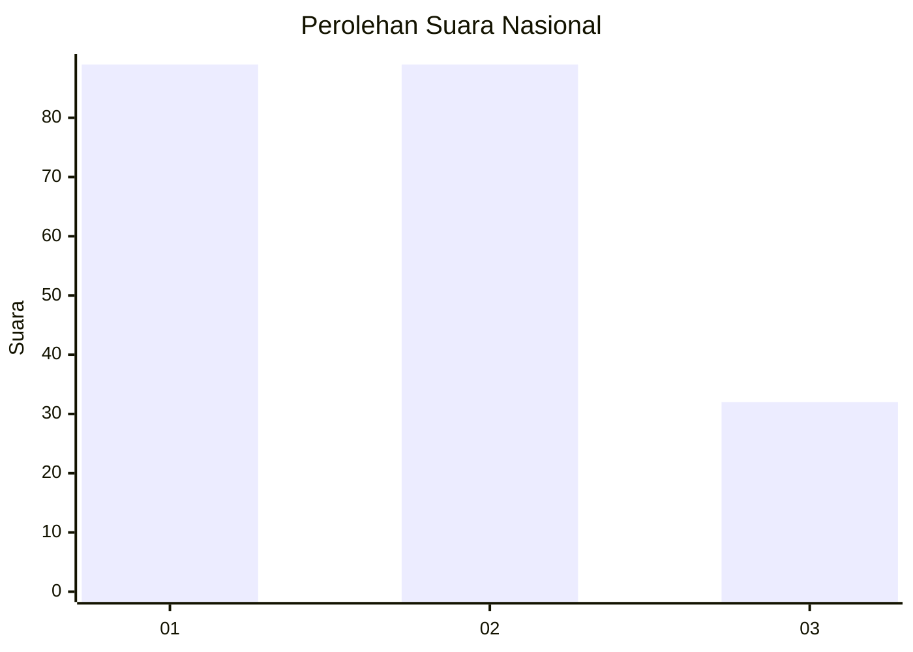
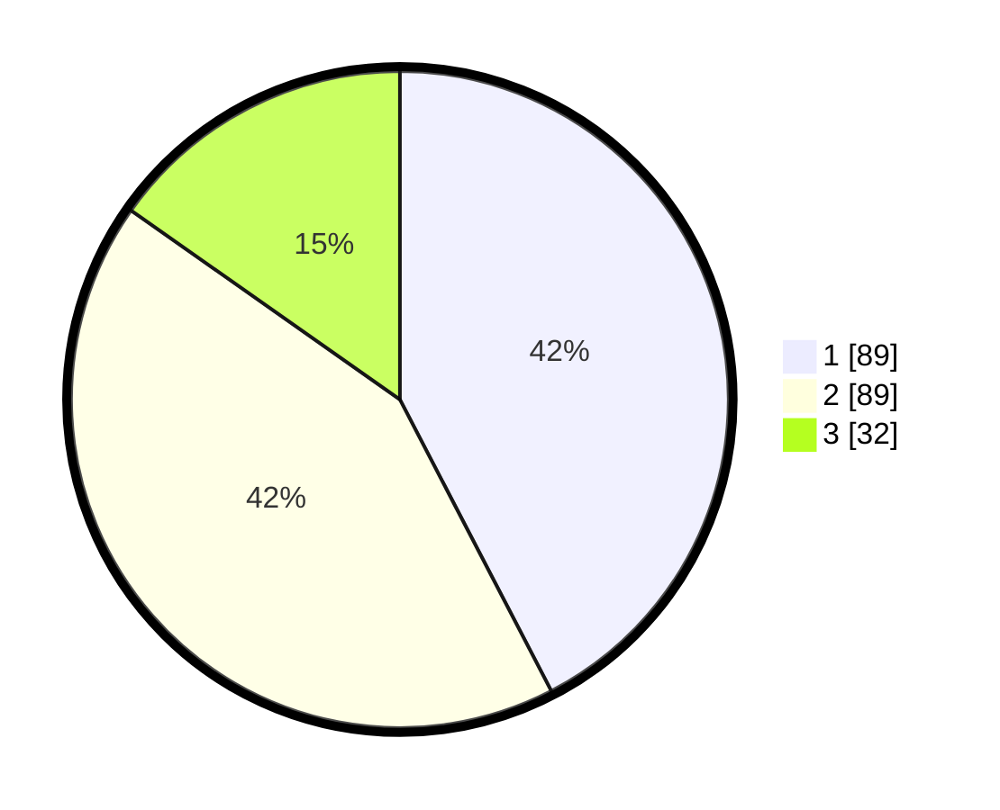

# Hasil

## Grafik

## Tabel

| No.    | Nama Paslon    | Suara | Suara (raw) | Persentase |
|:------ |:-------------- | -----:| -----------:| ----------:|
| 100025 | ANIES MUHAIMIN | 89    | [89][p-1]   | 42,38      |
| 100026 | PRABOWO GIBRAN | 89    | [89][p-2]   | 42,38      |
| 100027 | GANJAR MAHFUD  | 32    | [32][p-3]   | 15,24      |

[p-1]: https://github.com/gigit-pemilu/pemilu-2024/blob/main/pilpres/hitung-suara/sub/31-dki-jakarta/sub/74-jakarta-selatan/sub/10-pesanggrahan/sub/1003-petukangan-utara/sub/094-tps/sub/paslon-1.txt
[p-2]: https://github.com/gigit-pemilu/pemilu-2024/blob/main/pilpres/hitung-suara/sub/31-dki-jakarta/sub/74-jakarta-selatan/sub/10-pesanggrahan/sub/1003-petukangan-utara/sub/094-tps/sub/paslon-2.txt
[p-3]: https://github.com/gigit-pemilu/pemilu-2024/blob/main/pilpres/hitung-suara/sub/31-dki-jakarta/sub/74-jakarta-selatan/sub/10-pesanggrahan/sub/1003-petukangan-utara/sub/094-tps/sub/paslon-3.txt

## Foto C Plano

https://sirekap-obj-formc.kpu.go.id/8d15/pemilu/ppwp/31/74/10/10/03/3174101003094-20240214-201955--c5b61f00-38a5-43bb-bf56-f44bb2854970.jpg

https://sirekap-obj-formc.kpu.go.id/8d15/pemilu/ppwp/31/74/10/10/03/3174101003094-20240214-202001--c5917054-5504-4c95-bead-f20bf050beb3.jpg

https://sirekap-obj-formc.kpu.go.id/8d15/pemilu/ppwp/31/74/10/10/03/3174101003094-20240214-202005--810409ca-c556-4df2-b744-259c6ae452bc.jpg

## Metadata

| Key        | Value               |
| ---------- | ------------------- |
| Time Stamp | 2024-02-24 22:31:28 |

