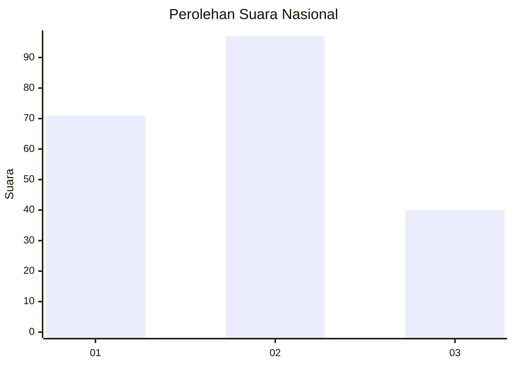
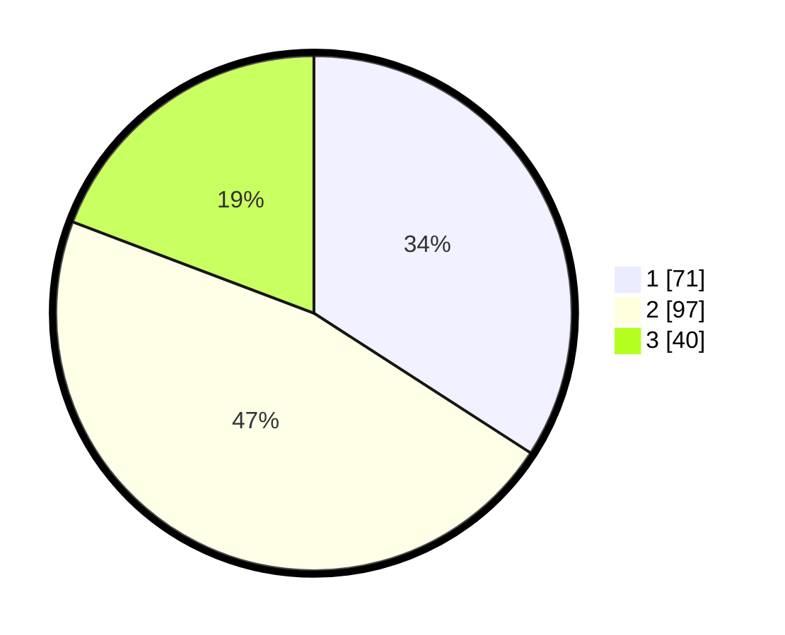

# Hasil

## Grafik

## Tabel

| No.    | Nama Paslon    | Suara | Suara (raw) | Persentase |
|:------ |:-------------- | -----:| -----------:| ----------:|
| 100025 | ANIES MUHAIMIN | 71    | [71][p-1]   | 34,13      |
| 100026 | PRABOWO GIBRAN | 97    | [97][p-2]   | 46,63      |
| 100027 | GANJAR MAHFUD  | 40    | [40][p-3]   | 19,23      |

[p-1]: https://github.com/gigit-pemilu/pemilu-2024/blob/main/pilpres/hitung-suara/sub/31-dki-jakarta/sub/74-jakarta-selatan/sub/10-pesanggrahan/sub/1003-petukangan-utara/sub/100-tps/sub/paslon-1.txt
[p-2]: https://github.com/gigit-pemilu/pemilu-2024/blob/main/pilpres/hitung-suara/sub/31-dki-jakarta/sub/74-jakarta-selatan/sub/10-pesanggrahan/sub/1003-petukangan-utara/sub/100-tps/sub/paslon-2.txt
[p-3]: https://github.com/gigit-pemilu/pemilu-2024/blob/main/pilpres/hitung-suara/sub/31-dki-jakarta/sub/74-jakarta-selatan/sub/10-pesanggrahan/sub/1003-petukangan-utara/sub/100-tps/sub/paslon-3.txt

## Foto C Plano

https://sirekap-obj-formc.kpu.go.id/2c05/pemilu/ppwp/31/74/10/10/03/3174101003100-20240214-204602--ee4b353b-d3f0-4f32-bb94-cb9286571abd.jpg

https://sirekap-obj-formc.kpu.go.id/2c05/pemilu/ppwp/31/74/10/10/03/3174101003100-20240214-204805--cca59294-fd1e-4501-a868-c6bd882a824a.jpg

https://sirekap-obj-formc.kpu.go.id/2c05/pemilu/ppwp/31/74/10/10/03/3174101003100-20240214-204714--885a97b8-c414-4c36-8dd5-7a73941552c8.jpg

## Metadata

| Key        | Value               |
| ---------- | ------------------- |
| Time Stamp | 2024-02-24 22:31:28 |

