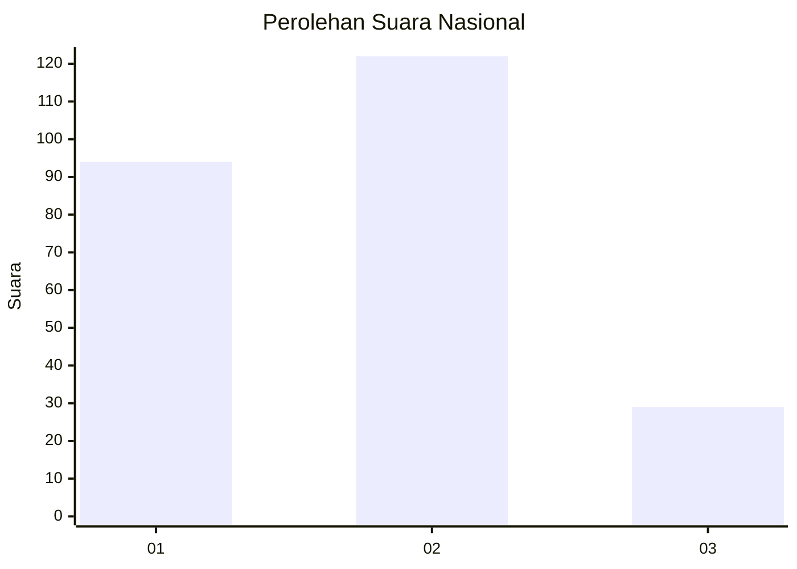
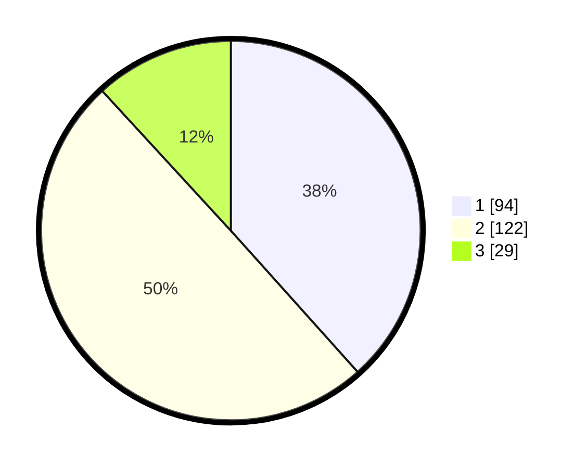

# Hasil

## Grafik

## Tabel

| No.    | Nama Paslon    | Suara | Suara (raw) | Persentase |
|:------ |:-------------- | -----:| -----------:| ----------:|
| 100025 | ANIES MUHAIMIN | 94    | [94][p-1]   | 38,37      |
| 100026 | PRABOWO GIBRAN | 122   | [122][p-2]  | 49,80      |
| 100027 | GANJAR MAHFUD  | 29    | [29][p-3]   | 11,84      |

[p-1]: https://github.com/gigit-pemilu/pemilu-2024/blob/main/pilpres/hitung-suara/sub/31-dki-jakarta/sub/74-jakarta-selatan/sub/10-pesanggrahan/sub/1003-petukangan-utara/sub/104-tps/sub/paslon-1.txt
[p-2]: https://github.com/gigit-pemilu/pemilu-2024/blob/main/pilpres/hitung-suara/sub/31-dki-jakarta/sub/74-jakarta-selatan/sub/10-pesanggrahan/sub/1003-petukangan-utara/sub/104-tps/sub/paslon-2.txt
[p-3]: https://github.com/gigit-pemilu/pemilu-2024/blob/main/pilpres/hitung-suara/sub/31-dki-jakarta/sub/74-jakarta-selatan/sub/10-pesanggrahan/sub/1003-petukangan-utara/sub/104-tps/sub/paslon-3.txt

## Foto C Plano

https://sirekap-obj-formc.kpu.go.id/df9e/pemilu/ppwp/31/74/10/10/03/3174101003104-20240214-233902--937d8b12-03b0-4d0b-a71a-001f491ac926.jpg

https://sirekap-obj-formc.kpu.go.id/df9e/pemilu/ppwp/31/74/10/10/03/3174101003104-20240214-233934--cca985a6-e656-4cc3-ae22-d88131171edd.jpg

https://sirekap-obj-formc.kpu.go.id/df9e/pemilu/ppwp/31/74/10/10/03/3174101003104-20240214-234004--ec54efb7-a80c-44fd-858d-206c02771327.jpg

## Metadata

| Key        | Value               |
| ---------- | ------------------- |
| Time Stamp | 2024-02-24 22:31:28 |

