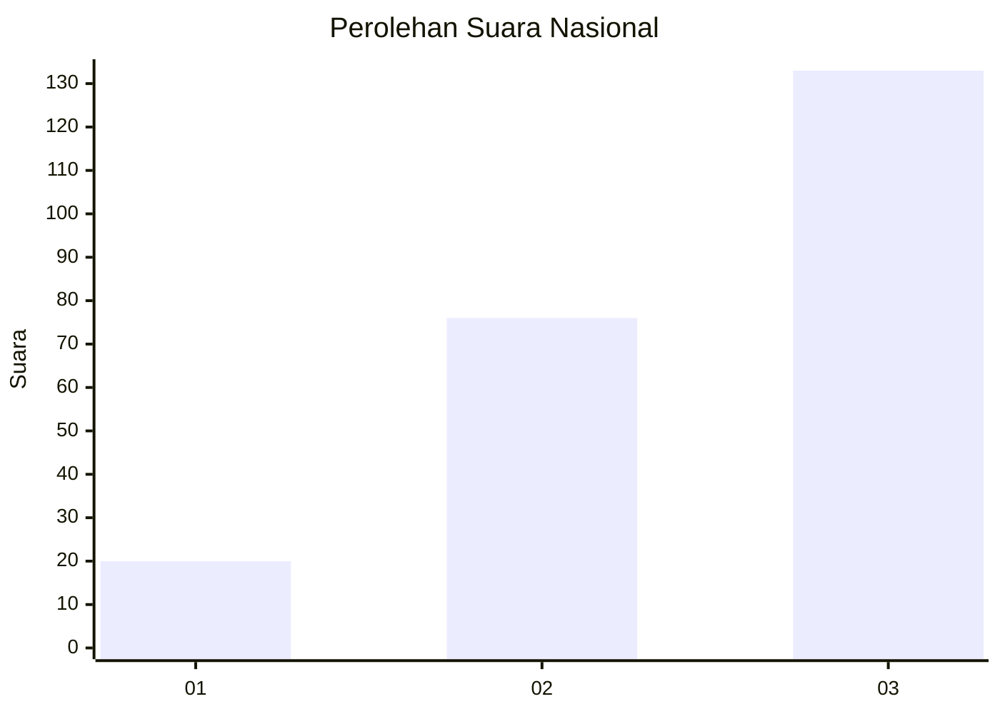
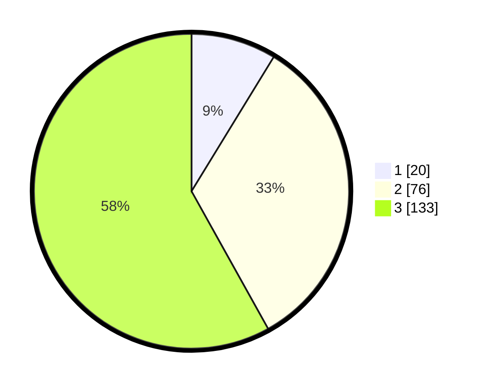

# Hasil

## Grafik

## Tabel

| No.    | Nama Paslon    | Suara | Suara (raw) | Persentase |
|:------ |:-------------- | -----:| -----------:| ----------:|
| 100025 | ANIES MUHAIMIN | 20    | [20][p-1]   | 8,73       |
| 100026 | PRABOWO GIBRAN | 76    | [76][p-2]   | 33,19      |
| 100027 | GANJAR MAHFUD  | 133   | [133][p-3]  | 58,08      |

[p-1]: https://github.com/gigit-pemilu/pemilu-2024/blob/main/pilpres/hitung-suara/sub/31-dki-jakarta/sub/74-jakarta-selatan/sub/10-pesanggrahan/sub/1003-petukangan-utara/sub/112-tps/sub/paslon-1.txt
[p-2]: https://github.com/gigit-pemilu/pemilu-2024/blob/main/pilpres/hitung-suara/sub/31-dki-jakarta/sub/74-jakarta-selatan/sub/10-pesanggrahan/sub/1003-petukangan-utara/sub/112-tps/sub/paslon-2.txt
[p-3]: https://github.com/gigit-pemilu/pemilu-2024/blob/main/pilpres/hitung-suara/sub/31-dki-jakarta/sub/74-jakarta-selatan/sub/10-pesanggrahan/sub/1003-petukangan-utara/sub/112-tps/sub/paslon-3.txt

## Foto C Plano

https://sirekap-obj-formc.kpu.go.id/548e/pemilu/ppwp/31/74/10/10/03/3174101003112-20240214-231235--1c4e570c-e75d-4e2c-801d-ff5bc41da2ec.jpg

https://sirekap-obj-formc.kpu.go.id/548e/pemilu/ppwp/31/74/10/10/03/3174101003112-20240214-231249--66bd65d3-4f2a-4d3e-bd28-a50fa3707344.jpg

https://sirekap-obj-formc.kpu.go.id/548e/pemilu/ppwp/31/74/10/10/03/3174101003112-20240214-231256--bfe3a77f-00b9-4fc0-b43c-9cb585000e34.jpg

## Metadata

| Key        | Value               |
| ---------- | ------------------- |
| Time Stamp | 2024-02-25 19:00:00 |

