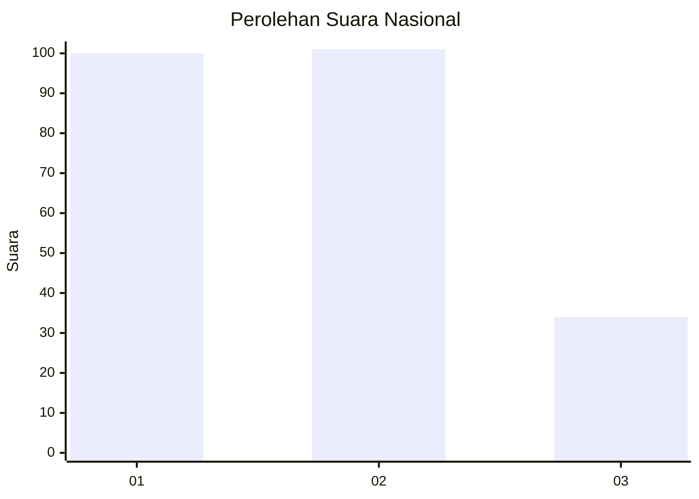
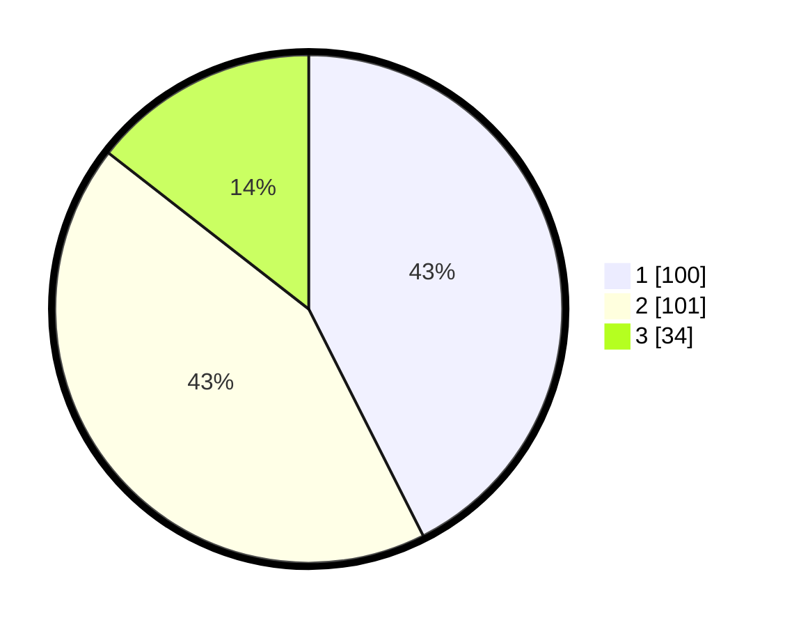

# Hasil

## Grafik

## Tabel

| No.    | Nama Paslon    | Suara | Suara (raw) | Persentase |
|:------ |:-------------- | -----:| -----------:| ----------:|
| 100025 | ANIES MUHAIMIN | 100   | [100][p-1]  | 42,55      |
| 100026 | PRABOWO GIBRAN | 101   | [101][p-2]  | 42,98      |
| 100027 | GANJAR MAHFUD  | 34    | [34][p-3]   | 14,47      |

[p-1]: https://github.com/gigit-pemilu/pemilu-2024/blob/main/pilpres/hitung-suara/sub/31-dki-jakarta/sub/74-jakarta-selatan/sub/10-pesanggrahan/sub/1003-petukangan-utara/sub/120-tps/sub/paslon-1.txt
[p-2]: https://github.com/gigit-pemilu/pemilu-2024/blob/main/pilpres/hitung-suara/sub/31-dki-jakarta/sub/74-jakarta-selatan/sub/10-pesanggrahan/sub/1003-petukangan-utara/sub/120-tps/sub/paslon-2.txt
[p-3]: https://github.com/gigit-pemilu/pemilu-2024/blob/main/pilpres/hitung-suara/sub/31-dki-jakarta/sub/74-jakarta-selatan/sub/10-pesanggrahan/sub/1003-petukangan-utara/sub/120-tps/sub/paslon-3.txt

## Foto C Plano

https://sirekap-obj-formc.kpu.go.id/6940/pemilu/ppwp/31/74/10/10/03/3174101003120-20240214-203515--68cad551-dad2-489a-90ce-a5490267c596.jpg

https://sirekap-obj-formc.kpu.go.id/6940/pemilu/ppwp/31/74/10/10/03/3174101003120-20240214-202236--fa8cd25c-0beb-4209-85c7-e474b58945ca.jpg

https://sirekap-obj-formc.kpu.go.id/6940/pemilu/ppwp/31/74/10/10/03/3174101003120-20240214-203749--183d2627-2834-4e95-88f3-aaff5909f242.jpg

## Metadata

| Key        | Value               |
| ---------- | ------------------- |
| Time Stamp | 2024-02-24 22:31:28 |

