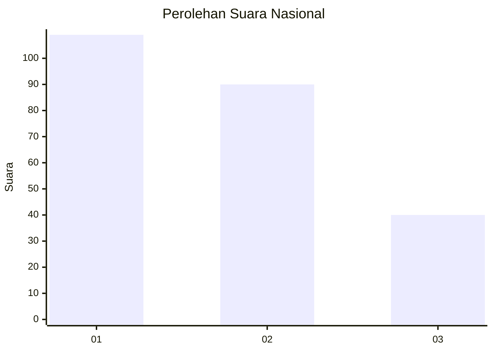
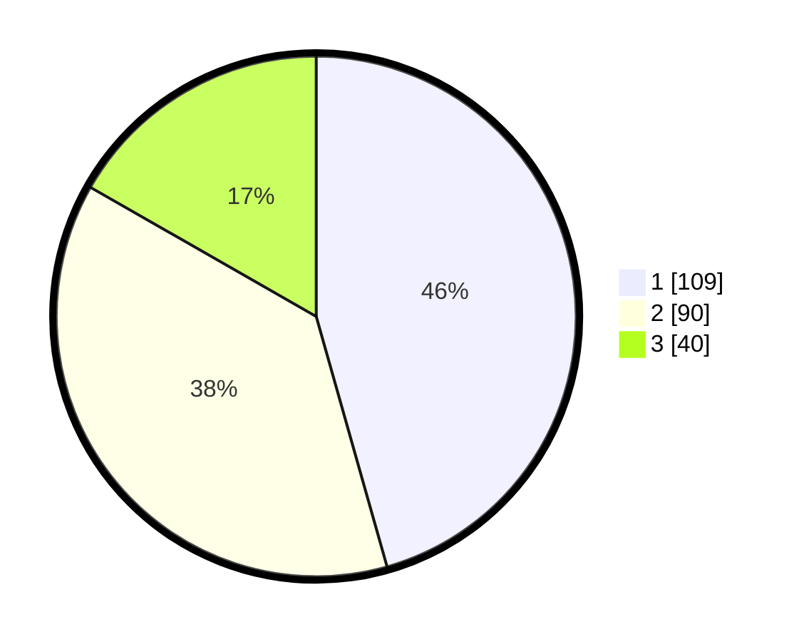

# Hasil

## Grafik

## Tabel

| No.    | Nama Paslon    | Suara | Suara (raw) | Persentase |
|:------ |:-------------- | -----:| -----------:| ----------:|
| 100025 | ANIES MUHAIMIN | 109   | [109][p-1]  | 45,61      |
| 100026 | PRABOWO GIBRAN | 90    | [90][p-2]   | 37,66      |
| 100027 | GANJAR MAHFUD  | 40    | [40][p-3]   | 16,74      |

[p-1]: https://github.com/gigit-pemilu/pemilu-2024/blob/main/pilpres/hitung-suara/sub/31-dki-jakarta/sub/74-jakarta-selatan/sub/10-pesanggrahan/sub/1003-petukangan-utara/sub/159-tps/sub/paslon-1.txt
[p-2]: https://github.com/gigit-pemilu/pemilu-2024/blob/main/pilpres/hitung-suara/sub/31-dki-jakarta/sub/74-jakarta-selatan/sub/10-pesanggrahan/sub/1003-petukangan-utara/sub/159-tps/sub/paslon-2.txt
[p-3]: https://github.com/gigit-pemilu/pemilu-2024/blob/main/pilpres/hitung-suara/sub/31-dki-jakarta/sub/74-jakarta-selatan/sub/10-pesanggrahan/sub/1003-petukangan-utara/sub/159-tps/sub/paslon-3.txt

## Foto C Plano

https://sirekap-obj-formc.kpu.go.id/a5b7/pemilu/ppwp/31/74/10/10/03/3174101003159-20240215-011435--56f5631c-65f0-4da5-8093-f113dcaa1077.jpg

https://sirekap-obj-formc.kpu.go.id/a5b7/pemilu/ppwp/31/74/10/10/03/3174101003159-20240214-210104--57cf716a-cf1c-4687-88de-91aba43eb57f.jpg

https://sirekap-obj-formc.kpu.go.id/a5b7/pemilu/ppwp/31/74/10/10/03/3174101003159-20240214-210144--ff6f0f55-1a9c-405e-b2e7-e39cb54f1910.jpg

## Metadata

| Key        | Value               |
| ---------- | ------------------- |
| Time Stamp | 2024-02-27 18:00:00 |

