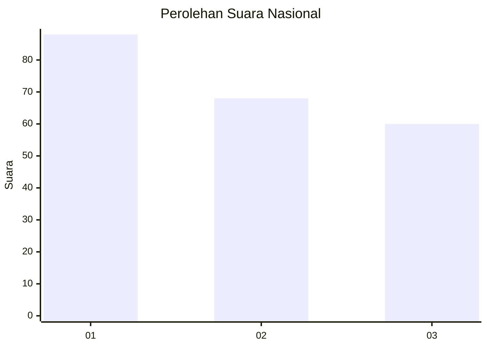
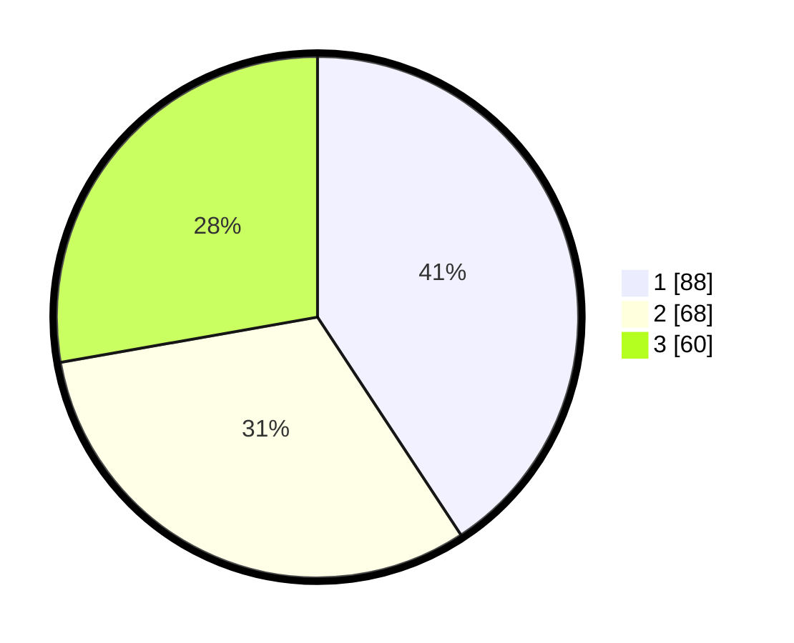

# Hasil

## Grafik

## Tabel

| No.    | Nama Paslon    | Suara | Suara (raw) | Persentase |
|:------ |:-------------- | -----:| -----------:| ----------:|
| 100025 | ANIES MUHAIMIN | 88    | [88][p-1]   | 40,74      |
| 100026 | PRABOWO GIBRAN | 68    | [68][p-2]   | 31,48      |
| 100027 | GANJAR MAHFUD  | 60    | [60][p-3]   | 27,78      |

[p-1]: https://github.com/gigit-pemilu/pemilu-2024/blob/main/pilpres/hitung-suara/sub/31-dki-jakarta/sub/74-jakarta-selatan/sub/10-pesanggrahan/sub/1004-petukangan-selatan/sub/006-tps/sub/paslon-1.txt
[p-2]: https://github.com/gigit-pemilu/pemilu-2024/blob/main/pilpres/hitung-suara/sub/31-dki-jakarta/sub/74-jakarta-selatan/sub/10-pesanggrahan/sub/1004-petukangan-selatan/sub/006-tps/sub/paslon-2.txt
[p-3]: https://github.com/gigit-pemilu/pemilu-2024/blob/main/pilpres/hitung-suara/sub/31-dki-jakarta/sub/74-jakarta-selatan/sub/10-pesanggrahan/sub/1004-petukangan-selatan/sub/006-tps/sub/paslon-3.txt

## Foto C Plano

https://sirekap-obj-formc.kpu.go.id/4ffb/pemilu/ppwp/31/74/10/10/04/3174101004006-20240214-200326--c2da6551-51f0-49c9-8078-c6f882418b93.jpg

https://sirekap-obj-formc.kpu.go.id/4ffb/pemilu/ppwp/31/74/10/10/04/3174101004006-20240214-200343--a080f232-3e71-43ef-bede-dc3469643002.jpg

https://sirekap-obj-formc.kpu.go.id/4ffb/pemilu/ppwp/31/74/10/10/04/3174101004006-20240214-200349--6139c212-6908-41f7-b961-946a42ef1b50.jpg

## Metadata

| Key        | Value               |
| ---------- | ------------------- |
| Time Stamp | 2024-02-25 10:00:00 |

