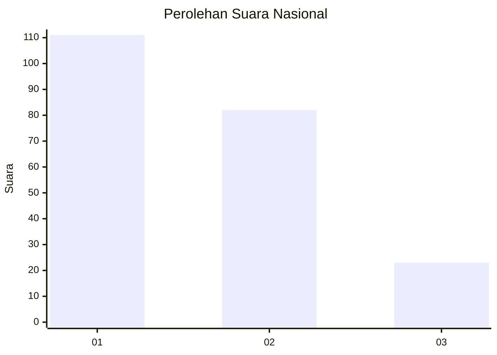
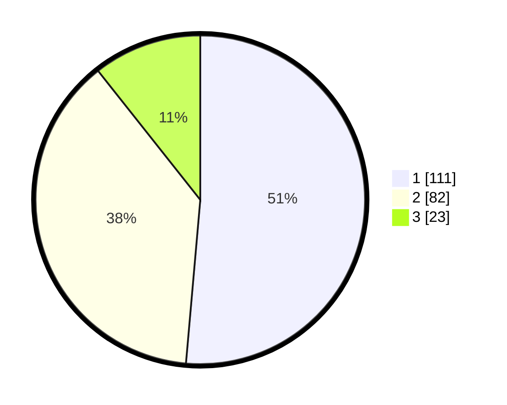

# Hasil

## Grafik

## Tabel

| No.    | Nama Paslon    | Suara | Suara (raw) | Persentase |
|:------ |:-------------- | -----:| -----------:| ----------:|
| 100025 | ANIES MUHAIMIN | 111   | [111][p-1]  | 51,39      |
| 100026 | PRABOWO GIBRAN | 82    | [82][p-2]   | 37,96      |
| 100027 | GANJAR MAHFUD  | 23    | [23][p-3]   | 10,65      |

[p-1]: https://github.com/gigit-pemilu/pemilu-2024/blob/main/pilpres/hitung-suara/sub/31-dki-jakarta/sub/74-jakarta-selatan/sub/10-pesanggrahan/sub/1004-petukangan-selatan/sub/008-tps/sub/paslon-1.txt
[p-2]: https://github.com/gigit-pemilu/pemilu-2024/blob/main/pilpres/hitung-suara/sub/31-dki-jakarta/sub/74-jakarta-selatan/sub/10-pesanggrahan/sub/1004-petukangan-selatan/sub/008-tps/sub/paslon-2.txt
[p-3]: https://github.com/gigit-pemilu/pemilu-2024/blob/main/pilpres/hitung-suara/sub/31-dki-jakarta/sub/74-jakarta-selatan/sub/10-pesanggrahan/sub/1004-petukangan-selatan/sub/008-tps/sub/paslon-3.txt

## Foto C Plano

https://sirekap-obj-formc.kpu.go.id/b8c6/pemilu/ppwp/31/74/10/10/04/3174101004008-20240217-112257--d5f3a08b-9c6b-4af9-830b-ceb50336f6b1.jpg

https://sirekap-obj-formc.kpu.go.id/b8c6/pemilu/ppwp/31/74/10/10/04/3174101004008-20240217-112337--7c68d2c0-5b3b-48e2-a255-052909b64a9a.jpg

https://sirekap-obj-formc.kpu.go.id/b8c6/pemilu/ppwp/31/74/10/10/04/3174101004008-20240217-112423--18b8baf5-3061-4ec4-bd9f-a27bc6296005.jpg

## Metadata

| Key        | Value               |
| ---------- | ------------------- |
| Time Stamp | 2024-02-24 22:31:28 |

