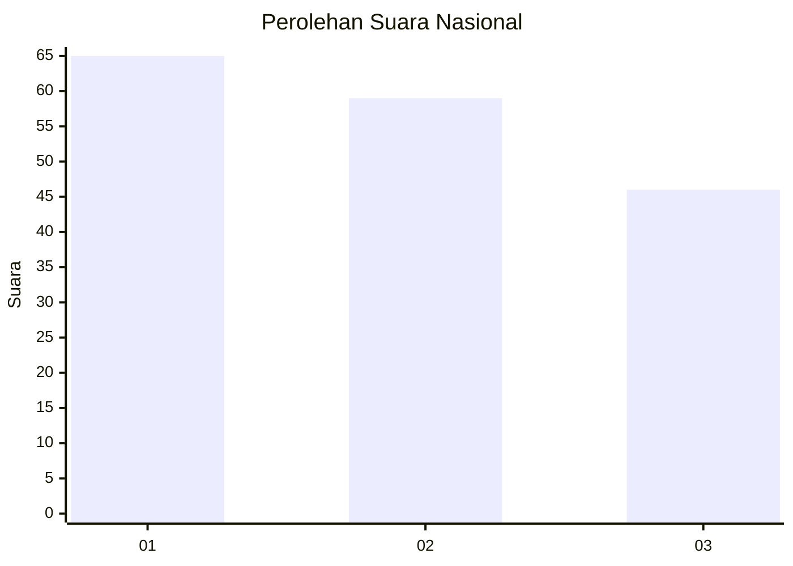
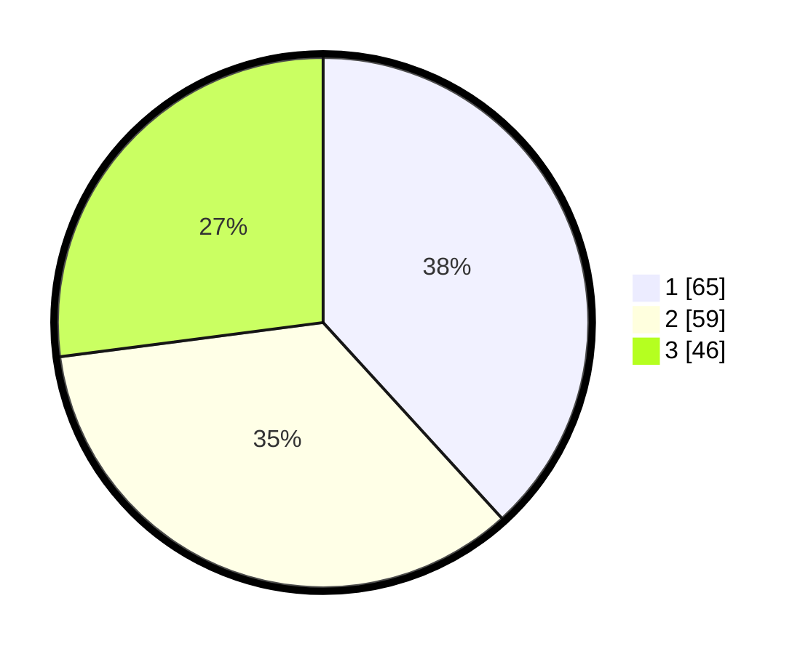

# Hasil

## Grafik

## Tabel

| No.    | Nama Paslon    | Suara | Suara (raw) | Persentase |
|:------ |:-------------- | -----:| -----------:| ----------:|
| 100025 | ANIES MUHAIMIN | 65    | [65][p-1]   | 38,24      |
| 100026 | PRABOWO GIBRAN | 59    | [59][p-2]   | 34,71      |
| 100027 | GANJAR MAHFUD  | 46    | [46][p-3]   | 27,06      |

[p-1]: https://github.com/gigit-pemilu/pemilu-2024/blob/main/pilpres/hitung-suara/sub/31-dki-jakarta/sub/74-jakarta-selatan/sub/10-pesanggrahan/sub/1004-petukangan-selatan/sub/018-tps/sub/paslon-1.txt
[p-2]: https://github.com/gigit-pemilu/pemilu-2024/blob/main/pilpres/hitung-suara/sub/31-dki-jakarta/sub/74-jakarta-selatan/sub/10-pesanggrahan/sub/1004-petukangan-selatan/sub/018-tps/sub/paslon-2.txt
[p-3]: https://github.com/gigit-pemilu/pemilu-2024/blob/main/pilpres/hitung-suara/sub/31-dki-jakarta/sub/74-jakarta-selatan/sub/10-pesanggrahan/sub/1004-petukangan-selatan/sub/018-tps/sub/paslon-3.txt

## Foto C Plano

https://sirekap-obj-formc.kpu.go.id/8046/pemilu/ppwp/31/74/10/10/04/3174101004018-20240218-101258--13b49d43-ec1f-40ca-bcc2-7e516fe0ce03.jpg

https://sirekap-obj-formc.kpu.go.id/8046/pemilu/ppwp/31/74/10/10/04/3174101004018-20240218-101359--145746a6-4c7a-4423-8478-c3c1af63fb47.jpg

https://sirekap-obj-formc.kpu.go.id/8046/pemilu/ppwp/31/74/10/10/04/3174101004018-20240218-101502--6b92634a-f271-47f2-9ab3-f1ac26a16e72.jpg

## Metadata

| Key        | Value               |
| ---------- | ------------------- |
| Time Stamp | 2024-02-24 22:31:28 |

