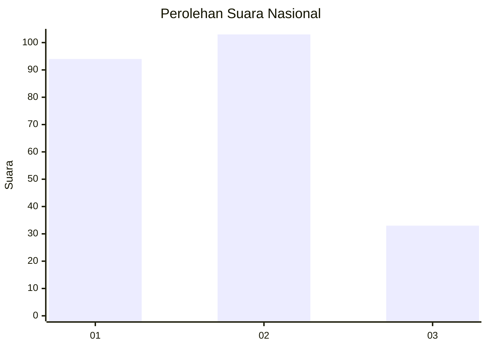
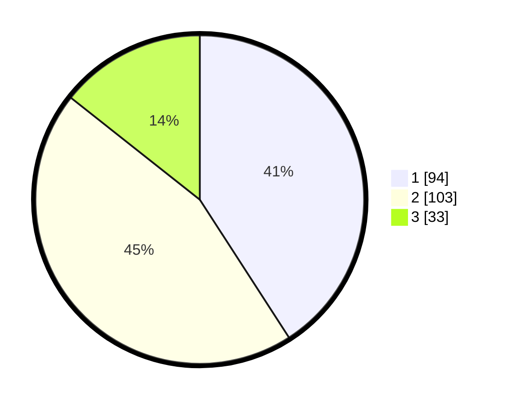

# Hasil

## Grafik

## Tabel

| No.    | Nama Paslon    | Suara | Suara (raw) | Persentase |
|:------ |:-------------- | -----:| -----------:| ----------:|
| 100025 | ANIES MUHAIMIN | 94    | [94][p-1]   | 40,87      |
| 100026 | PRABOWO GIBRAN | 103   | [103][p-2]  | 44,78      |
| 100027 | GANJAR MAHFUD  | 33    | [33][p-3]   | 14,35      |

[p-1]: https://github.com/gigit-pemilu/pemilu-2024/blob/main/pilpres/hitung-suara/sub/31-dki-jakarta/sub/74-jakarta-selatan/sub/10-pesanggrahan/sub/1004-petukangan-selatan/sub/028-tps/sub/paslon-1.txt
[p-2]: https://github.com/gigit-pemilu/pemilu-2024/blob/main/pilpres/hitung-suara/sub/31-dki-jakarta/sub/74-jakarta-selatan/sub/10-pesanggrahan/sub/1004-petukangan-selatan/sub/028-tps/sub/paslon-2.txt
[p-3]: https://github.com/gigit-pemilu/pemilu-2024/blob/main/pilpres/hitung-suara/sub/31-dki-jakarta/sub/74-jakarta-selatan/sub/10-pesanggrahan/sub/1004-petukangan-selatan/sub/028-tps/sub/paslon-3.txt

## Foto C Plano

https://sirekap-obj-formc.kpu.go.id/bf88/pemilu/ppwp/31/74/10/10/04/3174101004028-20240214-223856--cf94bb79-25e7-4ebe-8896-c01d469b94b8.jpg

https://sirekap-obj-formc.kpu.go.id/bf88/pemilu/ppwp/31/74/10/10/04/3174101004028-20240214-223739--ce111268-8794-4477-920c-9f6d3df8a5e3.jpg

https://sirekap-obj-formc.kpu.go.id/bf88/pemilu/ppwp/31/74/10/10/04/3174101004028-20240214-223630--7c605a2a-24a1-4adc-ab2b-6ca633b8b507.jpg

## Metadata

| Key        | Value               |
| ---------- | ------------------- |
| Time Stamp | 2024-02-24 22:31:28 |

