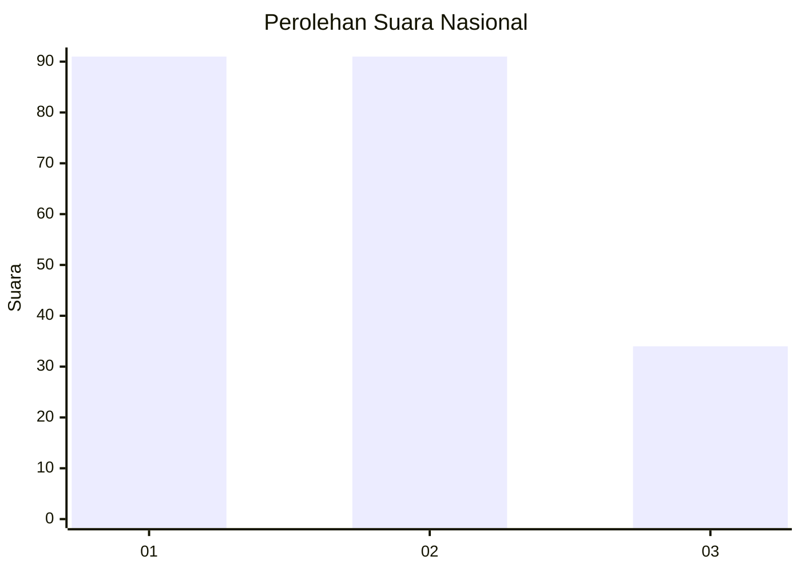
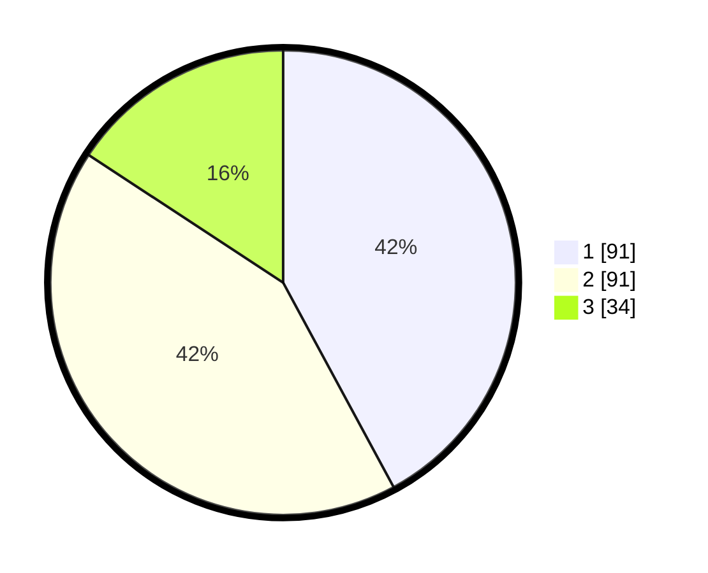

# Hasil

## Grafik

## Tabel

| No.    | Nama Paslon    | Suara | Suara (raw) | Persentase |
|:------ |:-------------- | -----:| -----------:| ----------:|
| 100025 | ANIES MUHAIMIN | 91    | [91][p-1]   | 42,13      |
| 100026 | PRABOWO GIBRAN | 91    | [91][p-2]   | 42,13      |
| 100027 | GANJAR MAHFUD  | 34    | [34][p-3]   | 15,74      |

[p-1]: https://github.com/gigit-pemilu/pemilu-2024/blob/main/pilpres/hitung-suara/sub/31-dki-jakarta/sub/74-jakarta-selatan/sub/10-pesanggrahan/sub/1004-petukangan-selatan/sub/033-tps/sub/paslon-1.txt
[p-2]: https://github.com/gigit-pemilu/pemilu-2024/blob/main/pilpres/hitung-suara/sub/31-dki-jakarta/sub/74-jakarta-selatan/sub/10-pesanggrahan/sub/1004-petukangan-selatan/sub/033-tps/sub/paslon-2.txt
[p-3]: https://github.com/gigit-pemilu/pemilu-2024/blob/main/pilpres/hitung-suara/sub/31-dki-jakarta/sub/74-jakarta-selatan/sub/10-pesanggrahan/sub/1004-petukangan-selatan/sub/033-tps/sub/paslon-3.txt

## Foto C Plano

https://sirekap-obj-formc.kpu.go.id/34a0/pemilu/ppwp/31/74/10/10/04/3174101004033-20240214-195516--97f55a20-1744-48fc-be22-fb9634867b5c.jpg

https://sirekap-obj-formc.kpu.go.id/34a0/pemilu/ppwp/31/74/10/10/04/3174101004033-20240214-195804--e5227723-b51d-4dda-baed-b1f5453d5fee.jpg

https://sirekap-obj-formc.kpu.go.id/34a0/pemilu/ppwp/31/74/10/10/04/3174101004033-20240214-200217--be269367-c3b8-40f3-ac86-fadd2ee33df8.jpg

## Metadata

| Key        | Value               |
| ---------- | ------------------- |
| Time Stamp | 2024-02-24 22:31:28 |

