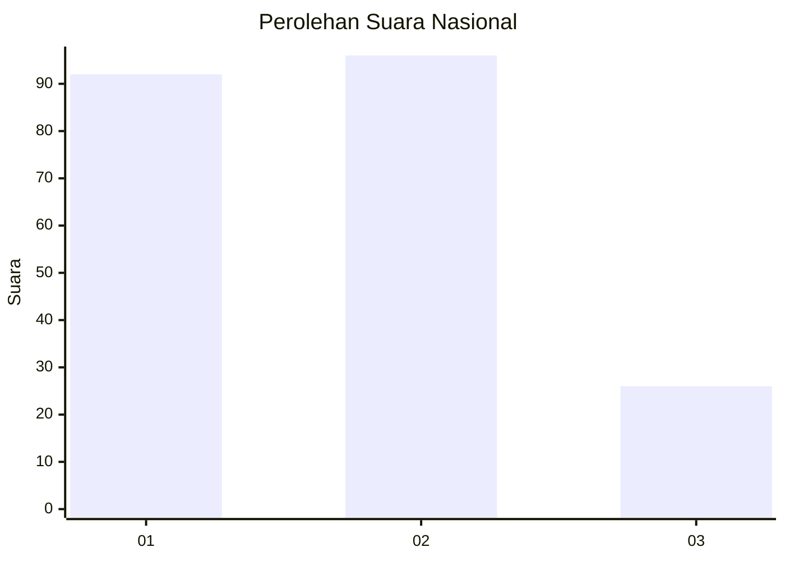
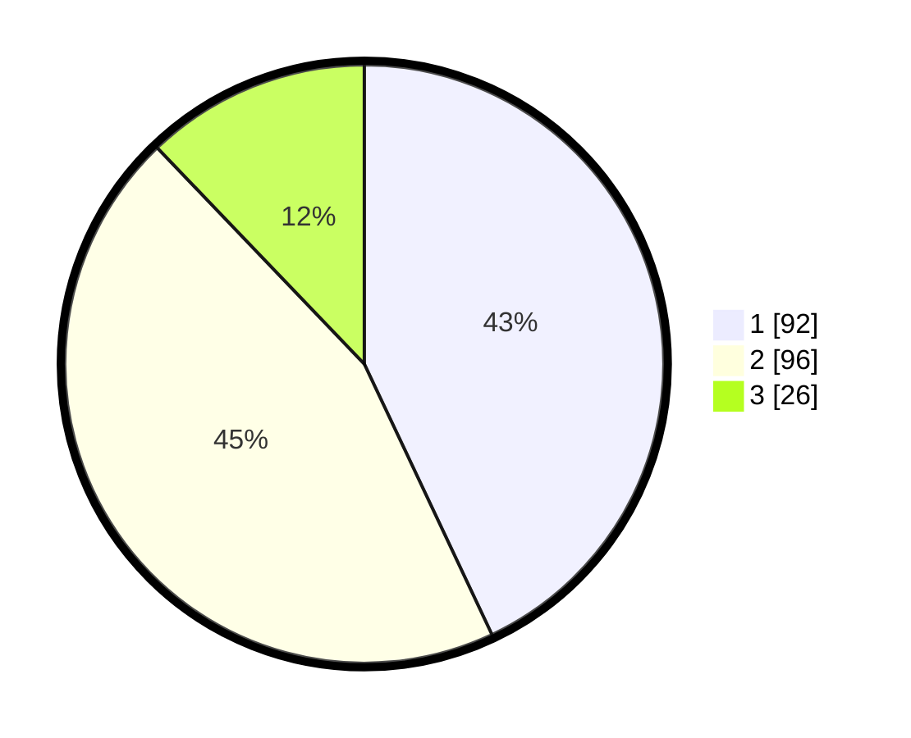

# Hasil

## Grafik

## Tabel

| No.    | Nama Paslon    | Suara | Suara (raw) | Persentase |
|:------ |:-------------- | -----:| -----------:| ----------:|
| 100025 | ANIES MUHAIMIN | 92    | [92][p-1]   | 42,99      |
| 100026 | PRABOWO GIBRAN | 96    | [96][p-2]   | 44,86      |
| 100027 | GANJAR MAHFUD  | 26    | [26][p-3]   | 12,15      |

[p-1]: https://github.com/gigit-pemilu/pemilu-2024/blob/main/pilpres/hitung-suara/sub/31-dki-jakarta/sub/74-jakarta-selatan/sub/10-pesanggrahan/sub/1004-petukangan-selatan/sub/038-tps/sub/paslon-1.txt
[p-2]: https://github.com/gigit-pemilu/pemilu-2024/blob/main/pilpres/hitung-suara/sub/31-dki-jakarta/sub/74-jakarta-selatan/sub/10-pesanggrahan/sub/1004-petukangan-selatan/sub/038-tps/sub/paslon-2.txt
[p-3]: https://github.com/gigit-pemilu/pemilu-2024/blob/main/pilpres/hitung-suara/sub/31-dki-jakarta/sub/74-jakarta-selatan/sub/10-pesanggrahan/sub/1004-petukangan-selatan/sub/038-tps/sub/paslon-3.txt

## Foto C Plano

https://sirekap-obj-formc.kpu.go.id/b180/pemilu/ppwp/31/74/10/10/04/3174101004038-20240214-212441--98f589c6-8d79-4f11-b441-64acb4a0ff0a.jpg

https://sirekap-obj-formc.kpu.go.id/b180/pemilu/ppwp/31/74/10/10/04/3174101004038-20240214-212534--05512f49-219d-4cd8-8afd-ee033c19e586.jpg

https://sirekap-obj-formc.kpu.go.id/b180/pemilu/ppwp/31/74/10/10/04/3174101004038-20240214-212644--4bb879ff-07c4-4688-9890-9f015f61abc2.jpg

## Metadata

| Key        | Value               |
| ---------- | ------------------- |
| Time Stamp | 2024-02-25 22:00:00 |

