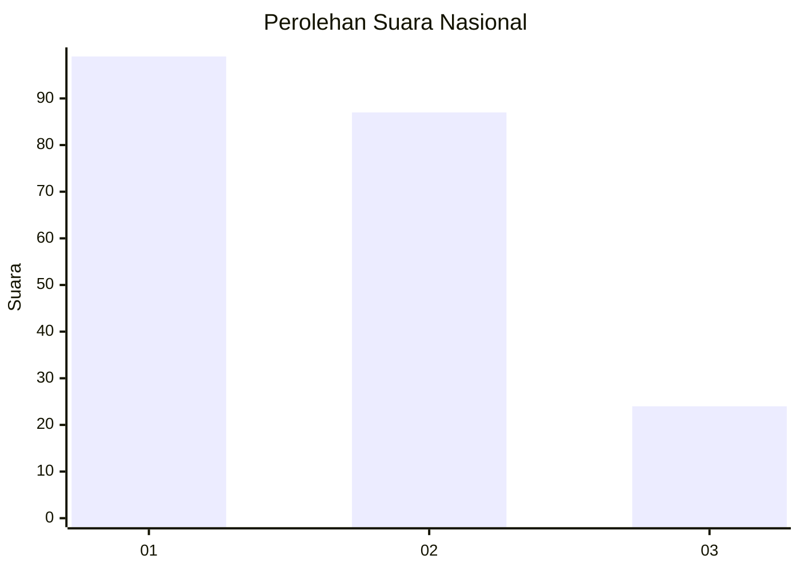
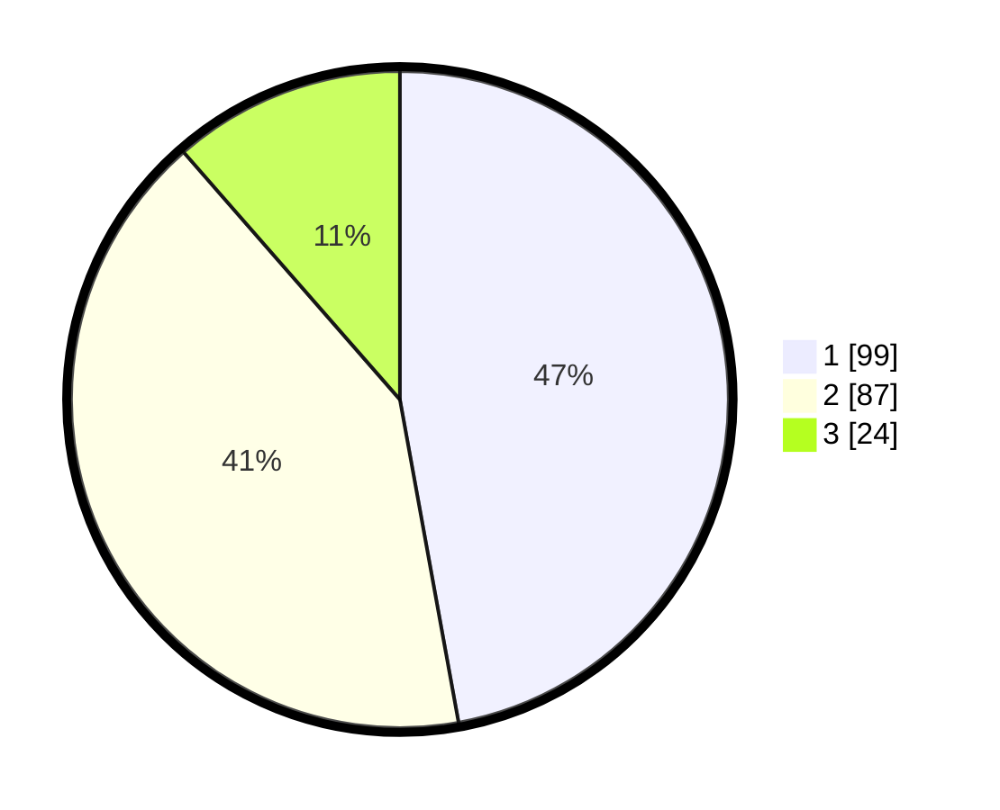

# Hasil

## Grafik

## Tabel

| No.    | Nama Paslon    | Suara | Suara (raw) | Persentase |
|:------ |:-------------- | -----:| -----------:| ----------:|
| 100025 | ANIES MUHAIMIN | 99    | [99][p-1]   | 47,14      |
| 100026 | PRABOWO GIBRAN | 87    | [87][p-2]   | 41,43      |
| 100027 | GANJAR MAHFUD  | 24    | [24][p-3]   | 11,43      |

[p-1]: https://github.com/gigit-pemilu/pemilu-2024/blob/main/pilpres/hitung-suara/sub/31-dki-jakarta/sub/74-jakarta-selatan/sub/10-pesanggrahan/sub/1004-petukangan-selatan/sub/057-tps/sub/paslon-1.txt
[p-2]: https://github.com/gigit-pemilu/pemilu-2024/blob/main/pilpres/hitung-suara/sub/31-dki-jakarta/sub/74-jakarta-selatan/sub/10-pesanggrahan/sub/1004-petukangan-selatan/sub/057-tps/sub/paslon-2.txt
[p-3]: https://github.com/gigit-pemilu/pemilu-2024/blob/main/pilpres/hitung-suara/sub/31-dki-jakarta/sub/74-jakarta-selatan/sub/10-pesanggrahan/sub/1004-petukangan-selatan/sub/057-tps/sub/paslon-3.txt

## Foto C Plano

https://sirekap-obj-formc.kpu.go.id/81ba/pemilu/ppwp/31/74/10/10/04/3174101004057-20240214-232918--dd9bc4ae-2a56-4001-ab24-9f6ff13ed75e.jpg

https://sirekap-obj-formc.kpu.go.id/81ba/pemilu/ppwp/31/74/10/10/04/3174101004057-20240214-232955--786d4331-90b8-419d-893d-329c8431f5e4.jpg

https://sirekap-obj-formc.kpu.go.id/81ba/pemilu/ppwp/31/74/10/10/04/3174101004057-20240214-233025--d2096149-6ef0-42bd-baac-62811e202b52.jpg

## Metadata

| Key        | Value               |
| ---------- | ------------------- |
| Time Stamp | 2024-02-19 09:00:00 |

