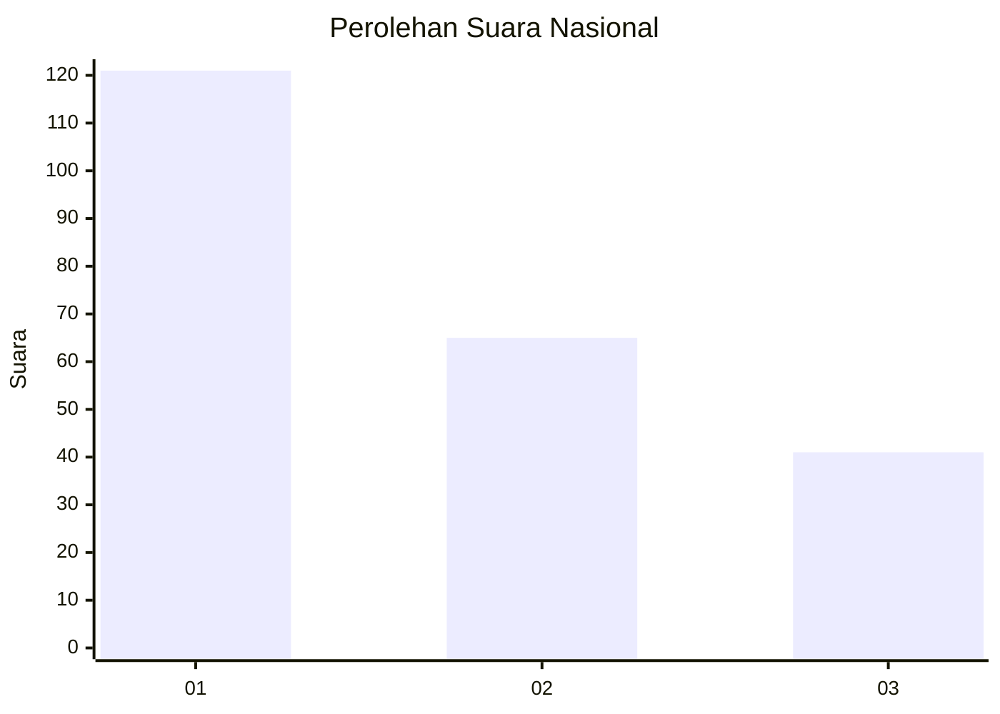
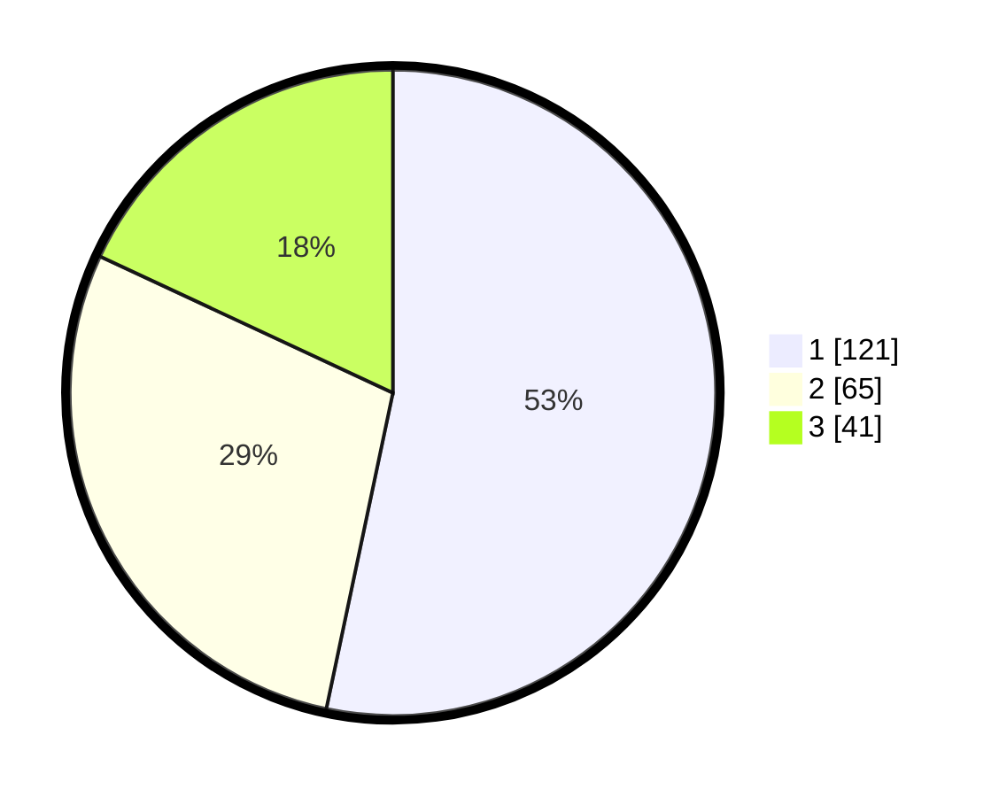

# Hasil

## Grafik

## Tabel

| No.    | Nama Paslon    | Suara | Suara (raw) | Persentase |
|:------ |:-------------- | -----:| -----------:| ----------:|
| 100025 | ANIES MUHAIMIN | 121   | [121][p-1]  | 53,30      |
| 100026 | PRABOWO GIBRAN | 65    | [65][p-2]   | 28,63      |
| 100027 | GANJAR MAHFUD  | 41    | [41][p-3]   | 18,06      |

[p-1]: https://github.com/gigit-pemilu/pemilu-2024/blob/main/pilpres/hitung-suara/sub/31-dki-jakarta/sub/74-jakarta-selatan/sub/10-pesanggrahan/sub/1004-petukangan-selatan/sub/058-tps/sub/paslon-1.txt
[p-2]: https://github.com/gigit-pemilu/pemilu-2024/blob/main/pilpres/hitung-suara/sub/31-dki-jakarta/sub/74-jakarta-selatan/sub/10-pesanggrahan/sub/1004-petukangan-selatan/sub/058-tps/sub/paslon-2.txt
[p-3]: https://github.com/gigit-pemilu/pemilu-2024/blob/main/pilpres/hitung-suara/sub/31-dki-jakarta/sub/74-jakarta-selatan/sub/10-pesanggrahan/sub/1004-petukangan-selatan/sub/058-tps/sub/paslon-3.txt

## Foto C Plano

https://sirekap-obj-formc.kpu.go.id/5238/pemilu/ppwp/31/74/10/10/04/3174101004058-20240214-205834--df050f22-443e-4488-b7b9-a93a5e74c513.jpg

https://sirekap-obj-formc.kpu.go.id/5238/pemilu/ppwp/31/74/10/10/04/3174101004058-20240214-210003--32efbb40-b122-41c6-8921-7a2209642f2b.jpg

https://sirekap-obj-formc.kpu.go.id/5238/pemilu/ppwp/31/74/10/10/04/3174101004058-20240214-210256--e5ccc1aa-d8ed-4059-b8c4-d82d3f3032b5.jpg

## Metadata

| Key        | Value               |
| ---------- | ------------------- |
| Time Stamp | 2024-02-24 22:31:28 |

