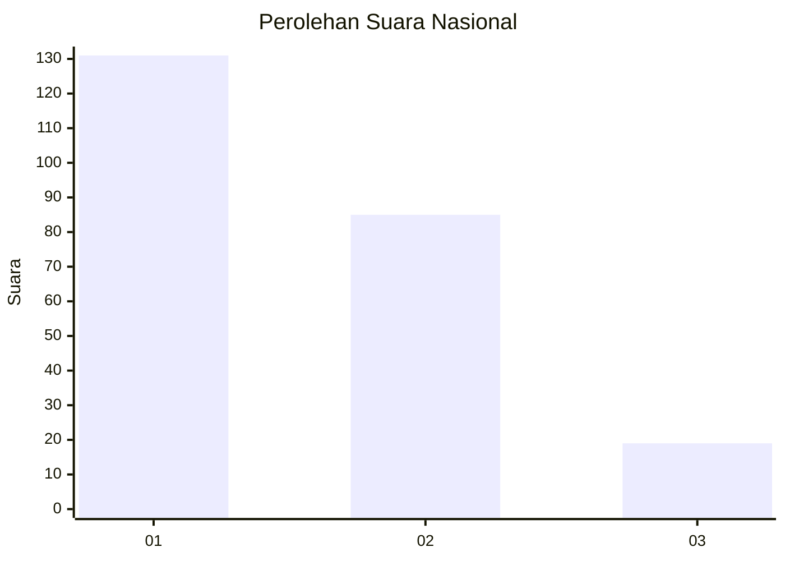
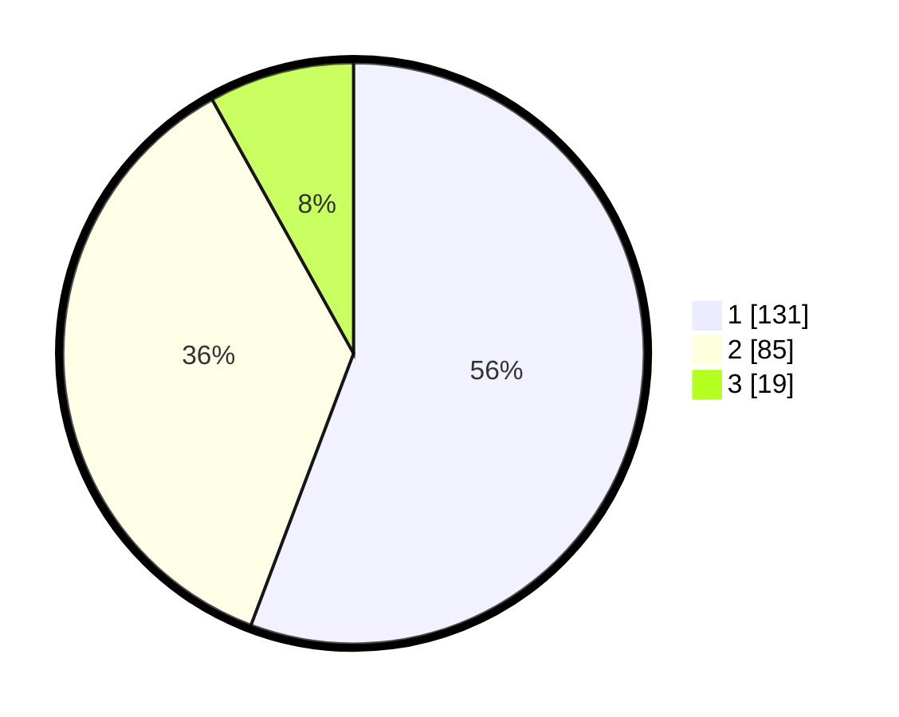

# Hasil

## Grafik

## Tabel

| No.    | Nama Paslon    | Suara | Suara (raw) | Persentase |
|:------ |:-------------- | -----:| -----------:| ----------:|
| 100025 | ANIES MUHAIMIN | 131   | [131][p-1]  | 55,74      |
| 100026 | PRABOWO GIBRAN | 85    | [85][p-2]   | 36,17      |
| 100027 | GANJAR MAHFUD  | 19    | [19][p-3]   | 8,09       |

[p-1]: https://github.com/gigit-pemilu/pemilu-2024/blob/main/pilpres/hitung-suara/sub/31-dki-jakarta/sub/74-jakarta-selatan/sub/10-pesanggrahan/sub/1004-petukangan-selatan/sub/059-tps/sub/paslon-1.txt
[p-2]: https://github.com/gigit-pemilu/pemilu-2024/blob/main/pilpres/hitung-suara/sub/31-dki-jakarta/sub/74-jakarta-selatan/sub/10-pesanggrahan/sub/1004-petukangan-selatan/sub/059-tps/sub/paslon-2.txt
[p-3]: https://github.com/gigit-pemilu/pemilu-2024/blob/main/pilpres/hitung-suara/sub/31-dki-jakarta/sub/74-jakarta-selatan/sub/10-pesanggrahan/sub/1004-petukangan-selatan/sub/059-tps/sub/paslon-3.txt

## Foto C Plano

https://sirekap-obj-formc.kpu.go.id/e351/pemilu/ppwp/31/74/10/10/04/3174101004059-20240214-220630--3e425172-3189-4218-bfca-0ad6ffd3b3da.jpg

https://sirekap-obj-formc.kpu.go.id/e351/pemilu/ppwp/31/74/10/10/04/3174101004059-20240214-221810--fcb5c328-fba8-4c86-9b11-4710597b9308.jpg

https://sirekap-obj-formc.kpu.go.id/e351/pemilu/ppwp/31/74/10/10/04/3174101004059-20240214-221859--7cbb88b1-2ae4-45f5-b8c9-668cd46b9800.jpg

## Metadata

| Key        | Value               |
| ---------- | ------------------- |
| Time Stamp | 2024-02-24 22:31:28 |

