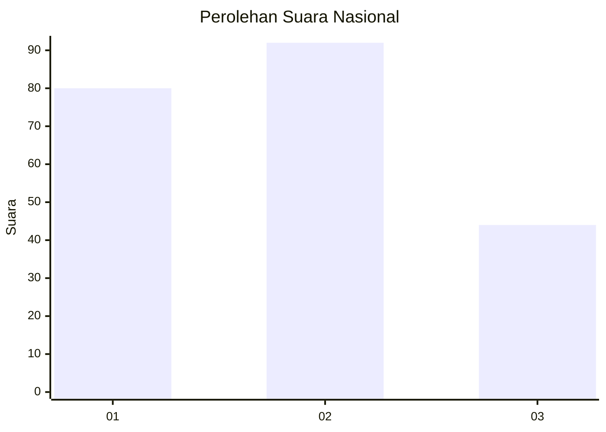
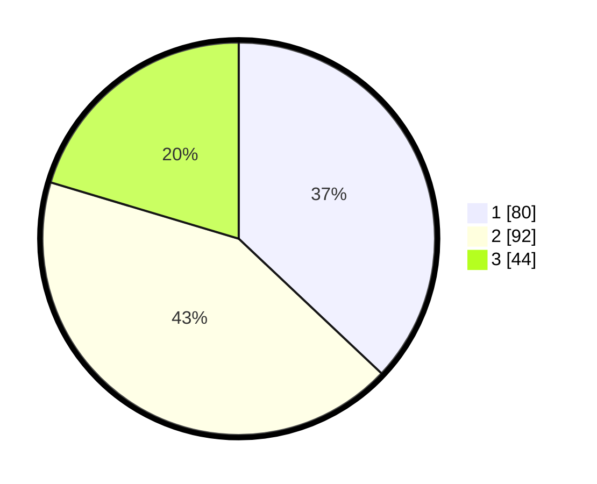

# Hasil

## Grafik

## Tabel

| No.    | Nama Paslon    | Suara | Suara (raw) | Persentase |
|:------ |:-------------- | -----:| -----------:| ----------:|
| 100025 | ANIES MUHAIMIN | 80    | [80][p-1]   | 37,04      |
| 100026 | PRABOWO GIBRAN | 92    | [92][p-2]   | 42,59      |
| 100027 | GANJAR MAHFUD  | 44    | [44][p-3]   | 20,37      |

[p-1]: https://github.com/gigit-pemilu/pemilu-2024/blob/main/pilpres/hitung-suara/sub/31-dki-jakarta/sub/74-jakarta-selatan/sub/10-pesanggrahan/sub/1004-petukangan-selatan/sub/069-tps/sub/paslon-1.txt
[p-2]: https://github.com/gigit-pemilu/pemilu-2024/blob/main/pilpres/hitung-suara/sub/31-dki-jakarta/sub/74-jakarta-selatan/sub/10-pesanggrahan/sub/1004-petukangan-selatan/sub/069-tps/sub/paslon-2.txt
[p-3]: https://github.com/gigit-pemilu/pemilu-2024/blob/main/pilpres/hitung-suara/sub/31-dki-jakarta/sub/74-jakarta-selatan/sub/10-pesanggrahan/sub/1004-petukangan-selatan/sub/069-tps/sub/paslon-3.txt

## Foto C Plano

https://sirekap-obj-formc.kpu.go.id/f966/pemilu/ppwp/31/74/10/10/04/3174101004069-20240214-193654--435c9c31-2d03-4156-b6fe-78db2a28d5a8.jpg

https://sirekap-obj-formc.kpu.go.id/f966/pemilu/ppwp/31/74/10/10/04/3174101004069-20240214-194036--e9373a11-82db-4362-8da3-68b5f05ee24b.jpg

https://sirekap-obj-formc.kpu.go.id/f966/pemilu/ppwp/31/74/10/10/04/3174101004069-20240214-194103--db8cb9ab-1b1f-4892-b420-388bf686fffd.jpg

## Metadata

| Key        | Value               |
| ---------- | ------------------- |
| Time Stamp | 2024-02-24 22:31:28 |

