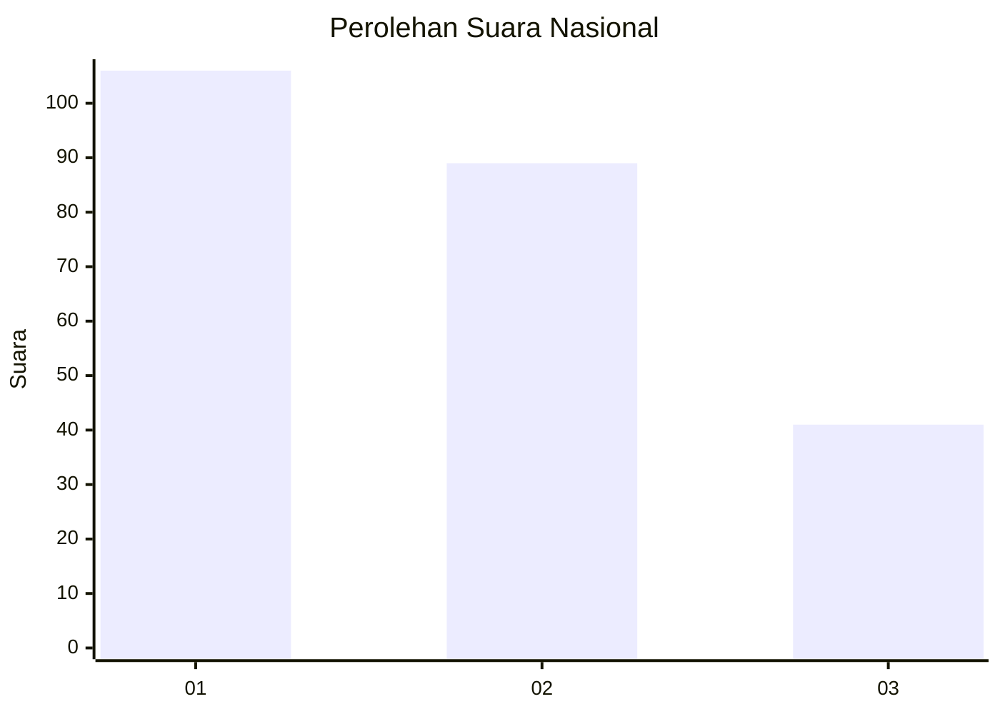
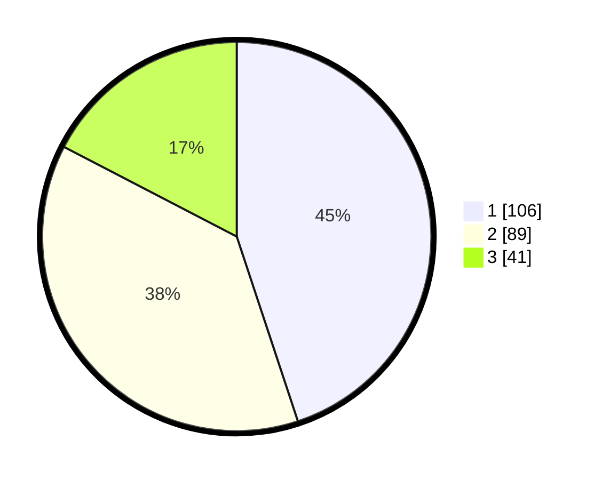

# Hasil

## Grafik

## Tabel

| No.    | Nama Paslon    | Suara | Suara (raw) | Persentase |
|:------ |:-------------- | -----:| -----------:| ----------:|
| 100025 | ANIES MUHAIMIN | 106   | [106][p-1]  | 44,92      |
| 100026 | PRABOWO GIBRAN | 89    | [89][p-2]   | 37,71      |
| 100027 | GANJAR MAHFUD  | 41    | [41][p-3]   | 17,37      |

[p-1]: https://github.com/gigit-pemilu/pemilu-2024/blob/main/pilpres/hitung-suara/sub/31-dki-jakarta/sub/74-jakarta-selatan/sub/10-pesanggrahan/sub/1004-petukangan-selatan/sub/072-tps/sub/paslon-1.txt
[p-2]: https://github.com/gigit-pemilu/pemilu-2024/blob/main/pilpres/hitung-suara/sub/31-dki-jakarta/sub/74-jakarta-selatan/sub/10-pesanggrahan/sub/1004-petukangan-selatan/sub/072-tps/sub/paslon-2.txt
[p-3]: https://github.com/gigit-pemilu/pemilu-2024/blob/main/pilpres/hitung-suara/sub/31-dki-jakarta/sub/74-jakarta-selatan/sub/10-pesanggrahan/sub/1004-petukangan-selatan/sub/072-tps/sub/paslon-3.txt

## Foto C Plano

https://sirekap-obj-formc.kpu.go.id/63f4/pemilu/ppwp/31/74/10/10/04/3174101004072-20240214-205935--36da68b6-508e-48d0-bde2-f6d6ddd1ad2e.jpg

https://sirekap-obj-formc.kpu.go.id/63f4/pemilu/ppwp/31/74/10/10/04/3174101004072-20240214-210250--7a8698b2-644f-47d2-97dd-7c37d00217d3.jpg

https://sirekap-obj-formc.kpu.go.id/63f4/pemilu/ppwp/31/74/10/10/04/3174101004072-20240214-210034--1c2f1fae-cf4b-455f-985e-8f0d0baed1b1.jpg

## Metadata

| Key        | Value               |
| ---------- | ------------------- |
| Time Stamp | 2024-02-24 22:31:28 |

