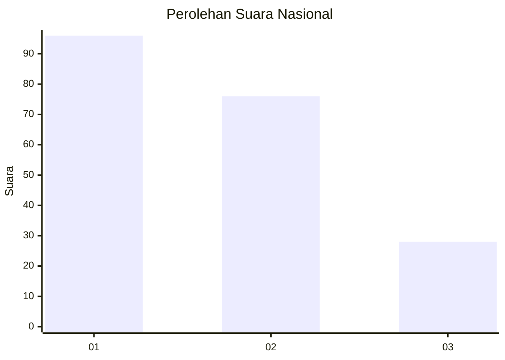
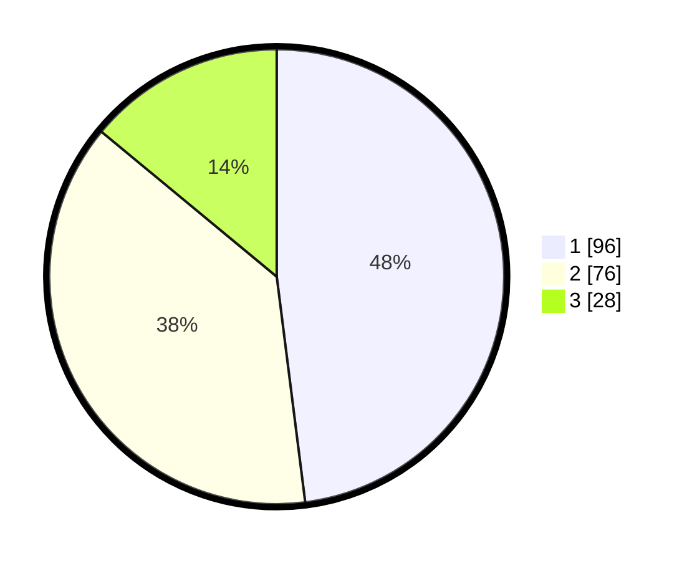

# Hasil

## Grafik

## Tabel

| No.    | Nama Paslon    | Suara | Suara (raw) | Persentase |
|:------ |:-------------- | -----:| -----------:| ----------:|
| 100025 | ANIES MUHAIMIN | 96    | [96][p-1]   | 48,00      |
| 100026 | PRABOWO GIBRAN | 76    | [76][p-2]   | 38,00      |
| 100027 | GANJAR MAHFUD  | 28    | [28][p-3]   | 14,00      |

[p-1]: https://github.com/gigit-pemilu/pemilu-2024/blob/main/pilpres/hitung-suara/sub/31-dki-jakarta/sub/74-jakarta-selatan/sub/10-pesanggrahan/sub/1004-petukangan-selatan/sub/073-tps/sub/paslon-1.txt
[p-2]: https://github.com/gigit-pemilu/pemilu-2024/blob/main/pilpres/hitung-suara/sub/31-dki-jakarta/sub/74-jakarta-selatan/sub/10-pesanggrahan/sub/1004-petukangan-selatan/sub/073-tps/sub/paslon-2.txt
[p-3]: https://github.com/gigit-pemilu/pemilu-2024/blob/main/pilpres/hitung-suara/sub/31-dki-jakarta/sub/74-jakarta-selatan/sub/10-pesanggrahan/sub/1004-petukangan-selatan/sub/073-tps/sub/paslon-3.txt

## Foto C Plano

https://sirekap-obj-formc.kpu.go.id/9cd6/pemilu/ppwp/31/74/10/10/04/3174101004073-20240214-160152--c471f213-65a6-4352-88f6-4509857163d7.jpg

https://sirekap-obj-formc.kpu.go.id/9cd6/pemilu/ppwp/31/74/10/10/04/3174101004073-20240214-185605--73b7d455-49c0-48e7-abc1-3bf6305ff533.jpg

https://sirekap-obj-formc.kpu.go.id/9cd6/pemilu/ppwp/31/74/10/10/04/3174101004073-20240214-185329--f845a357-918a-4a00-b24c-2ac2a98b335c.jpg

## Metadata

| Key        | Value               |
| ---------- | ------------------- |
| Time Stamp | 2024-02-24 22:31:28 |

