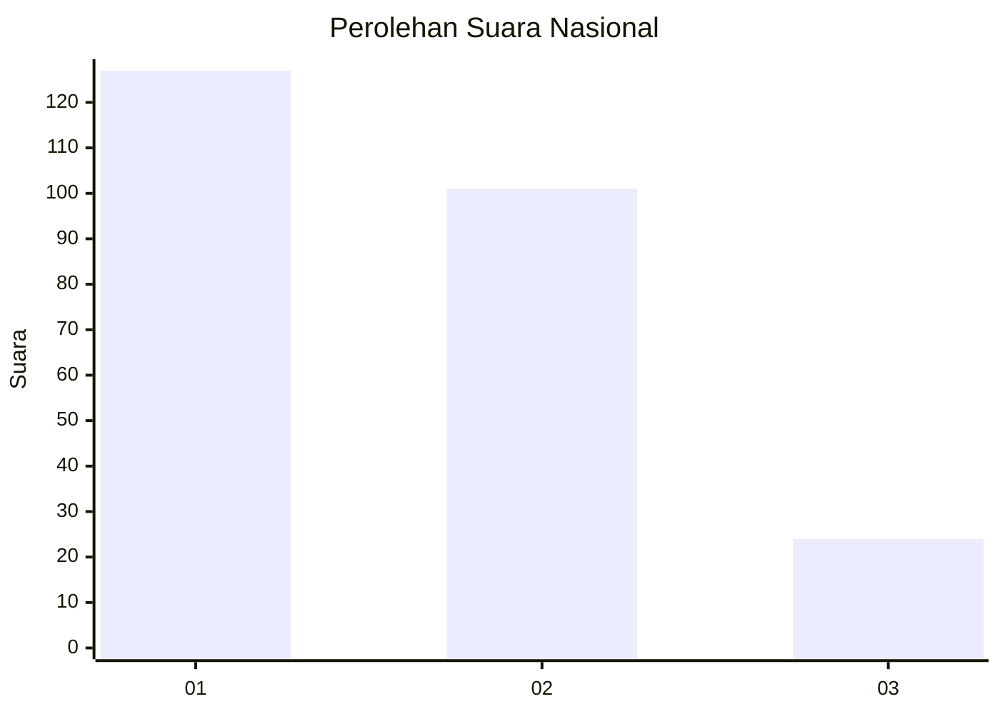
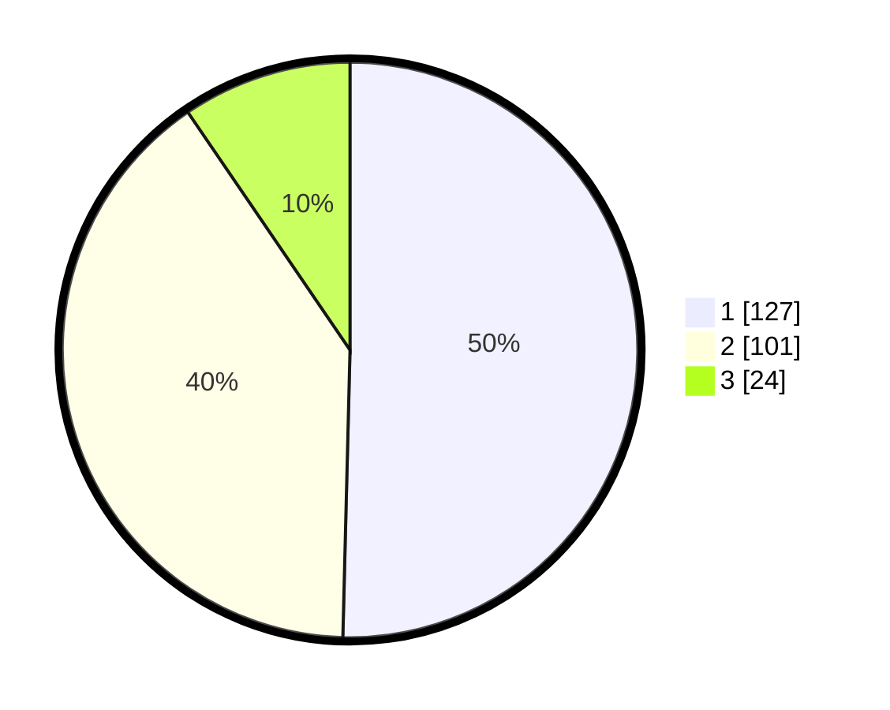

# Hasil

## Grafik

## Tabel

| No.    | Nama Paslon    | Suara | Suara (raw) | Persentase |
|:------ |:-------------- | -----:| -----------:| ----------:|
| 100025 | ANIES MUHAIMIN | 127   | [127][p-1]  | 50,40      |
| 100026 | PRABOWO GIBRAN | 101   | [101][p-2]  | 40,08      |
| 100027 | GANJAR MAHFUD  | 24    | [24][p-3]   | 9,52       |

[p-1]: https://github.com/gigit-pemilu/pemilu-2024/blob/main/pilpres/hitung-suara/sub/31-dki-jakarta/sub/74-jakarta-selatan/sub/10-pesanggrahan/sub/1004-petukangan-selatan/sub/084-tps/sub/paslon-1.txt
[p-2]: https://github.com/gigit-pemilu/pemilu-2024/blob/main/pilpres/hitung-suara/sub/31-dki-jakarta/sub/74-jakarta-selatan/sub/10-pesanggrahan/sub/1004-petukangan-selatan/sub/084-tps/sub/paslon-2.txt
[p-3]: https://github.com/gigit-pemilu/pemilu-2024/blob/main/pilpres/hitung-suara/sub/31-dki-jakarta/sub/74-jakarta-selatan/sub/10-pesanggrahan/sub/1004-petukangan-selatan/sub/084-tps/sub/paslon-3.txt

## Foto C Plano

https://sirekap-obj-formc.kpu.go.id/291d/pemilu/ppwp/31/74/10/10/04/3174101004084-20240215-072456--6c4fbd3e-a93b-4ee7-bdfd-27078061862a.jpg

https://sirekap-obj-formc.kpu.go.id/291d/pemilu/ppwp/31/74/10/10/04/3174101004084-20240215-072630--71fd97fc-dad8-404c-859e-61def5ba5cee.jpg

https://sirekap-obj-formc.kpu.go.id/291d/pemilu/ppwp/31/74/10/10/04/3174101004084-20240215-072729--b9863bf4-c064-44b6-8e37-97ab2ea1a191.jpg

## Metadata

| Key        | Value               |
| ---------- | ------------------- |
| Time Stamp | 2024-02-24 22:31:28 |

