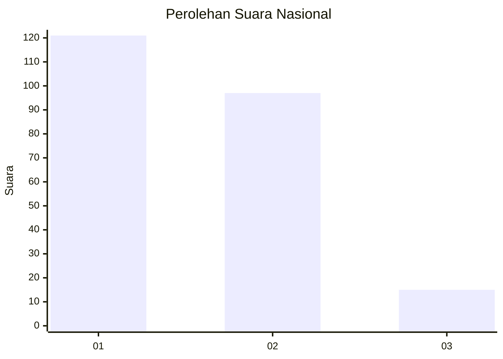
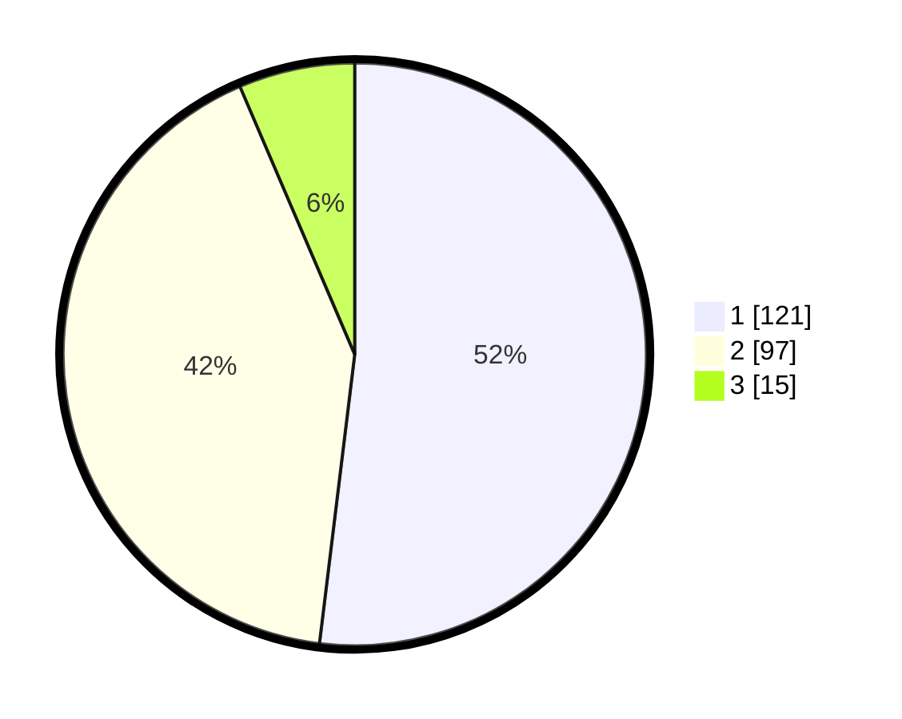

# Hasil

## Grafik

## Tabel

| No.    | Nama Paslon    | Suara | Suara (raw) | Persentase |
|:------ |:-------------- | -----:| -----------:| ----------:|
| 100025 | ANIES MUHAIMIN | 121   | [121][p-1]  | 51,93      |
| 100026 | PRABOWO GIBRAN | 97    | [97][p-2]   | 41,63      |
| 100027 | GANJAR MAHFUD  | 15    | [15][p-3]   | 6,44       |

[p-1]: https://github.com/gigit-pemilu/pemilu-2024/blob/main/pilpres/hitung-suara/sub/31-dki-jakarta/sub/74-jakarta-selatan/sub/10-pesanggrahan/sub/1005-ulujami/sub/071-tps/sub/paslon-1.txt
[p-2]: https://github.com/gigit-pemilu/pemilu-2024/blob/main/pilpres/hitung-suara/sub/31-dki-jakarta/sub/74-jakarta-selatan/sub/10-pesanggrahan/sub/1005-ulujami/sub/071-tps/sub/paslon-2.txt
[p-3]: https://github.com/gigit-pemilu/pemilu-2024/blob/main/pilpres/hitung-suara/sub/31-dki-jakarta/sub/74-jakarta-selatan/sub/10-pesanggrahan/sub/1005-ulujami/sub/071-tps/sub/paslon-3.txt

## Foto C Plano

https://sirekap-obj-formc.kpu.go.id/af4d/pemilu/ppwp/31/74/10/10/05/3174101005071-20240214-213206--b46318a0-351d-45ba-91ee-d1454b601cbe.jpg

https://sirekap-obj-formc.kpu.go.id/af4d/pemilu/ppwp/31/74/10/10/05/3174101005071-20240214-213842--72d1e28b-07ee-4a6c-9e7f-56b3c33bbde3.jpg

https://sirekap-obj-formc.kpu.go.id/af4d/pemilu/ppwp/31/74/10/10/05/3174101005071-20240214-214422--ed279546-409a-4dd8-a81b-429f1867c4fd.jpg

## Metadata

| Key        | Value               |
| ---------- | ------------------- |
| Time Stamp | 2024-02-24 22:31:28 |

