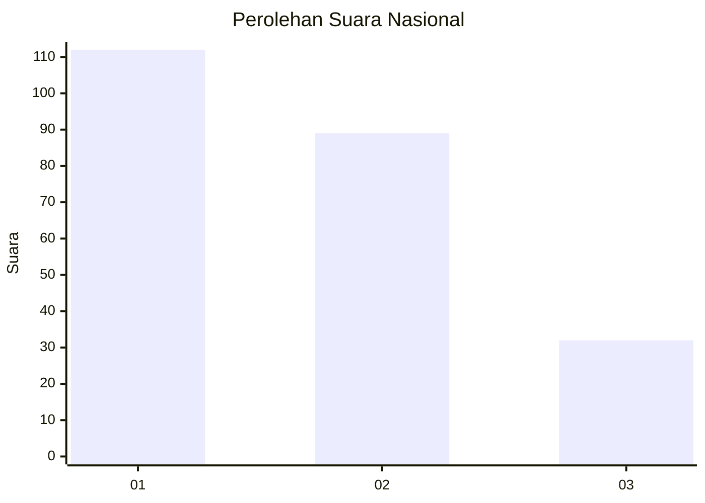
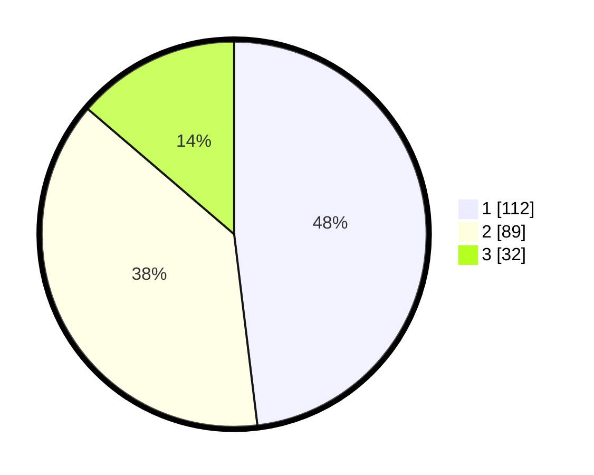

# Hasil

## Grafik

## Tabel

| No.    | Nama Paslon    | Suara | Suara (raw) | Persentase |
|:------ |:-------------- | -----:| -----------:| ----------:|
| 100025 | ANIES MUHAIMIN | 112   | [112][p-1]  | 48,07      |
| 100026 | PRABOWO GIBRAN | 89    | [89][p-2]   | 38,20      |
| 100027 | GANJAR MAHFUD  | 32    | [32][p-3]   | 13,73      |

[p-1]: https://github.com/gigit-pemilu/pemilu-2024/blob/main/pilpres/hitung-suara/sub/31-dki-jakarta/sub/74-jakarta-selatan/sub/10-pesanggrahan/sub/1005-ulujami/sub/072-tps/sub/paslon-1.txt
[p-2]: https://github.com/gigit-pemilu/pemilu-2024/blob/main/pilpres/hitung-suara/sub/31-dki-jakarta/sub/74-jakarta-selatan/sub/10-pesanggrahan/sub/1005-ulujami/sub/072-tps/sub/paslon-2.txt
[p-3]: https://github.com/gigit-pemilu/pemilu-2024/blob/main/pilpres/hitung-suara/sub/31-dki-jakarta/sub/74-jakarta-selatan/sub/10-pesanggrahan/sub/1005-ulujami/sub/072-tps/sub/paslon-3.txt

## Foto C Plano

https://sirekap-obj-formc.kpu.go.id/6f9f/pemilu/ppwp/31/74/10/10/05/3174101005072-20240214-220855--8df2fb59-e5f0-49b9-8e87-7f6f4b366af8.jpg

https://sirekap-obj-formc.kpu.go.id/6f9f/pemilu/ppwp/31/74/10/10/05/3174101005072-20240214-221022--c3785b5f-1882-4086-b12d-b2241e524ed1.jpg

https://sirekap-obj-formc.kpu.go.id/6f9f/pemilu/ppwp/31/74/10/10/05/3174101005072-20240214-221222--786e9048-9fdf-473a-8bba-d870debf2622.jpg

## Metadata

| Key        | Value               |
| ---------- | ------------------- |
| Time Stamp | 2024-02-26 15:00:00 |

