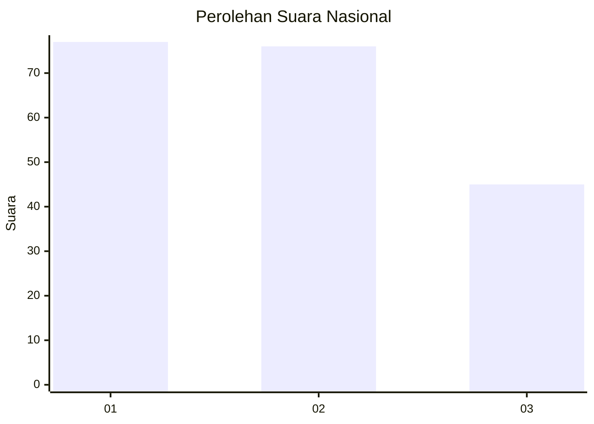
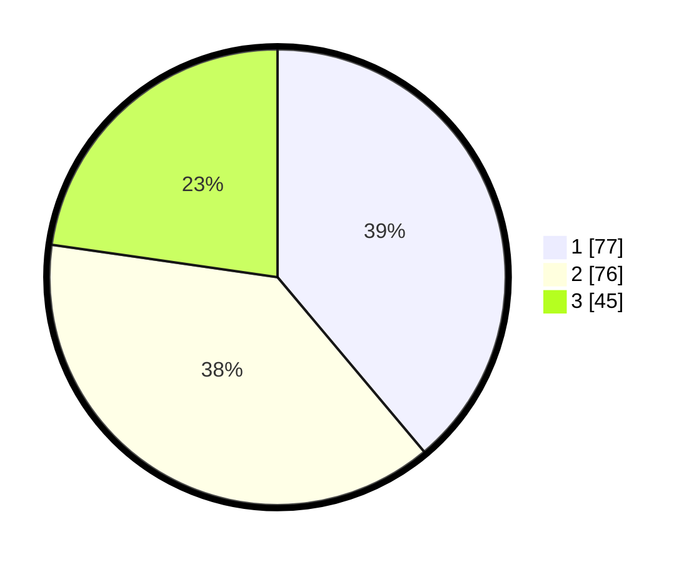

# Hasil

## Grafik

## Tabel

| No.    | Nama Paslon    | Suara | Suara (raw) | Persentase |
|:------ |:-------------- | -----:| -----------:| ----------:|
| 100025 | ANIES MUHAIMIN | 77    | [77][p-1]   | 38,89      |
| 100026 | PRABOWO GIBRAN | 76    | [76][p-2]   | 38,38      |
| 100027 | GANJAR MAHFUD  | 45    | [45][p-3]   | 22,73      |

[p-1]: https://github.com/gigit-pemilu/pemilu-2024/blob/main/pilpres/hitung-suara/sub/31-dki-jakarta/sub/74-jakarta-selatan/sub/10-pesanggrahan/sub/1005-ulujami/sub/119-tps/sub/paslon-1.txt
[p-2]: https://github.com/gigit-pemilu/pemilu-2024/blob/main/pilpres/hitung-suara/sub/31-dki-jakarta/sub/74-jakarta-selatan/sub/10-pesanggrahan/sub/1005-ulujami/sub/119-tps/sub/paslon-2.txt
[p-3]: https://github.com/gigit-pemilu/pemilu-2024/blob/main/pilpres/hitung-suara/sub/31-dki-jakarta/sub/74-jakarta-selatan/sub/10-pesanggrahan/sub/1005-ulujami/sub/119-tps/sub/paslon-3.txt

## Foto C Plano

https://sirekap-obj-formc.kpu.go.id/ecfc/pemilu/ppwp/31/74/10/10/05/3174101005119-20240214-222725--b464a052-1839-4618-bf45-a3f34b2f6289.jpg

https://sirekap-obj-formc.kpu.go.id/ecfc/pemilu/ppwp/31/74/10/10/05/3174101005119-20240214-222817--02304dbd-ce98-4907-b758-7c003e62c9c6.jpg

https://sirekap-obj-formc.kpu.go.id/ecfc/pemilu/ppwp/31/74/10/10/05/3174101005119-20240214-222929--feb7ef39-fe96-44f1-a30c-edbc160db334.jpg

## Metadata

| Key        | Value               |
| ---------- | ------------------- |
| Time Stamp | 2024-02-24 22:31:28 |

