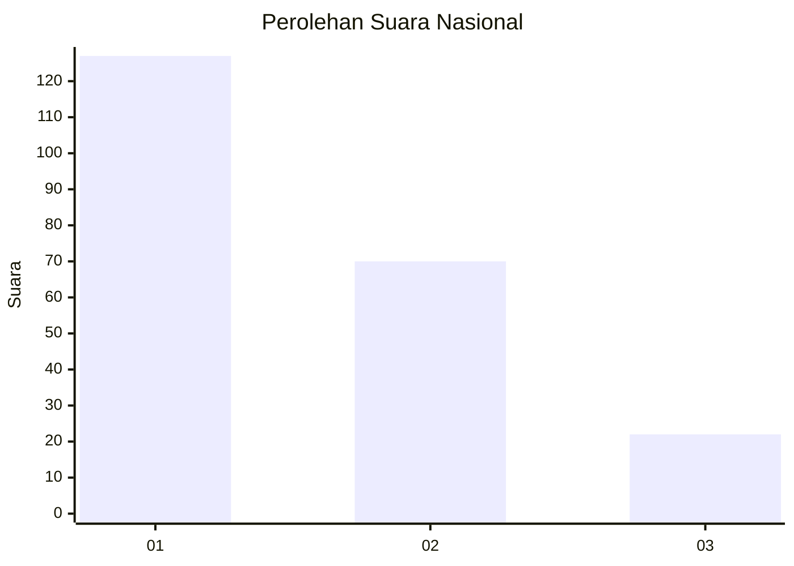
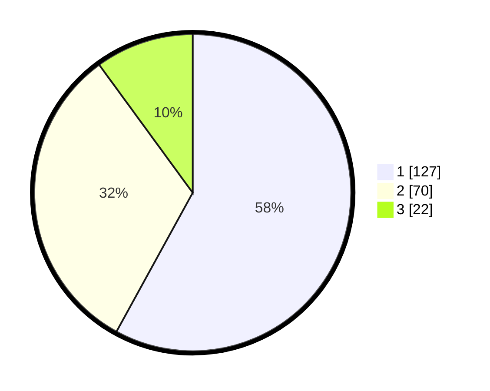

# Hasil

## Grafik

## Tabel

| No.    | Nama Paslon    | Suara | Suara (raw) | Persentase |
|:------ |:-------------- | -----:| -----------:| ----------:|
| 100025 | ANIES MUHAIMIN | 127   | [127][p-1]  | 57,99      |
| 100026 | PRABOWO GIBRAN | 70    | [70][p-2]   | 31,96      |
| 100027 | GANJAR MAHFUD  | 22    | [22][p-3]   | 10,05      |

[p-1]: https://github.com/gigit-pemilu/pemilu-2024/blob/main/pilpres/hitung-suara/sub/31-dki-jakarta/sub/74-jakarta-selatan/sub/10-pesanggrahan/sub/1005-ulujami/sub/132-tps/sub/paslon-1.txt
[p-2]: https://github.com/gigit-pemilu/pemilu-2024/blob/main/pilpres/hitung-suara/sub/31-dki-jakarta/sub/74-jakarta-selatan/sub/10-pesanggrahan/sub/1005-ulujami/sub/132-tps/sub/paslon-2.txt
[p-3]: https://github.com/gigit-pemilu/pemilu-2024/blob/main/pilpres/hitung-suara/sub/31-dki-jakarta/sub/74-jakarta-selatan/sub/10-pesanggrahan/sub/1005-ulujami/sub/132-tps/sub/paslon-3.txt

## Foto C Plano

https://sirekap-obj-formc.kpu.go.id/e835/pemilu/ppwp/31/74/10/10/05/3174101005132-20240214-234404--50c1feea-7d0f-40ae-bc47-10d1d5716b45.jpg

https://sirekap-obj-formc.kpu.go.id/e835/pemilu/ppwp/31/74/10/10/05/3174101005132-20240214-211648--e546f466-34ef-4802-96bd-e40849b06956.jpg

https://sirekap-obj-formc.kpu.go.id/e835/pemilu/ppwp/31/74/10/10/05/3174101005132-20240214-234556--aa37dc43-da57-4486-9783-0f8130b2a4bf.jpg

## Metadata

| Key        | Value               |
| ---------- | ------------------- |
| Time Stamp | 2024-02-24 22:31:28 |

