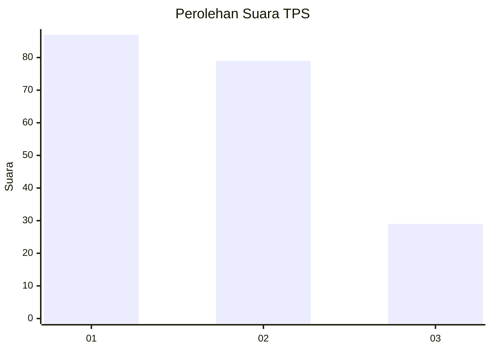
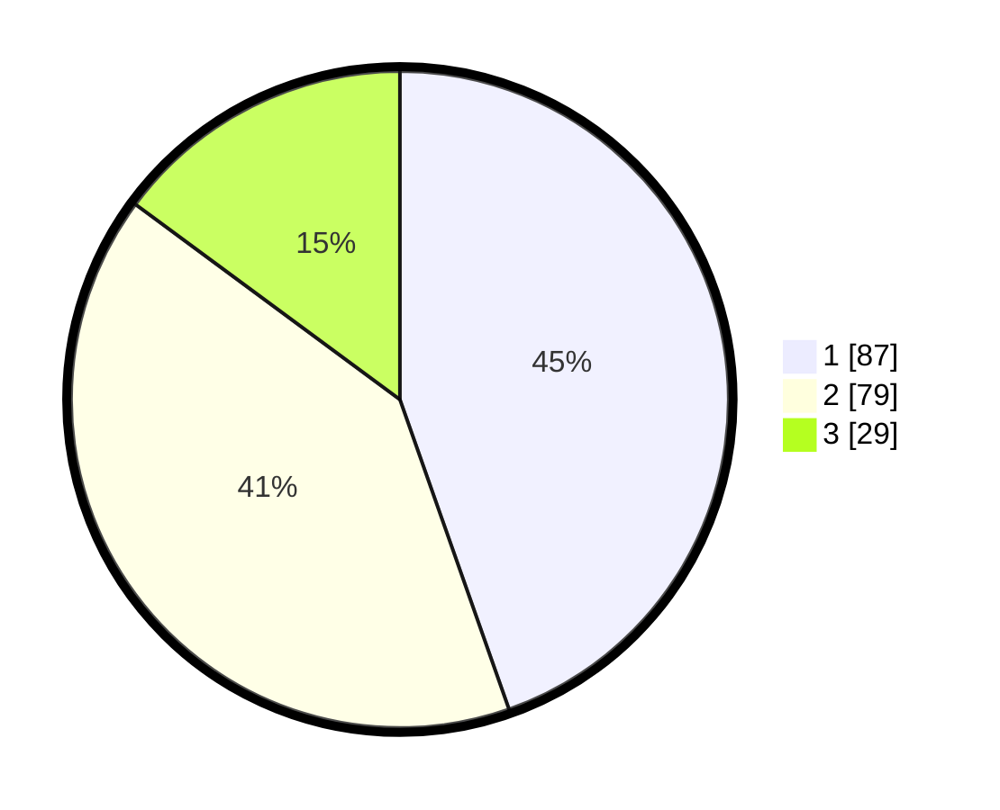

# Hasil

## Grafik

## Tabel

| No. | Nama Paslon    | Suara | Suara (raw) | Persentase |
|:--- |:-------------- | -----:| -----------:| ----------:|
| 1   | ANIES MUHAIMIN | 87    | [87][p-1]   | 44,62      |
| 2   | PRABOWO GIBRAN | 79    | [79][p-2]   | 40,51      |
| 3   | GANJAR MAHFUD  | 29    | [29][p-3]   | 14,87      |

[p-1]: https://github.com/gigit-pemilu/pemilu-2024-31-dki-jakarta/blob/main/pilpres/hitung-suara/sub/31-dki-jakarta/sub/75-jakarta-timur/sub/01-matraman/sub/1001-pisangan-baru/sub/005-tps/sub/paslon-1.txt
[p-2]: https://github.com/gigit-pemilu/pemilu-2024-31-dki-jakarta/blob/main/pilpres/hitung-suara/sub/31-dki-jakarta/sub/75-jakarta-timur/sub/01-matraman/sub/1001-pisangan-baru/sub/005-tps/sub/paslon-2.txt
[p-3]: https://github.com/gigit-pemilu/pemilu-2024-31-dki-jakarta/blob/main/pilpres/hitung-suara/sub/31-dki-jakarta/sub/75-jakarta-timur/sub/01-matraman/sub/1001-pisangan-baru/sub/005-tps/sub/paslon-3.txt

## Foto C Plano

https://sirekap-obj-formc.kpu.go.id/2566/pemilu/ppwp/31/75/01/10/01/3175011001005-20240215-053436--d3f261f1-da9c-4da7-95d5-457f995cd1b2.jpg

https://sirekap-obj-formc.kpu.go.id/2566/pemilu/ppwp/31/75/01/10/01/3175011001005-20240215-053617--6b063192-262a-4ca4-8de6-07629d8511db.jpg

https://sirekap-obj-formc.kpu.go.id/2566/pemilu/ppwp/31/75/01/10/01/3175011001005-20240215-053719--f1aea39e-791e-4eee-94b5-cc595dbf8b4f.jpg

## Metadata

| Key        | Value               |
| ---------- | ------------------- |
| Time Stamp | 2024-02-15 17:30:25 |

