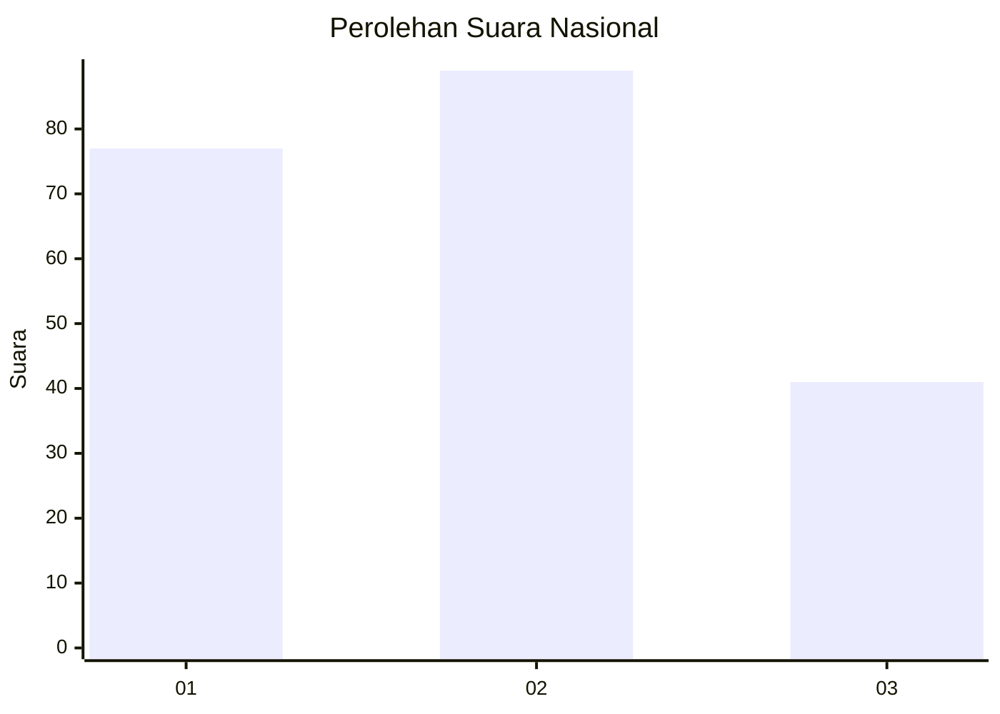
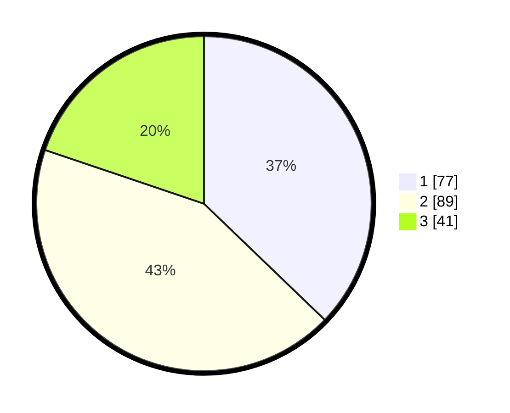

# Hasil

## Grafik

## Tabel

| No. | Nama Paslon    | Suara | Suara (raw) | Persentase |
|:--- |:-------------- | -----:| -----------:| ----------:|
| 1   | ANIES MUHAIMIN | 77    | [77][p-1]   | 37,20      |
| 2   | PRABOWO GIBRAN | 89    | [89][p-2]   | 43,00      |
| 3   | GANJAR MAHFUD  | 41    | [41][p-3]   | 19,81      |

[p-1]: https://github.com/gigit-pemilu/pemilu-2024/blob/main/pilpres/hitung-suara/sub/31-dki-jakarta/sub/75-jakarta-timur/sub/01-matraman/sub/1001-pisangan-baru/sub/009-tps/sub/paslon-1.txt
[p-2]: https://github.com/gigit-pemilu/pemilu-2024/blob/main/pilpres/hitung-suara/sub/31-dki-jakarta/sub/75-jakarta-timur/sub/01-matraman/sub/1001-pisangan-baru/sub/009-tps/sub/paslon-2.txt
[p-3]: https://github.com/gigit-pemilu/pemilu-2024/blob/main/pilpres/hitung-suara/sub/31-dki-jakarta/sub/75-jakarta-timur/sub/01-matraman/sub/1001-pisangan-baru/sub/009-tps/sub/paslon-3.txt

## Foto C Plano

https://sirekap-obj-formc.kpu.go.id/9c31/pemilu/ppwp/31/75/01/10/01/3175011001009-20240214-214650--af2294aa-fdeb-49ad-bb11-4da9c581b355.jpg

https://sirekap-obj-formc.kpu.go.id/9c31/pemilu/ppwp/31/75/01/10/01/3175011001009-20240214-205334--39e7b433-6a41-431c-a87b-31c9ffeb85de.jpg

https://sirekap-obj-formc.kpu.go.id/9c31/pemilu/ppwp/31/75/01/10/01/3175011001009-20240214-231410--870ee213-c3f1-4372-a484-a0bbad2e777c.jpg

## Metadata

| Key        | Value               |
| ---------- | ------------------- |
| Time Stamp | 2024-02-15 15:00:29 |

