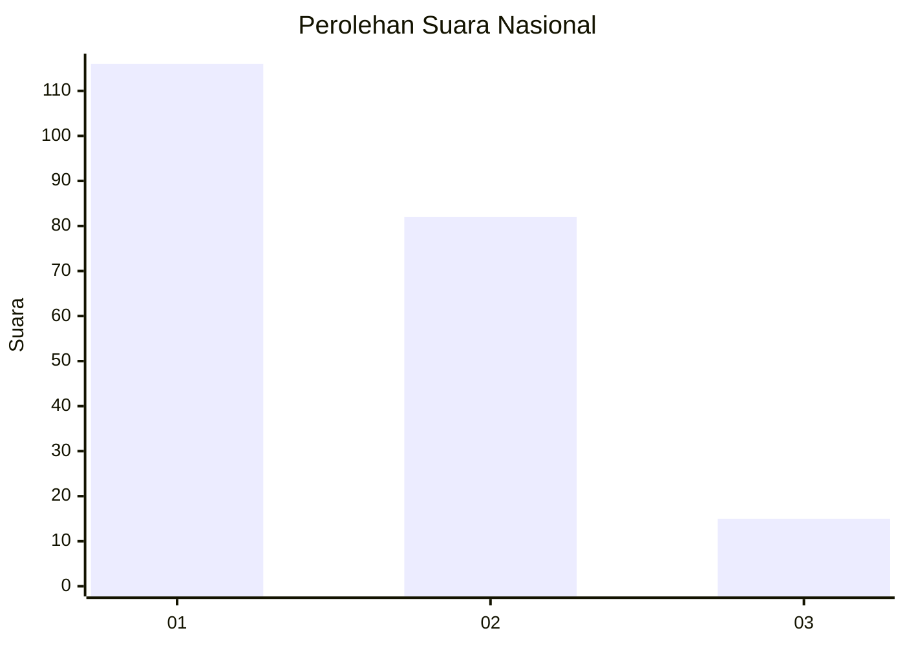
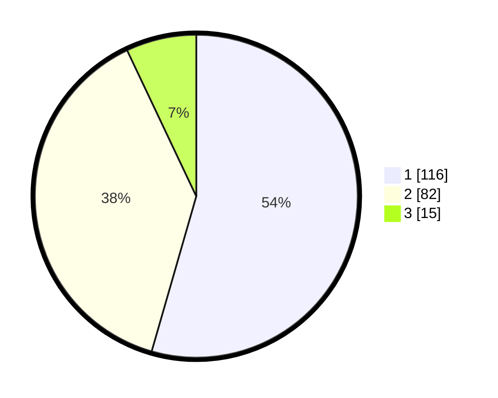

# Hasil

## Grafik

## Tabel

| No.    | Nama Paslon    | Suara | Suara (raw) | Persentase |
|:------ |:-------------- | -----:| -----------:| ----------:|
| 100025 | ANIES MUHAIMIN | 116   | [116][p-1]  | 54,46      |
| 100026 | PRABOWO GIBRAN | 82    | [82][p-2]   | 38,50      |
| 100027 | GANJAR MAHFUD  | 15    | [15][p-3]   | 7,04       |

[p-1]: https://github.com/gigit-pemilu/pemilu-2024/blob/main/pilpres/hitung-suara/sub/31-dki-jakarta/sub/75-jakarta-timur/sub/01-matraman/sub/1001-pisangan-baru/sub/010-tps/sub/paslon-1.txt
[p-2]: https://github.com/gigit-pemilu/pemilu-2024/blob/main/pilpres/hitung-suara/sub/31-dki-jakarta/sub/75-jakarta-timur/sub/01-matraman/sub/1001-pisangan-baru/sub/010-tps/sub/paslon-2.txt
[p-3]: https://github.com/gigit-pemilu/pemilu-2024/blob/main/pilpres/hitung-suara/sub/31-dki-jakarta/sub/75-jakarta-timur/sub/01-matraman/sub/1001-pisangan-baru/sub/010-tps/sub/paslon-3.txt

## Foto C Plano

https://sirekap-obj-formc.kpu.go.id/da27/pemilu/ppwp/31/75/01/10/01/3175011001010-20240214-190648--9a6659df-ef7f-4494-8acc-786125b79e96.jpg

https://sirekap-obj-formc.kpu.go.id/da27/pemilu/ppwp/31/75/01/10/01/3175011001010-20240214-190944--5a73707b-2e45-4a2f-aa16-52baea402a05.jpg

https://sirekap-obj-formc.kpu.go.id/da27/pemilu/ppwp/31/75/01/10/01/3175011001010-20240214-200221--8ac5a58f-bfed-4869-ad1e-31d8db9da1a4.jpg

## Metadata

| Key        | Value               |
| ---------- | ------------------- |
| Time Stamp | 2024-02-15 12:00:28 |

