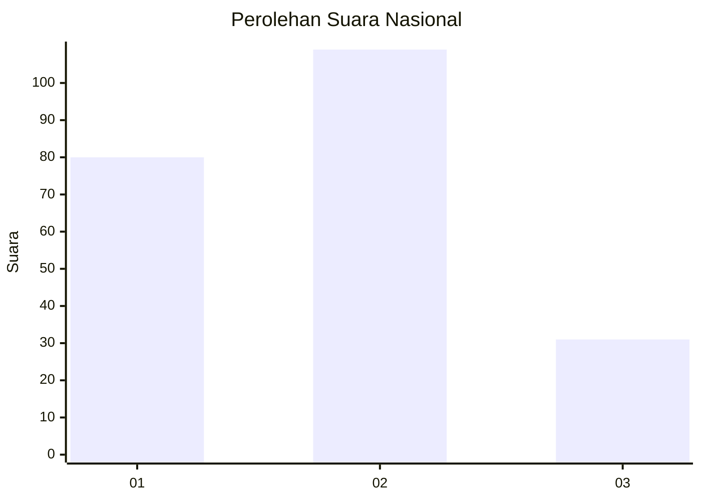
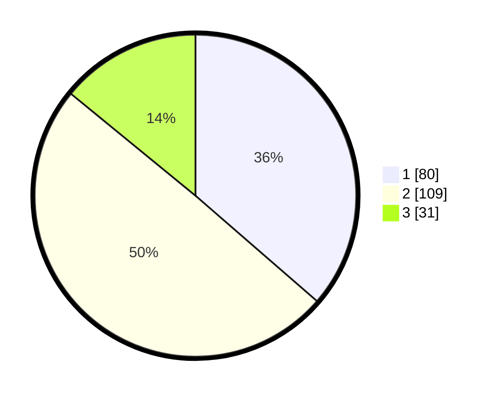

# Hasil

## Grafik

## Tabel

| No.    | Nama Paslon    | Suara | Suara (raw) | Persentase |
|:------ |:-------------- | -----:| -----------:| ----------:|
| 100025 | ANIES MUHAIMIN | 80    | [80][p-1]   | 36,36      |
| 100026 | PRABOWO GIBRAN | 109   | [109][p-2]  | 49,55      |
| 100027 | GANJAR MAHFUD  | 31    | [31][p-3]   | 14,09      |

[p-1]: https://github.com/gigit-pemilu/pemilu-2024/blob/main/pilpres/hitung-suara/sub/31-dki-jakarta/sub/75-jakarta-timur/sub/01-matraman/sub/1001-pisangan-baru/sub/013-tps/sub/paslon-1.txt
[p-2]: https://github.com/gigit-pemilu/pemilu-2024/blob/main/pilpres/hitung-suara/sub/31-dki-jakarta/sub/75-jakarta-timur/sub/01-matraman/sub/1001-pisangan-baru/sub/013-tps/sub/paslon-2.txt
[p-3]: https://github.com/gigit-pemilu/pemilu-2024/blob/main/pilpres/hitung-suara/sub/31-dki-jakarta/sub/75-jakarta-timur/sub/01-matraman/sub/1001-pisangan-baru/sub/013-tps/sub/paslon-3.txt

## Foto C Plano

https://sirekap-obj-formc.kpu.go.id/168d/pemilu/ppwp/31/75/01/10/01/3175011001013-20240214-200846--e6b19987-0e03-49d7-aeaf-554c52c30afb.jpg

https://sirekap-obj-formc.kpu.go.id/168d/pemilu/ppwp/31/75/01/10/01/3175011001013-20240214-214717--becab3b4-4e7d-4b3c-849d-e0d6e3cf727a.jpg

https://sirekap-obj-formc.kpu.go.id/168d/pemilu/ppwp/31/75/01/10/01/3175011001013-20240214-214544--70a86aa3-fa0b-46e6-9861-1c5fb1464b96.jpg

## Metadata

| Key        | Value               |
| ---------- | ------------------- |
| Time Stamp | 2024-02-15 22:30:27 |

