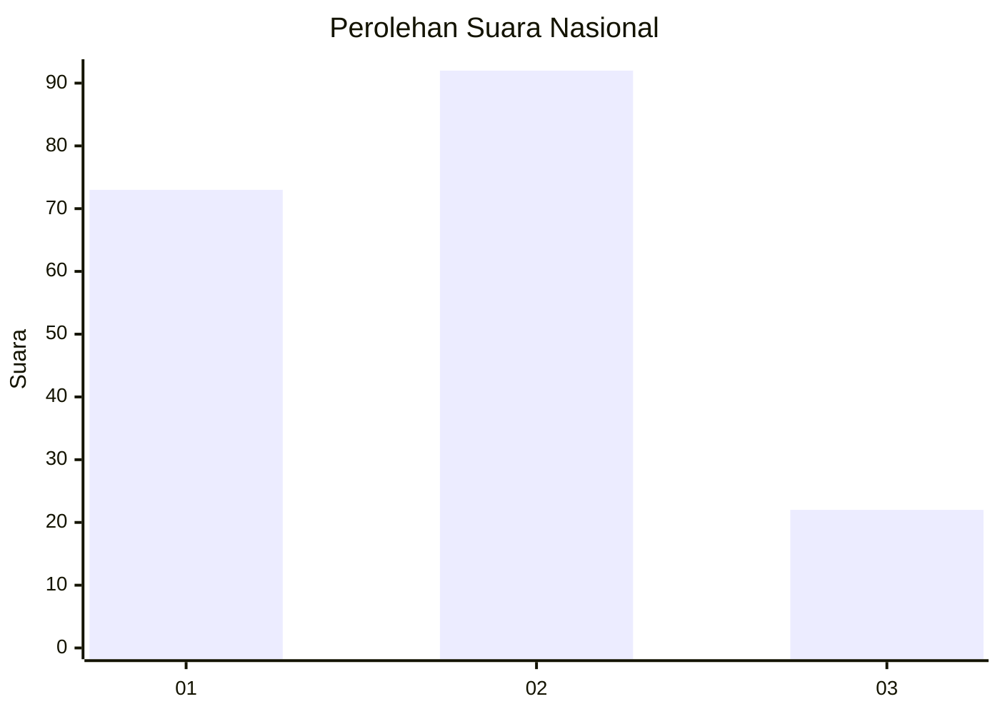
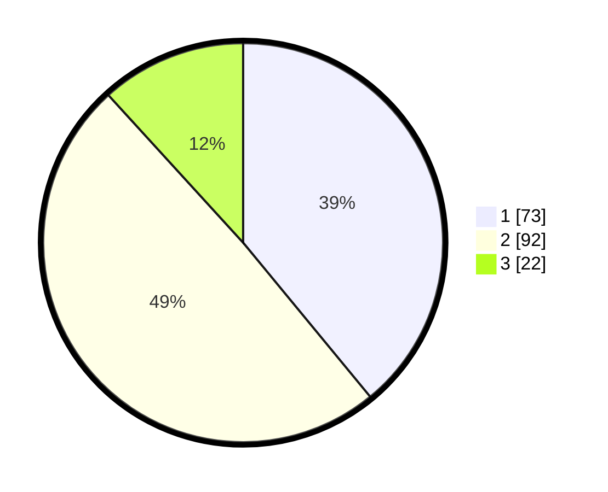

# Hasil

## Grafik

## Tabel

| No.    | Nama Paslon    | Suara | Suara (raw) | Persentase |
|:------ |:-------------- | -----:| -----------:| ----------:|
| 100025 | ANIES MUHAIMIN | 73    | [73][p-1]   | 39,04      |
| 100026 | PRABOWO GIBRAN | 92    | [92][p-2]   | 49,20      |
| 100027 | GANJAR MAHFUD  | 22    | [22][p-3]   | 11,76      |

[p-1]: https://github.com/gigit-pemilu/pemilu-2024/blob/main/pilpres/hitung-suara/sub/31-dki-jakarta/sub/75-jakarta-timur/sub/01-matraman/sub/1001-pisangan-baru/sub/014-tps/sub/paslon-1.txt
[p-2]: https://github.com/gigit-pemilu/pemilu-2024/blob/main/pilpres/hitung-suara/sub/31-dki-jakarta/sub/75-jakarta-timur/sub/01-matraman/sub/1001-pisangan-baru/sub/014-tps/sub/paslon-2.txt
[p-3]: https://github.com/gigit-pemilu/pemilu-2024/blob/main/pilpres/hitung-suara/sub/31-dki-jakarta/sub/75-jakarta-timur/sub/01-matraman/sub/1001-pisangan-baru/sub/014-tps/sub/paslon-3.txt

## Foto C Plano

https://sirekap-obj-formc.kpu.go.id/d685/pemilu/ppwp/31/75/01/10/01/3175011001014-20240216-145007--b8a33818-3182-41cc-8b29-c95a3564febf.jpg

https://sirekap-obj-formc.kpu.go.id/d685/pemilu/ppwp/31/75/01/10/01/3175011001014-20240216-145039--13eb3ede-5952-48f5-8401-98829b7cc696.jpg

https://sirekap-obj-formc.kpu.go.id/d685/pemilu/ppwp/31/75/01/10/01/3175011001014-20240216-145032--59a19c62-941a-4552-bc55-dd1c809bf75d.jpg

## Metadata

| Key        | Value               |
| ---------- | ------------------- |
| Time Stamp | 2024-02-16 16:25:10 |

