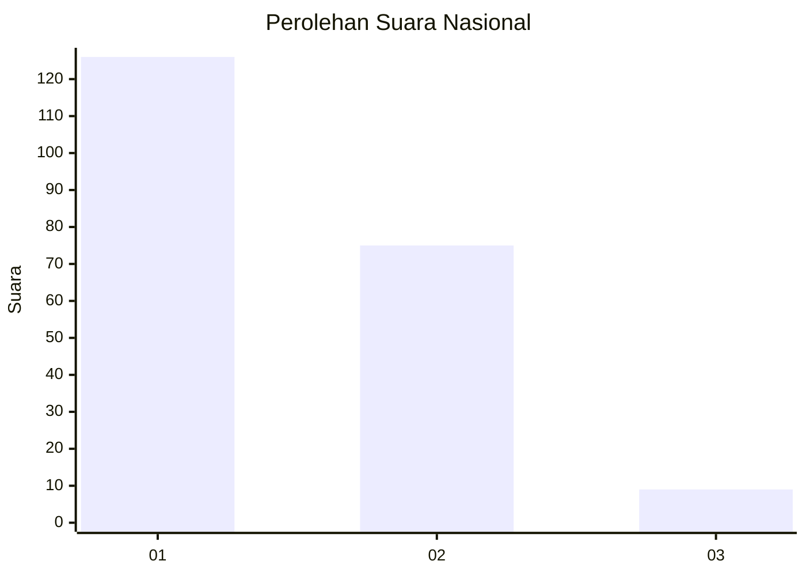
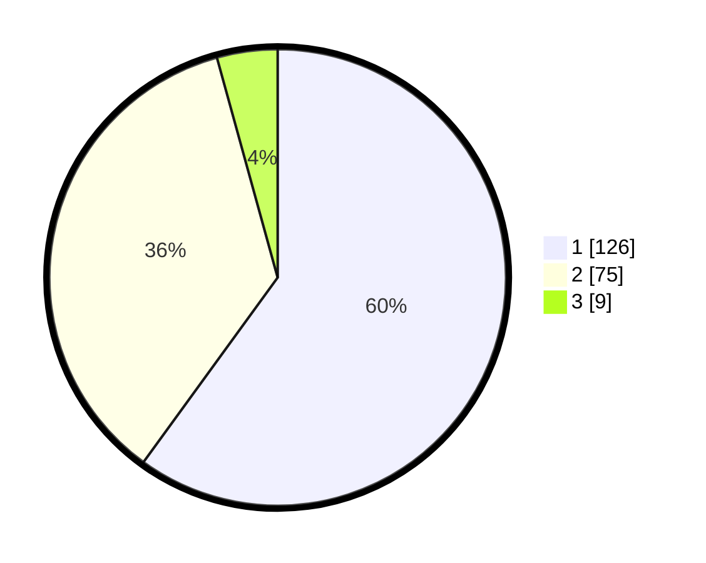

# Hasil

## Grafik

## Tabel

| No.    | Nama Paslon    | Suara | Suara (raw) | Persentase |
|:------ |:-------------- | -----:| -----------:| ----------:|
| 100025 | ANIES MUHAIMIN | 126   | [126][p-1]  | 60,00      |
| 100026 | PRABOWO GIBRAN | 75    | [75][p-2]   | 35,71      |
| 100027 | GANJAR MAHFUD  | 9     | [9][p-3]    | 4,29       |

[p-1]: https://github.com/gigit-pemilu/pemilu-2024/blob/main/pilpres/hitung-suara/sub/31-dki-jakarta/sub/75-jakarta-timur/sub/01-matraman/sub/1001-pisangan-baru/sub/022-tps/sub/paslon-1.txt
[p-2]: https://github.com/gigit-pemilu/pemilu-2024/blob/main/pilpres/hitung-suara/sub/31-dki-jakarta/sub/75-jakarta-timur/sub/01-matraman/sub/1001-pisangan-baru/sub/022-tps/sub/paslon-2.txt
[p-3]: https://github.com/gigit-pemilu/pemilu-2024/blob/main/pilpres/hitung-suara/sub/31-dki-jakarta/sub/75-jakarta-timur/sub/01-matraman/sub/1001-pisangan-baru/sub/022-tps/sub/paslon-3.txt

## Foto C Plano

https://sirekap-obj-formc.kpu.go.id/13fd/pemilu/ppwp/31/75/01/10/01/3175011001022-20240214-235533--584ea5af-59e6-4e7a-86e5-f6be4406846a.jpg

https://sirekap-obj-formc.kpu.go.id/13fd/pemilu/ppwp/31/75/01/10/01/3175011001022-20240214-235654--43cc400e-0516-433e-a910-1e1b9138b5ce.jpg

https://sirekap-obj-formc.kpu.go.id/13fd/pemilu/ppwp/31/75/01/10/01/3175011001022-20240214-235810--ac9bb3e2-a0b2-4510-85ac-37301b99fbfc.jpg

## Metadata

| Key        | Value               |
| ---------- | ------------------- |
| Time Stamp | 2024-02-15 15:00:29 |

