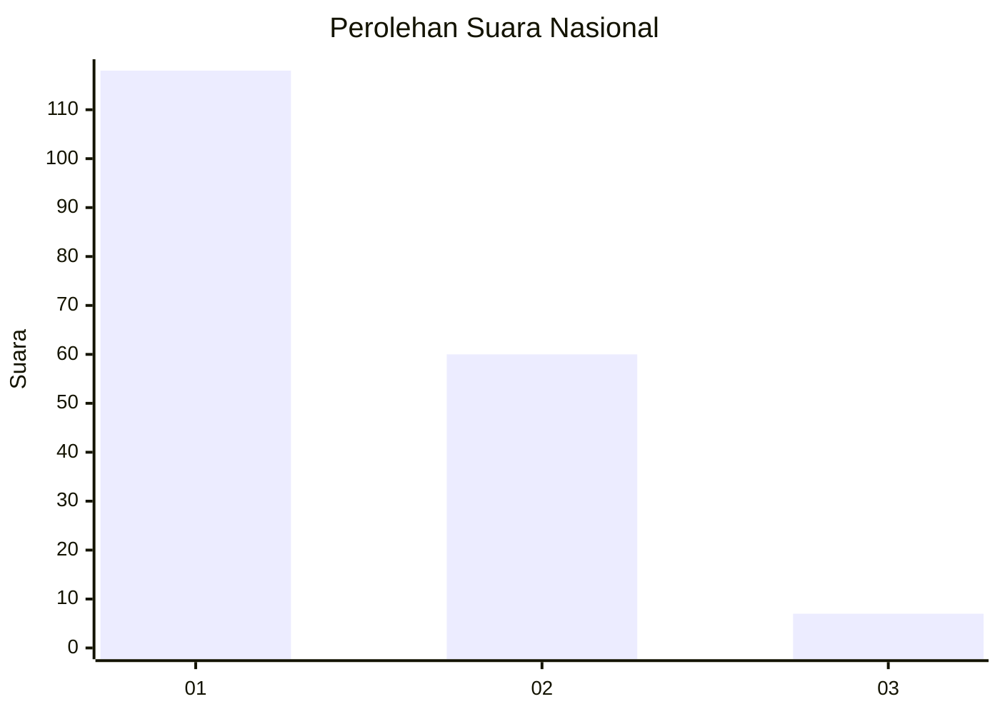
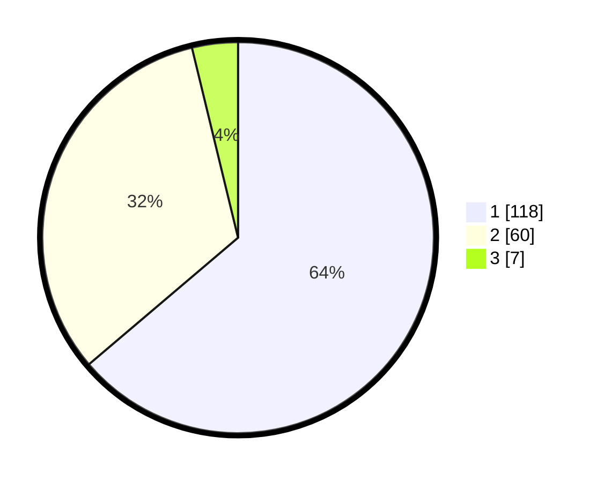

# Hasil

## Grafik

## Tabel

| No.    | Nama Paslon    | Suara | Suara (raw) | Persentase |
|:------ |:-------------- | -----:| -----------:| ----------:|
| 100025 | ANIES MUHAIMIN | 118   | [118][p-1]  | 63,78      |
| 100026 | PRABOWO GIBRAN | 60    | [60][p-2]   | 32,43      |
| 100027 | GANJAR MAHFUD  | 7     | [7][p-3]    | 3,78       |

[p-1]: https://github.com/gigit-pemilu/pemilu-2024/blob/main/pilpres/hitung-suara/sub/31-dki-jakarta/sub/75-jakarta-timur/sub/01-matraman/sub/1001-pisangan-baru/sub/028-tps/sub/paslon-1.txt
[p-2]: https://github.com/gigit-pemilu/pemilu-2024/blob/main/pilpres/hitung-suara/sub/31-dki-jakarta/sub/75-jakarta-timur/sub/01-matraman/sub/1001-pisangan-baru/sub/028-tps/sub/paslon-2.txt
[p-3]: https://github.com/gigit-pemilu/pemilu-2024/blob/main/pilpres/hitung-suara/sub/31-dki-jakarta/sub/75-jakarta-timur/sub/01-matraman/sub/1001-pisangan-baru/sub/028-tps/sub/paslon-3.txt

## Foto C Plano

https://sirekap-obj-formc.kpu.go.id/d0e8/pemilu/ppwp/31/75/01/10/01/3175011001028-20240214-212738--2db1f774-1b9a-4d5c-adab-8c9b8a866190.jpg

https://sirekap-obj-formc.kpu.go.id/d0e8/pemilu/ppwp/31/75/01/10/01/3175011001028-20240214-213049--67fc9dfc-6014-4a8a-99f8-b8163f838424.jpg

https://sirekap-obj-formc.kpu.go.id/d0e8/pemilu/ppwp/31/75/01/10/01/3175011001028-20240214-204733--65b6e903-8aa5-4723-8833-7899022bc56c.jpg

## Metadata

| Key        | Value               |
| ---------- | ------------------- |
| Time Stamp | 2024-02-16 21:01:00 |

