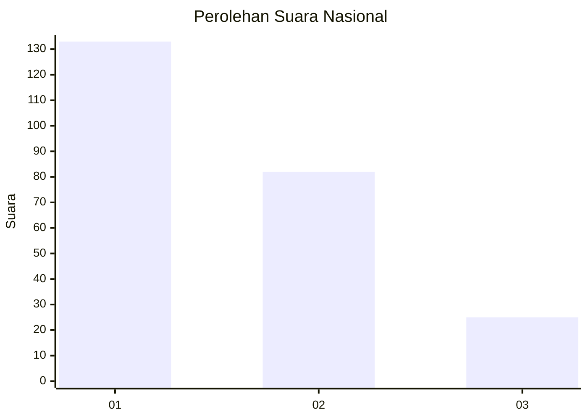
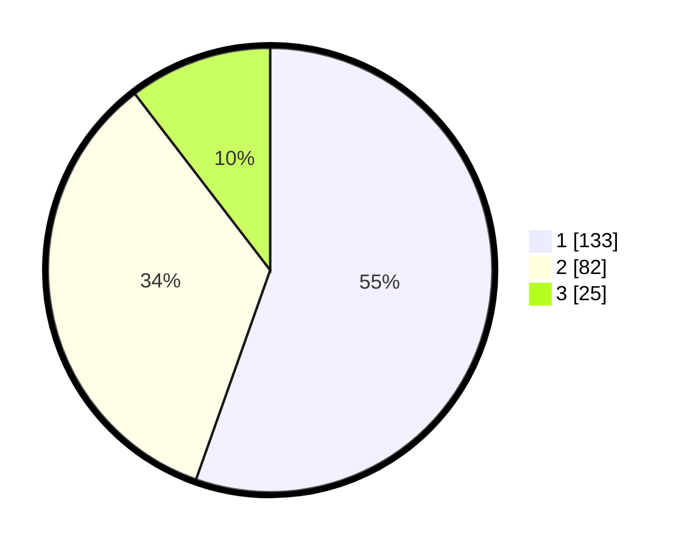

# Hasil

## Grafik

## Tabel

| No.    | Nama Paslon    | Suara | Suara (raw) | Persentase |
|:------ |:-------------- | -----:| -----------:| ----------:|
| 100025 | ANIES MUHAIMIN | 133   | [133][p-1]  | 55,42      |
| 100026 | PRABOWO GIBRAN | 82    | [82][p-2]   | 34,17      |
| 100027 | GANJAR MAHFUD  | 25    | [25][p-3]   | 10,42      |

[p-1]: https://github.com/gigit-pemilu/pemilu-2024/blob/main/pilpres/hitung-suara/sub/31-dki-jakarta/sub/75-jakarta-timur/sub/01-matraman/sub/1001-pisangan-baru/sub/048-tps/sub/paslon-1.txt
[p-2]: https://github.com/gigit-pemilu/pemilu-2024/blob/main/pilpres/hitung-suara/sub/31-dki-jakarta/sub/75-jakarta-timur/sub/01-matraman/sub/1001-pisangan-baru/sub/048-tps/sub/paslon-2.txt
[p-3]: https://github.com/gigit-pemilu/pemilu-2024/blob/main/pilpres/hitung-suara/sub/31-dki-jakarta/sub/75-jakarta-timur/sub/01-matraman/sub/1001-pisangan-baru/sub/048-tps/sub/paslon-3.txt

## Foto C Plano

https://sirekap-obj-formc.kpu.go.id/37e4/pemilu/ppwp/31/75/01/10/01/3175011001048-20240214-214704--d443c592-55cb-4485-a53f-c1b1db035c65.jpg

https://sirekap-obj-formc.kpu.go.id/37e4/pemilu/ppwp/31/75/01/10/01/3175011001048-20240214-215036--d9b828ea-7b97-406e-99de-c746308d4907.jpg

https://sirekap-obj-formc.kpu.go.id/37e4/pemilu/ppwp/31/75/01/10/01/3175011001048-20240214-214934--148faea0-5394-4e58-bfc8-4aae3fe3e7c9.jpg

## Metadata

| Key        | Value               |
| ---------- | ------------------- |
| Time Stamp | 2024-02-15 04:00:24 |

