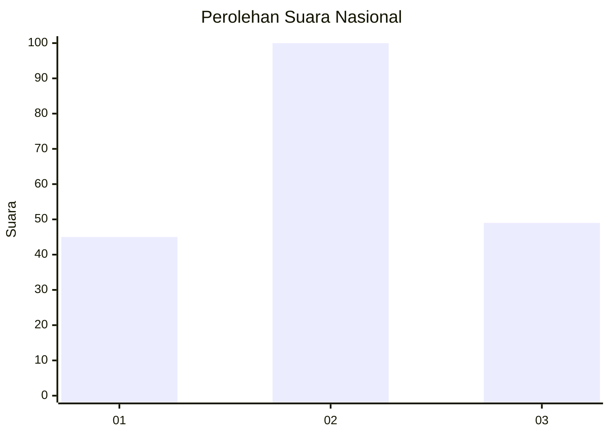
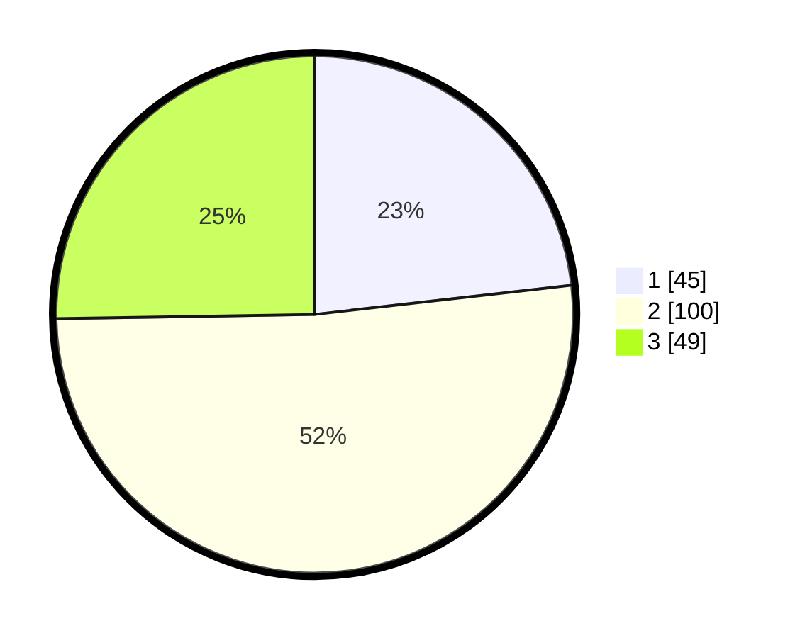

# Hasil

## Grafik

## Tabel

| No.    | Nama Paslon    | Suara | Suara (raw) | Persentase |
|:------ |:-------------- | -----:| -----------:| ----------:|
| 100025 | ANIES MUHAIMIN | 45    | [45][p-1]   | 23,20      |
| 100026 | PRABOWO GIBRAN | 100   | [100][p-2]  | 51,55      |
| 100027 | GANJAR MAHFUD  | 49    | [49][p-3]   | 25,26      |

[p-1]: https://github.com/gigit-pemilu/pemilu-2024/blob/main/pilpres/hitung-suara/sub/31-dki-jakarta/sub/75-jakarta-timur/sub/01-matraman/sub/1001-pisangan-baru/sub/063-tps/sub/paslon-1.txt
[p-2]: https://github.com/gigit-pemilu/pemilu-2024/blob/main/pilpres/hitung-suara/sub/31-dki-jakarta/sub/75-jakarta-timur/sub/01-matraman/sub/1001-pisangan-baru/sub/063-tps/sub/paslon-2.txt
[p-3]: https://github.com/gigit-pemilu/pemilu-2024/blob/main/pilpres/hitung-suara/sub/31-dki-jakarta/sub/75-jakarta-timur/sub/01-matraman/sub/1001-pisangan-baru/sub/063-tps/sub/paslon-3.txt

## Foto C Plano

https://sirekap-obj-formc.kpu.go.id/bfec/pemilu/ppwp/31/75/01/10/01/3175011001063-20240214-220022--c9d7c7d9-353c-460c-8d59-1bbb1d53b8cf.jpg

https://sirekap-obj-formc.kpu.go.id/bfec/pemilu/ppwp/31/75/01/10/01/3175011001063-20240214-220201--d7216569-de1a-4cd3-87e9-32aaa964f6b0.jpg

https://sirekap-obj-formc.kpu.go.id/bfec/pemilu/ppwp/31/75/01/10/01/3175011001063-20240214-221928--96c6c8bb-3cd4-423f-9d5e-6d3ea85fac9d.jpg

## Metadata

| Key        | Value               |
| ---------- | ------------------- |
| Time Stamp | 2024-02-15 15:00:29 |

