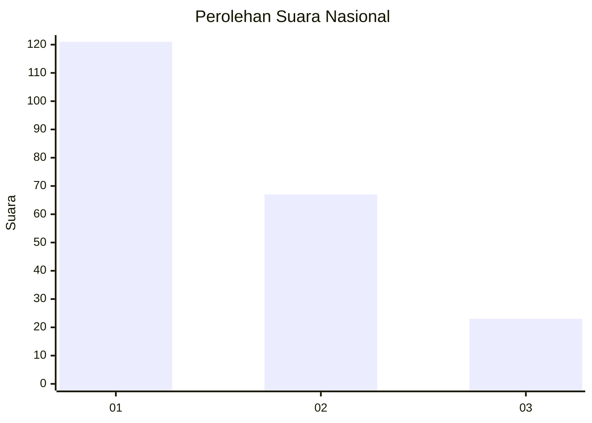
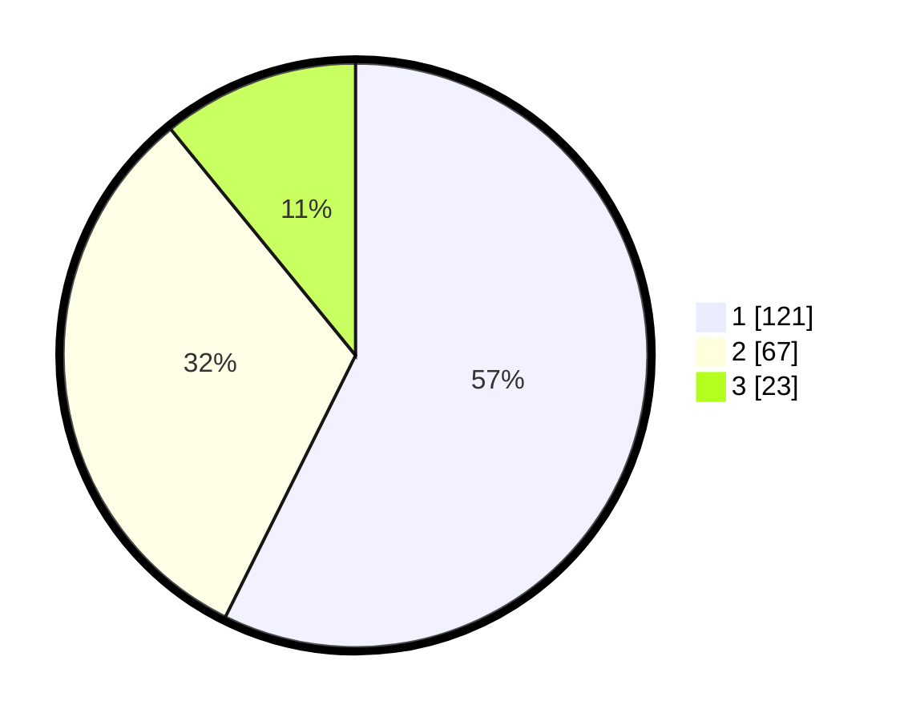

# Hasil

## Grafik

## Tabel

| No.    | Nama Paslon    | Suara | Suara (raw) | Persentase |
|:------ |:-------------- | -----:| -----------:| ----------:|
| 100025 | ANIES MUHAIMIN | 121   | [121][p-1]  | 57,35      |
| 100026 | PRABOWO GIBRAN | 67    | [67][p-2]   | 31,75      |
| 100027 | GANJAR MAHFUD  | 23    | [23][p-3]   | 10,90      |

[p-1]: https://github.com/gigit-pemilu/pemilu-2024/blob/main/pilpres/hitung-suara/sub/31-dki-jakarta/sub/75-jakarta-timur/sub/01-matraman/sub/1001-pisangan-baru/sub/072-tps/sub/paslon-1.txt
[p-2]: https://github.com/gigit-pemilu/pemilu-2024/blob/main/pilpres/hitung-suara/sub/31-dki-jakarta/sub/75-jakarta-timur/sub/01-matraman/sub/1001-pisangan-baru/sub/072-tps/sub/paslon-2.txt
[p-3]: https://github.com/gigit-pemilu/pemilu-2024/blob/main/pilpres/hitung-suara/sub/31-dki-jakarta/sub/75-jakarta-timur/sub/01-matraman/sub/1001-pisangan-baru/sub/072-tps/sub/paslon-3.txt

## Foto C Plano

https://sirekap-obj-formc.kpu.go.id/e680/pemilu/ppwp/31/75/01/10/01/3175011001072-20240215-171124--c0ce39da-ce5e-4857-bf0e-6d7c95e6fbfe.jpg

https://sirekap-obj-formc.kpu.go.id/e680/pemilu/ppwp/31/75/01/10/01/3175011001072-20240215-171239--13084379-f2f0-4c86-9296-7b17633fe1ff.jpg

https://sirekap-obj-formc.kpu.go.id/e680/pemilu/ppwp/31/75/01/10/01/3175011001072-20240215-171334--e5610fee-5764-4eb4-9a2a-5c8418cbc76b.jpg

## Metadata

| Key        | Value               |
| ---------- | ------------------- |
| Time Stamp | 2024-02-19 06:16:00 |

