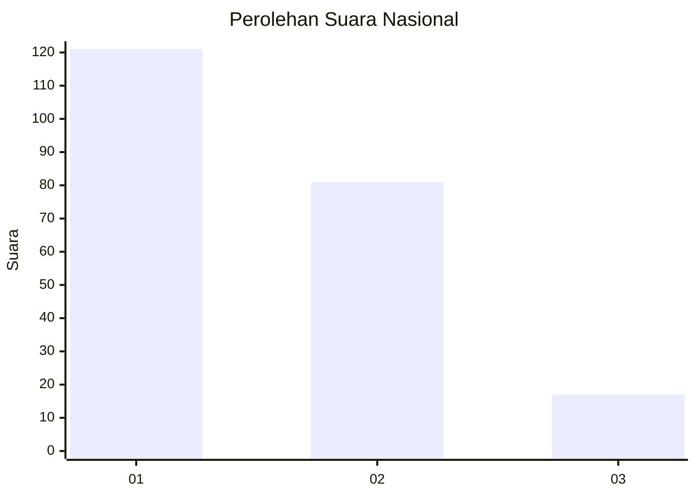
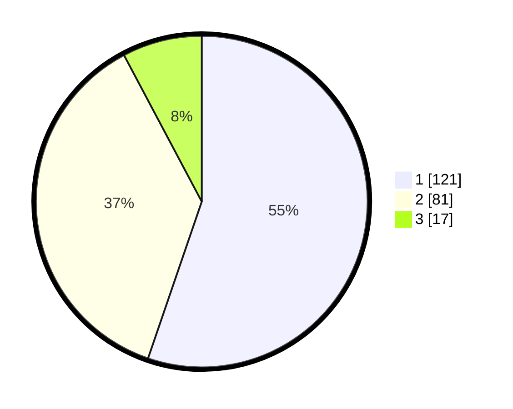

# Hasil

## Grafik

## Tabel

| No.    | Nama Paslon    | Suara | Suara (raw) | Persentase |
|:------ |:-------------- | -----:| -----------:| ----------:|
| 100025 | ANIES MUHAIMIN | 121   | [121][p-1]  | 55,25      |
| 100026 | PRABOWO GIBRAN | 81    | [81][p-2]   | 36,99      |
| 100027 | GANJAR MAHFUD  | 17    | [17][p-3]   | 7,76       |

[p-1]: https://github.com/gigit-pemilu/pemilu-2024/blob/main/pilpres/hitung-suara/sub/31-dki-jakarta/sub/75-jakarta-timur/sub/01-matraman/sub/1001-pisangan-baru/sub/077-tps/sub/paslon-1.txt
[p-2]: https://github.com/gigit-pemilu/pemilu-2024/blob/main/pilpres/hitung-suara/sub/31-dki-jakarta/sub/75-jakarta-timur/sub/01-matraman/sub/1001-pisangan-baru/sub/077-tps/sub/paslon-2.txt
[p-3]: https://github.com/gigit-pemilu/pemilu-2024/blob/main/pilpres/hitung-suara/sub/31-dki-jakarta/sub/75-jakarta-timur/sub/01-matraman/sub/1001-pisangan-baru/sub/077-tps/sub/paslon-3.txt

## Foto C Plano

https://sirekap-obj-formc.kpu.go.id/d78b/pemilu/ppwp/31/75/01/10/01/3175011001077-20240214-235937--60bbad4b-8a9b-4e4c-8944-b309d907cf2a.jpg

https://sirekap-obj-formc.kpu.go.id/d78b/pemilu/ppwp/31/75/01/10/01/3175011001077-20240214-235941--bc572679-cfd2-4bd6-9f8c-50e44c3ac3af.jpg

https://sirekap-obj-formc.kpu.go.id/d78b/pemilu/ppwp/31/75/01/10/01/3175011001077-20240216-184621--94b2eedb-78e6-4a75-b6e8-c248d230ec35.jpg

## Metadata

| Key        | Value               |
| ---------- | ------------------- |
| Time Stamp | 2024-02-16 21:01:00 |

