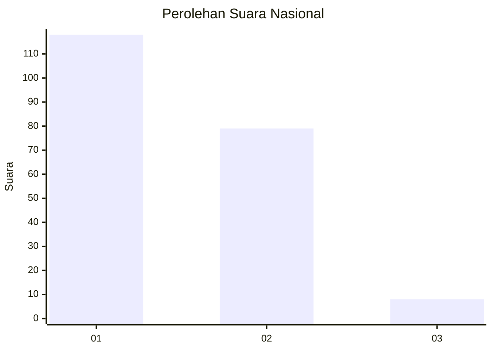
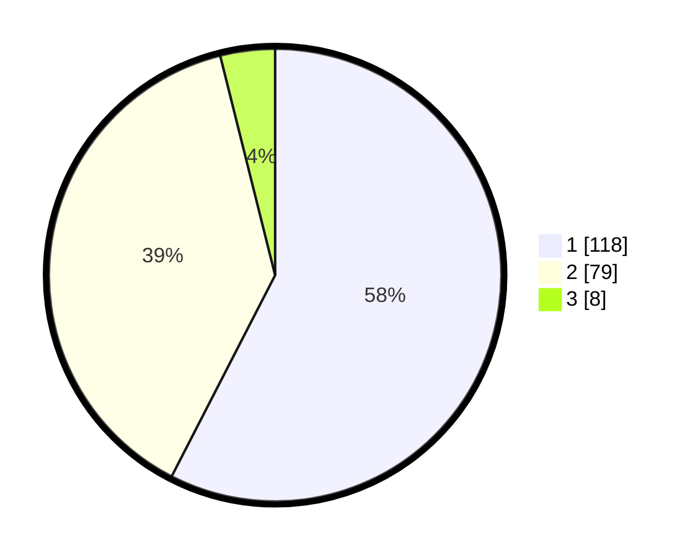

# Hasil

## Grafik

## Tabel

| No.    | Nama Paslon    | Suara | Suara (raw) | Persentase |
|:------ |:-------------- | -----:| -----------:| ----------:|
| 100025 | ANIES MUHAIMIN | 118   | [118][p-1]  | 57,56      |
| 100026 | PRABOWO GIBRAN | 79    | [79][p-2]   | 38,54      |
| 100027 | GANJAR MAHFUD  | 8     | [8][p-3]    | 3,90       |

[p-1]: https://github.com/gigit-pemilu/pemilu-2024/blob/main/pilpres/hitung-suara/sub/31-dki-jakarta/sub/75-jakarta-timur/sub/01-matraman/sub/1001-pisangan-baru/sub/080-tps/sub/paslon-1.txt
[p-2]: https://github.com/gigit-pemilu/pemilu-2024/blob/main/pilpres/hitung-suara/sub/31-dki-jakarta/sub/75-jakarta-timur/sub/01-matraman/sub/1001-pisangan-baru/sub/080-tps/sub/paslon-2.txt
[p-3]: https://github.com/gigit-pemilu/pemilu-2024/blob/main/pilpres/hitung-suara/sub/31-dki-jakarta/sub/75-jakarta-timur/sub/01-matraman/sub/1001-pisangan-baru/sub/080-tps/sub/paslon-3.txt

## Foto C Plano

https://sirekap-obj-formc.kpu.go.id/5906/pemilu/ppwp/31/75/01/10/01/3175011001080-20240215-001609--84cf3e03-7e27-4616-8bfb-4d440d545d1e.jpg

https://sirekap-obj-formc.kpu.go.id/5906/pemilu/ppwp/31/75/01/10/01/3175011001080-20240214-201010--7664a6e1-dc00-4e6c-bfdb-66fd9d0e0d0a.jpg

https://sirekap-obj-formc.kpu.go.id/5906/pemilu/ppwp/31/75/01/10/01/3175011001080-20240214-235529--a9990b29-1da9-4caf-bbfb-5dd0983c4e08.jpg

## Metadata

| Key        | Value               |
| ---------- | ------------------- |
| Time Stamp | 2024-02-15 12:00:28 |

