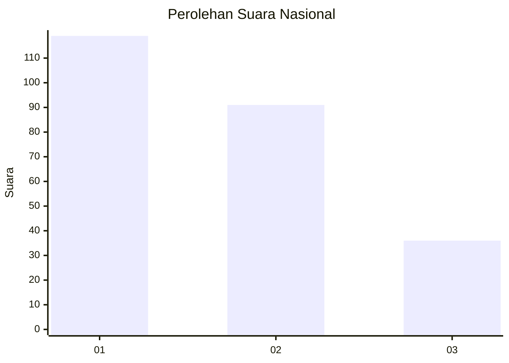
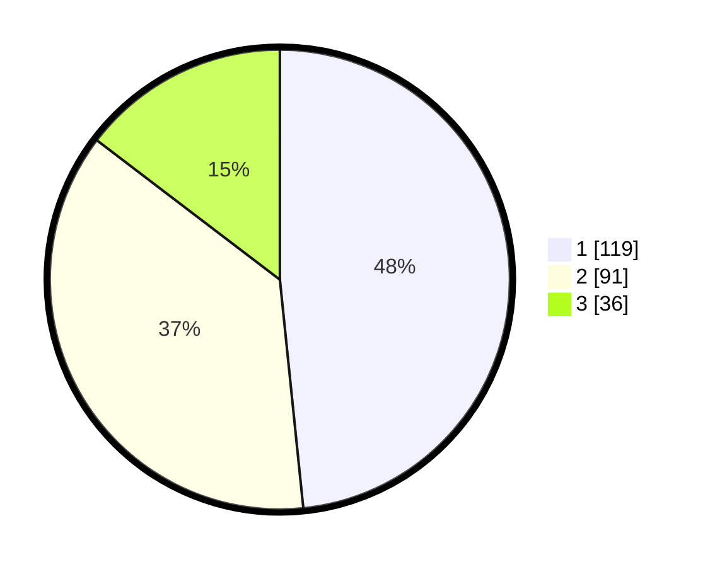

# Hasil

## Grafik

## Tabel

| No.    | Nama Paslon    | Suara | Suara (raw) | Persentase |
|:------ |:-------------- | -----:| -----------:| ----------:|
| 100025 | ANIES MUHAIMIN | 119   | [119][p-1]  | 48,37      |
| 100026 | PRABOWO GIBRAN | 91    | [91][p-2]   | 36,99      |
| 100027 | GANJAR MAHFUD  | 36    | [36][p-3]   | 14,63      |

[p-1]: https://github.com/gigit-pemilu/pemilu-2024/blob/main/pilpres/hitung-suara/sub/31-dki-jakarta/sub/75-jakarta-timur/sub/01-matraman/sub/1001-pisangan-baru/sub/102-tps/sub/paslon-1.txt
[p-2]: https://github.com/gigit-pemilu/pemilu-2024/blob/main/pilpres/hitung-suara/sub/31-dki-jakarta/sub/75-jakarta-timur/sub/01-matraman/sub/1001-pisangan-baru/sub/102-tps/sub/paslon-2.txt
[p-3]: https://github.com/gigit-pemilu/pemilu-2024/blob/main/pilpres/hitung-suara/sub/31-dki-jakarta/sub/75-jakarta-timur/sub/01-matraman/sub/1001-pisangan-baru/sub/102-tps/sub/paslon-3.txt

## Foto C Plano

https://sirekap-obj-formc.kpu.go.id/02a2/pemilu/ppwp/31/75/01/10/01/3175011001102-20240215-004813--3420f164-868f-4be8-a1f5-7c35b0adfeb5.jpg

https://sirekap-obj-formc.kpu.go.id/02a2/pemilu/ppwp/31/75/01/10/01/3175011001102-20240215-004845--fff6eb40-3e01-4da5-b36f-dfd6a1f956e5.jpg

https://sirekap-obj-formc.kpu.go.id/02a2/pemilu/ppwp/31/75/01/10/01/3175011001102-20240215-004921--19faa52b-9212-4880-a1b7-5197167dbbfb.jpg

## Metadata

| Key        | Value               |
| ---------- | ------------------- |
| Time Stamp | 2024-02-15 15:00:29 |

