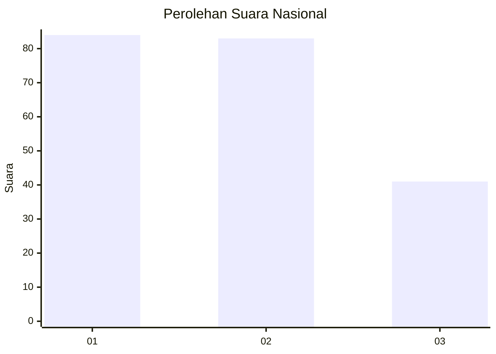
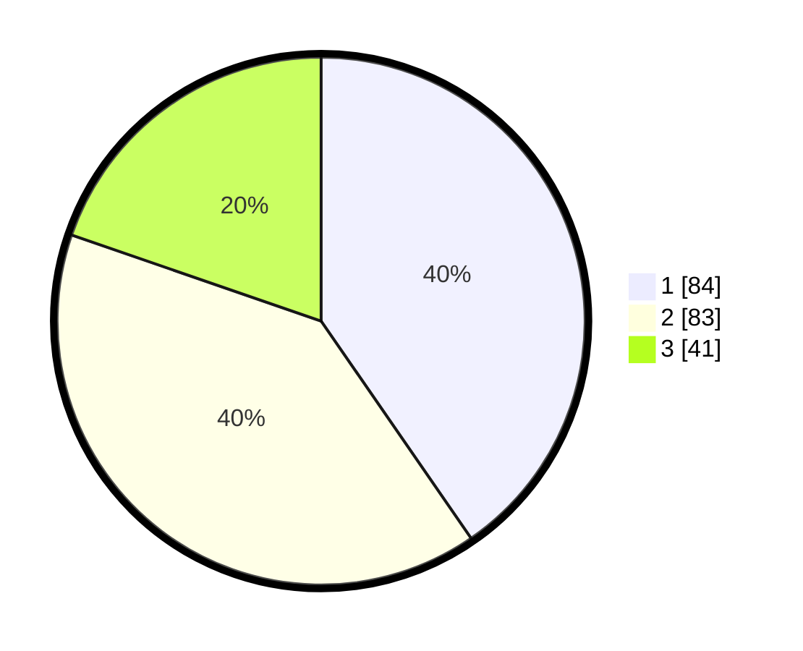

# Hasil

## Grafik

## Tabel

| No.    | Nama Paslon    | Suara | Suara (raw) | Persentase |
|:------ |:-------------- | -----:| -----------:| ----------:|
| 100025 | ANIES MUHAIMIN | 84    | [84][p-1]   | 40,38      |
| 100026 | PRABOWO GIBRAN | 83    | [83][p-2]   | 39,90      |
| 100027 | GANJAR MAHFUD  | 41    | [41][p-3]   | 19,71      |

[p-1]: https://github.com/gigit-pemilu/pemilu-2024/blob/main/pilpres/hitung-suara/sub/31-dki-jakarta/sub/75-jakarta-timur/sub/01-matraman/sub/1001-pisangan-baru/sub/105-tps/sub/paslon-1.txt
[p-2]: https://github.com/gigit-pemilu/pemilu-2024/blob/main/pilpres/hitung-suara/sub/31-dki-jakarta/sub/75-jakarta-timur/sub/01-matraman/sub/1001-pisangan-baru/sub/105-tps/sub/paslon-2.txt
[p-3]: https://github.com/gigit-pemilu/pemilu-2024/blob/main/pilpres/hitung-suara/sub/31-dki-jakarta/sub/75-jakarta-timur/sub/01-matraman/sub/1001-pisangan-baru/sub/105-tps/sub/paslon-3.txt

## Foto C Plano

https://sirekap-obj-formc.kpu.go.id/c4f4/pemilu/ppwp/31/75/01/10/01/3175011001105-20240214-224239--d58ddd85-44f6-464a-9ff3-ac638b6a3527.jpg

https://sirekap-obj-formc.kpu.go.id/c4f4/pemilu/ppwp/31/75/01/10/01/3175011001105-20240214-155900--1ecba5d7-b141-47de-8c99-a9b7c1b56fed.jpg

https://sirekap-obj-formc.kpu.go.id/c4f4/pemilu/ppwp/31/75/01/10/01/3175011001105-20240214-160133--a5256290-00eb-4e2b-892b-a8d9dfba4577.jpg

## Metadata

| Key        | Value               |
| ---------- | ------------------- |
| Time Stamp | 2024-02-15 12:00:28 |

