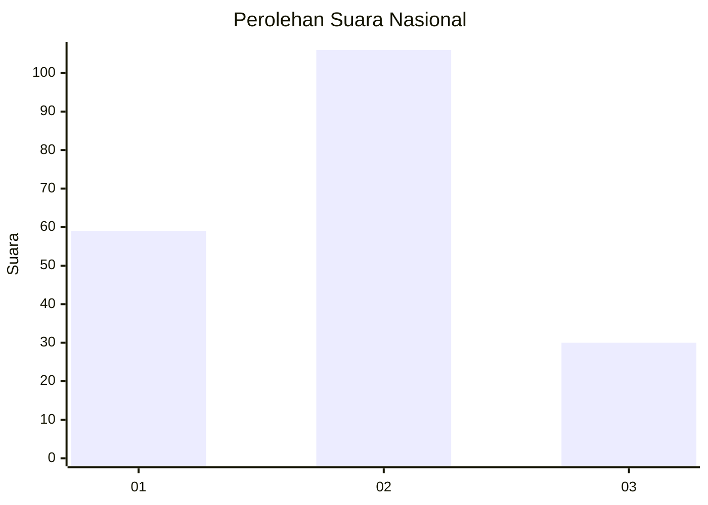
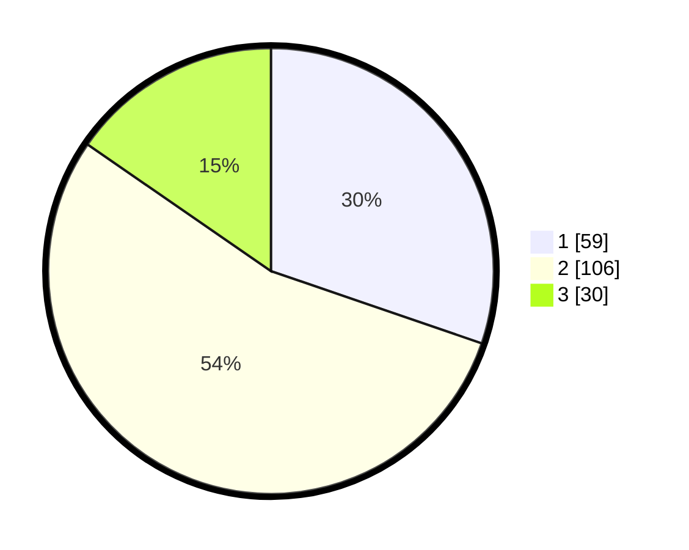

# Hasil

## Grafik

## Tabel

| No.    | Nama Paslon    | Suara | Suara (raw) | Persentase |
|:------ |:-------------- | -----:| -----------:| ----------:|
| 100025 | ANIES MUHAIMIN | 59    | [59][p-1]   | 30,26      |
| 100026 | PRABOWO GIBRAN | 106   | [106][p-2]  | 54,36      |
| 100027 | GANJAR MAHFUD  | 30    | [30][p-3]   | 15,38      |

[p-1]: https://github.com/gigit-pemilu/pemilu-2024/blob/main/pilpres/hitung-suara/sub/31-dki-jakarta/sub/75-jakarta-timur/sub/01-matraman/sub/1002-utan-kayu-utara/sub/007-tps/sub/paslon-1.txt
[p-2]: https://github.com/gigit-pemilu/pemilu-2024/blob/main/pilpres/hitung-suara/sub/31-dki-jakarta/sub/75-jakarta-timur/sub/01-matraman/sub/1002-utan-kayu-utara/sub/007-tps/sub/paslon-2.txt
[p-3]: https://github.com/gigit-pemilu/pemilu-2024/blob/main/pilpres/hitung-suara/sub/31-dki-jakarta/sub/75-jakarta-timur/sub/01-matraman/sub/1002-utan-kayu-utara/sub/007-tps/sub/paslon-3.txt

## Foto C Plano

https://sirekap-obj-formc.kpu.go.id/3569/pemilu/ppwp/31/75/01/10/02/3175011002007-20240215-011337--66b366f4-de88-44c5-bab3-368289d83b9e.jpg

https://sirekap-obj-formc.kpu.go.id/3569/pemilu/ppwp/31/75/01/10/02/3175011002007-20240215-011455--fb773122-b1ae-432e-a781-c1b8493b4a6b.jpg

https://sirekap-obj-formc.kpu.go.id/3569/pemilu/ppwp/31/75/01/10/02/3175011002007-20240215-011606--09b952f3-0623-4733-9923-f0c8e5ffd411.jpg

## Metadata

| Key        | Value               |
| ---------- | ------------------- |
| Time Stamp | 2024-02-17 11:30:03 |

