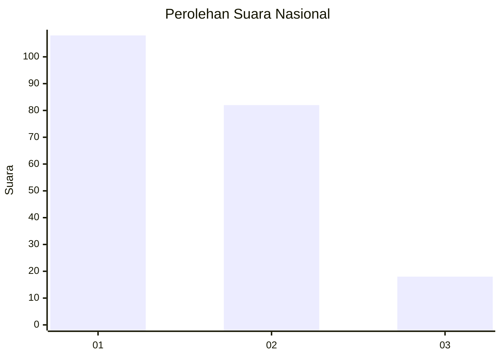
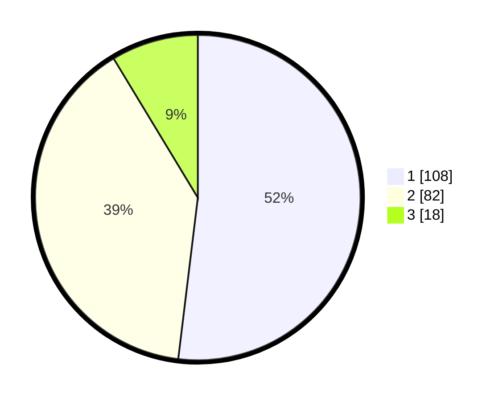

# Hasil

## Grafik

## Tabel

| No.    | Nama Paslon    | Suara | Suara (raw) | Persentase |
|:------ |:-------------- | -----:| -----------:| ----------:|
| 100025 | ANIES MUHAIMIN | 108   | [108][p-1]  | 51,92      |
| 100026 | PRABOWO GIBRAN | 82    | [82][p-2]   | 39,42      |
| 100027 | GANJAR MAHFUD  | 18    | [18][p-3]   | 8,65       |

[p-1]: https://github.com/gigit-pemilu/pemilu-2024/blob/main/pilpres/hitung-suara/sub/31-dki-jakarta/sub/75-jakarta-timur/sub/01-matraman/sub/1002-utan-kayu-utara/sub/043-tps/sub/paslon-1.txt
[p-2]: https://github.com/gigit-pemilu/pemilu-2024/blob/main/pilpres/hitung-suara/sub/31-dki-jakarta/sub/75-jakarta-timur/sub/01-matraman/sub/1002-utan-kayu-utara/sub/043-tps/sub/paslon-2.txt
[p-3]: https://github.com/gigit-pemilu/pemilu-2024/blob/main/pilpres/hitung-suara/sub/31-dki-jakarta/sub/75-jakarta-timur/sub/01-matraman/sub/1002-utan-kayu-utara/sub/043-tps/sub/paslon-3.txt

## Foto C Plano

https://sirekap-obj-formc.kpu.go.id/42bb/pemilu/ppwp/31/75/01/10/02/3175011002043-20240215-025610--47981555-e445-4ff4-b5aa-11f832fc5a05.jpg

https://sirekap-obj-formc.kpu.go.id/42bb/pemilu/ppwp/31/75/01/10/02/3175011002043-20240215-025758--524404e1-2039-4e65-98ab-d49b209395b9.jpg

https://sirekap-obj-formc.kpu.go.id/42bb/pemilu/ppwp/31/75/01/10/02/3175011002043-20240215-041339--90e312fb-58b0-43ea-9ea7-51af44d659dc.jpg

## Metadata

| Key        | Value               |
| ---------- | ------------------- |
| Time Stamp | 2024-02-15 17:30:25 |

