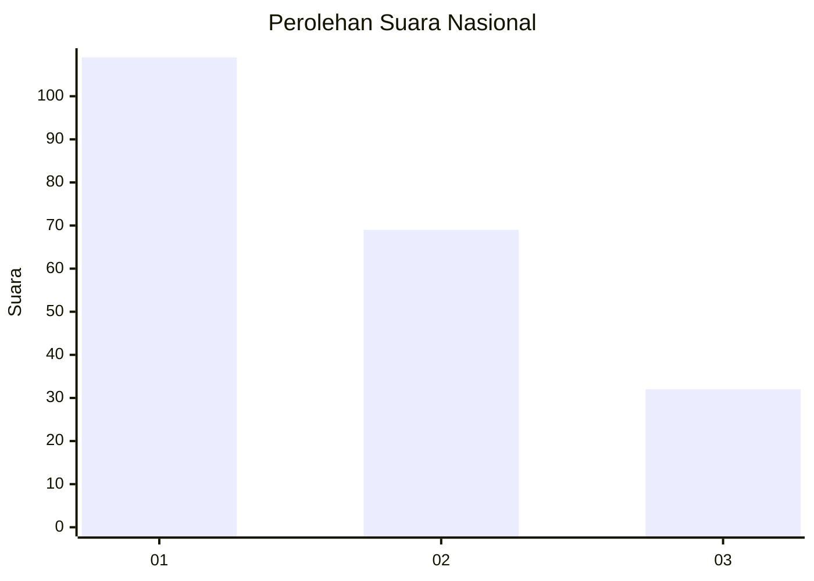
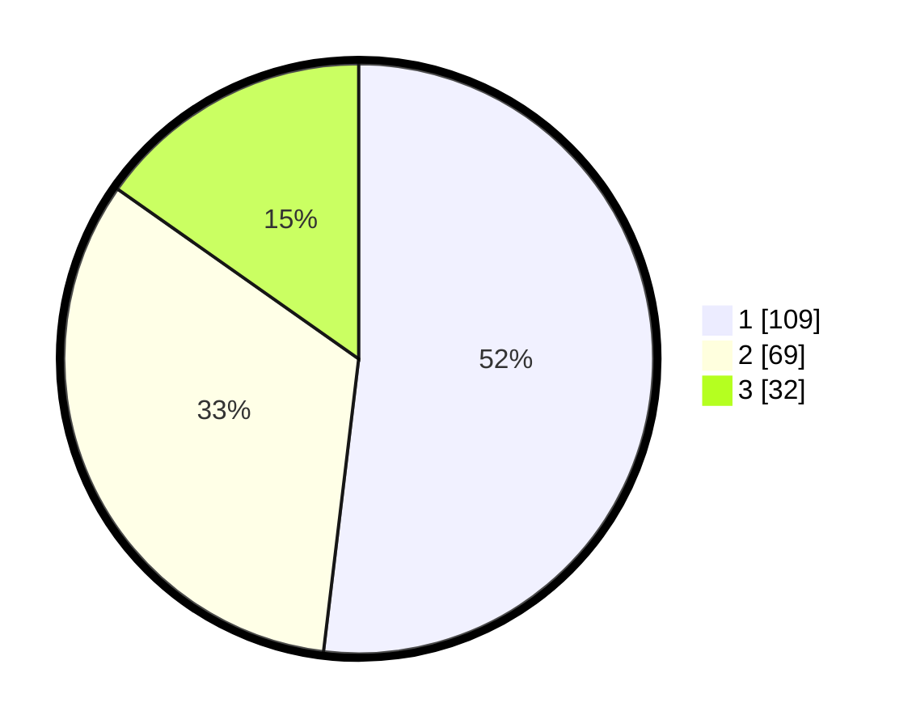

# Hasil

## Grafik

## Tabel

| No.    | Nama Paslon    | Suara | Suara (raw) | Persentase |
|:------ |:-------------- | -----:| -----------:| ----------:|
| 100025 | ANIES MUHAIMIN | 109   | [109][p-1]  | 51,90      |
| 100026 | PRABOWO GIBRAN | 69    | [69][p-2]   | 32,86      |
| 100027 | GANJAR MAHFUD  | 32    | [32][p-3]   | 15,24      |

[p-1]: https://github.com/gigit-pemilu/pemilu-2024/blob/main/pilpres/hitung-suara/sub/31-dki-jakarta/sub/75-jakarta-timur/sub/01-matraman/sub/1002-utan-kayu-utara/sub/045-tps/sub/paslon-1.txt
[p-2]: https://github.com/gigit-pemilu/pemilu-2024/blob/main/pilpres/hitung-suara/sub/31-dki-jakarta/sub/75-jakarta-timur/sub/01-matraman/sub/1002-utan-kayu-utara/sub/045-tps/sub/paslon-2.txt
[p-3]: https://github.com/gigit-pemilu/pemilu-2024/blob/main/pilpres/hitung-suara/sub/31-dki-jakarta/sub/75-jakarta-timur/sub/01-matraman/sub/1002-utan-kayu-utara/sub/045-tps/sub/paslon-3.txt

## Foto C Plano

https://sirekap-obj-formc.kpu.go.id/6194/pemilu/ppwp/31/75/01/10/02/3175011002045-20240215-005813--f0d0c360-c108-42e3-a081-d810e447023c.jpg

https://sirekap-obj-formc.kpu.go.id/6194/pemilu/ppwp/31/75/01/10/02/3175011002045-20240215-005904--40d7aa94-9a7b-4313-9cab-1e82e2791707.jpg

https://sirekap-obj-formc.kpu.go.id/6194/pemilu/ppwp/31/75/01/10/02/3175011002045-20240215-005940--2f9abb3d-78a5-4394-b5a6-82167017d957.jpg

## Metadata

| Key        | Value               |
| ---------- | ------------------- |
| Time Stamp | 2024-02-15 16:30:25 |

