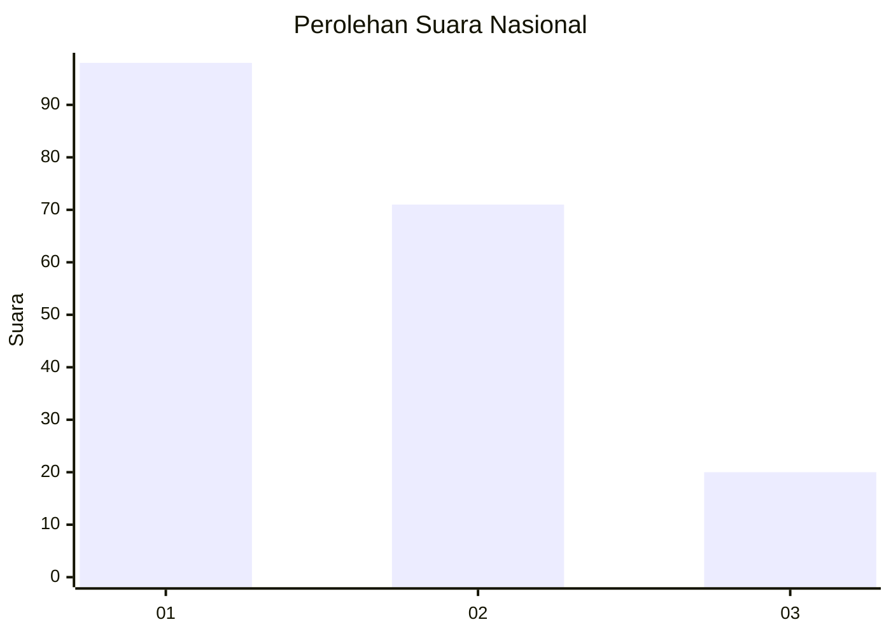
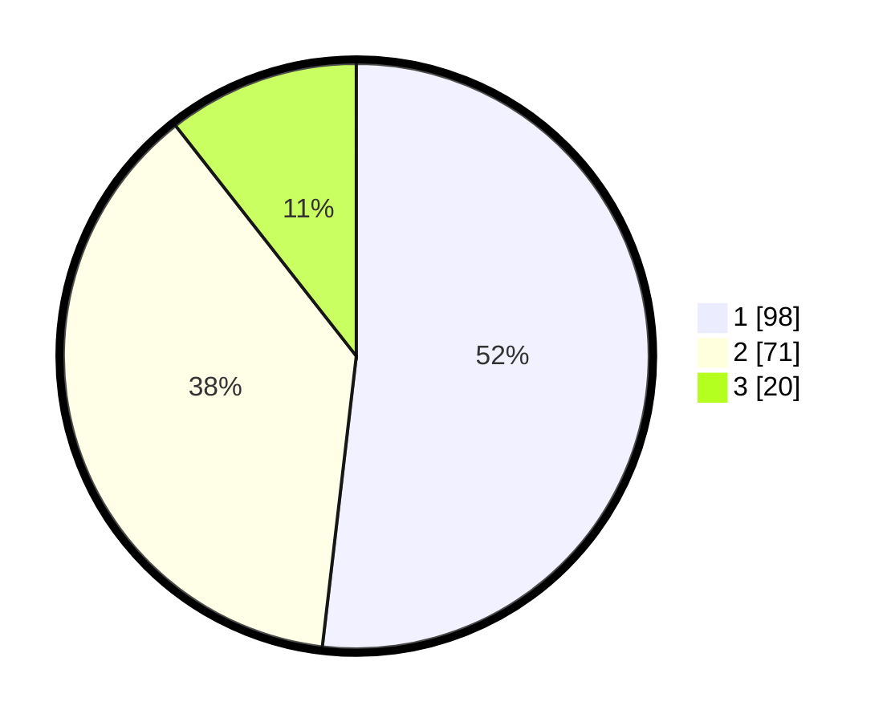

# Hasil

## Grafik

## Tabel

| No.    | Nama Paslon    | Suara | Suara (raw) | Persentase |
|:------ |:-------------- | -----:| -----------:| ----------:|
| 100025 | ANIES MUHAIMIN | 98    | [98][p-1]   | 51,85      |
| 100026 | PRABOWO GIBRAN | 71    | [71][p-2]   | 37,57      |
| 100027 | GANJAR MAHFUD  | 20    | [20][p-3]   | 10,58      |

[p-1]: https://github.com/gigit-pemilu/pemilu-2024/blob/main/pilpres/hitung-suara/sub/31-dki-jakarta/sub/75-jakarta-timur/sub/01-matraman/sub/1002-utan-kayu-utara/sub/048-tps/sub/paslon-1.txt
[p-2]: https://github.com/gigit-pemilu/pemilu-2024/blob/main/pilpres/hitung-suara/sub/31-dki-jakarta/sub/75-jakarta-timur/sub/01-matraman/sub/1002-utan-kayu-utara/sub/048-tps/sub/paslon-2.txt
[p-3]: https://github.com/gigit-pemilu/pemilu-2024/blob/main/pilpres/hitung-suara/sub/31-dki-jakarta/sub/75-jakarta-timur/sub/01-matraman/sub/1002-utan-kayu-utara/sub/048-tps/sub/paslon-3.txt

## Foto C Plano

https://sirekap-obj-formc.kpu.go.id/6270/pemilu/ppwp/31/75/01/10/02/3175011002048-20240214-214906--f1caa6bb-07c4-4591-b72f-8a4abf8c897b.jpg

https://sirekap-obj-formc.kpu.go.id/6270/pemilu/ppwp/31/75/01/10/02/3175011002048-20240214-215001--96169419-aa9b-4680-9854-2ec0116f3770.jpg

https://sirekap-obj-formc.kpu.go.id/6270/pemilu/ppwp/31/75/01/10/02/3175011002048-20240214-215050--488ad9dc-907f-4486-b565-9d96248c585e.jpg

## Metadata

| Key        | Value               |
| ---------- | ------------------- |
| Time Stamp | 2024-02-15 15:00:29 |

