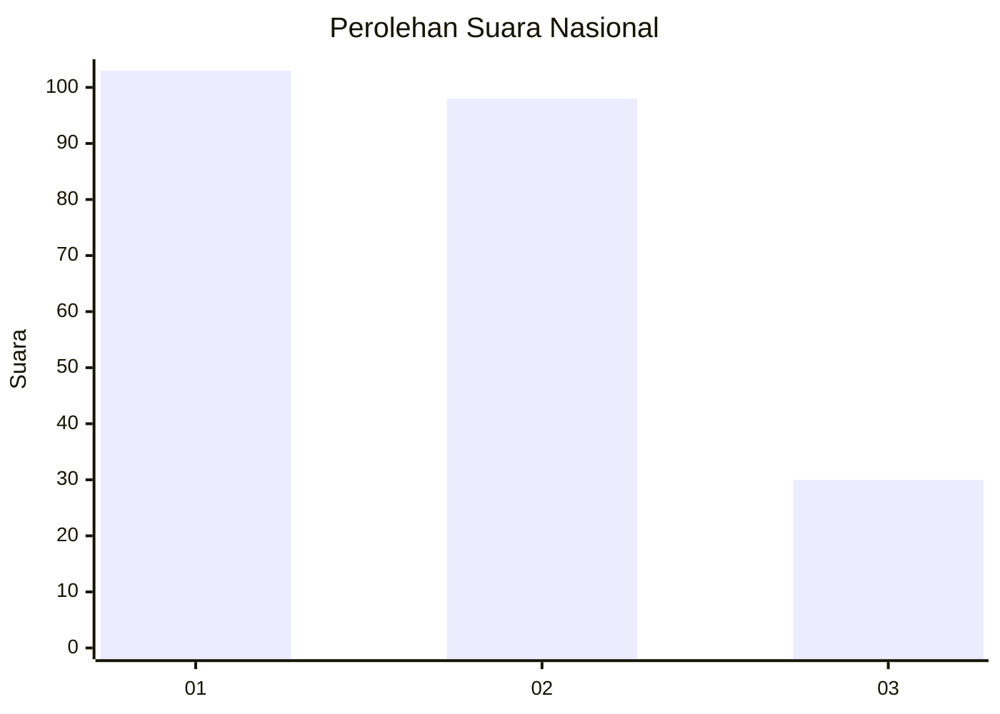
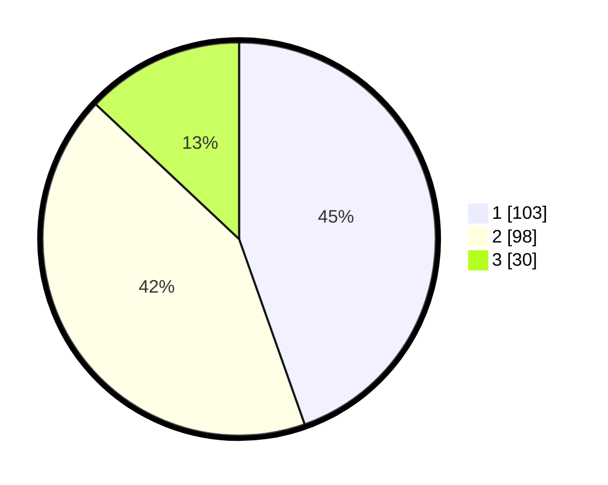

# Hasil

## Grafik

## Tabel

| No.    | Nama Paslon    | Suara | Suara (raw) | Persentase |
|:------ |:-------------- | -----:| -----------:| ----------:|
| 100025 | ANIES MUHAIMIN | 103   | [103][p-1]  | 44,59      |
| 100026 | PRABOWO GIBRAN | 98    | [98][p-2]   | 42,42      |
| 100027 | GANJAR MAHFUD  | 30    | [30][p-3]   | 12,99      |

[p-1]: https://github.com/gigit-pemilu/pemilu-2024/blob/main/pilpres/hitung-suara/sub/31-dki-jakarta/sub/75-jakarta-timur/sub/01-matraman/sub/1002-utan-kayu-utara/sub/059-tps/sub/paslon-1.txt
[p-2]: https://github.com/gigit-pemilu/pemilu-2024/blob/main/pilpres/hitung-suara/sub/31-dki-jakarta/sub/75-jakarta-timur/sub/01-matraman/sub/1002-utan-kayu-utara/sub/059-tps/sub/paslon-2.txt
[p-3]: https://github.com/gigit-pemilu/pemilu-2024/blob/main/pilpres/hitung-suara/sub/31-dki-jakarta/sub/75-jakarta-timur/sub/01-matraman/sub/1002-utan-kayu-utara/sub/059-tps/sub/paslon-3.txt

## Foto C Plano

https://sirekap-obj-formc.kpu.go.id/30d3/pemilu/ppwp/31/75/01/10/02/3175011002059-20240215-010222--e5766a40-fb0d-4362-97df-efbc36d89183.jpg

https://sirekap-obj-formc.kpu.go.id/30d3/pemilu/ppwp/31/75/01/10/02/3175011002059-20240215-010231--7b06cc36-5878-4e4b-a52c-d98c55a403b6.jpg

https://sirekap-obj-formc.kpu.go.id/30d3/pemilu/ppwp/31/75/01/10/02/3175011002059-20240215-010239--790da418-591b-483c-a75b-03a62e946c45.jpg

## Metadata

| Key        | Value               |
| ---------- | ------------------- |
| Time Stamp | 2024-02-15 15:00:29 |

