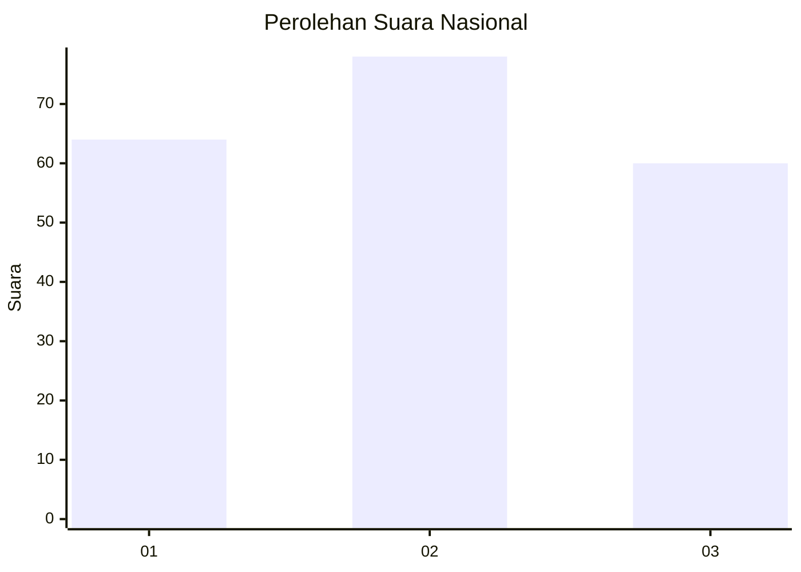
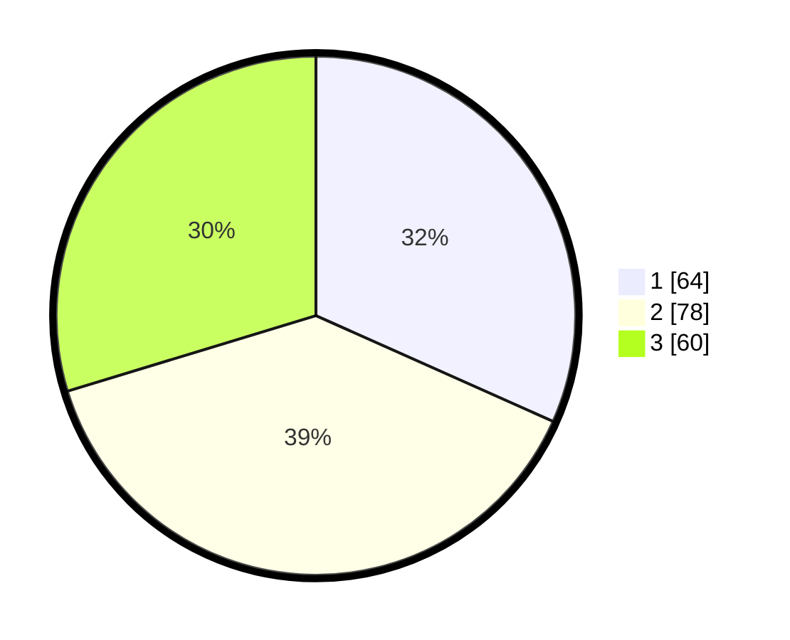

# Hasil

## Grafik

## Tabel

| No.    | Nama Paslon    | Suara | Suara (raw) | Persentase |
|:------ |:-------------- | -----:| -----------:| ----------:|
| 100025 | ANIES MUHAIMIN | 64    | [64][p-1]   | 31,68      |
| 100026 | PRABOWO GIBRAN | 78    | [78][p-2]   | 38,61      |
| 100027 | GANJAR MAHFUD  | 60    | [60][p-3]   | 29,70      |

[p-1]: https://github.com/gigit-pemilu/pemilu-2024/blob/main/pilpres/hitung-suara/sub/31-dki-jakarta/sub/75-jakarta-timur/sub/01-matraman/sub/1002-utan-kayu-utara/sub/076-tps/sub/paslon-1.txt
[p-2]: https://github.com/gigit-pemilu/pemilu-2024/blob/main/pilpres/hitung-suara/sub/31-dki-jakarta/sub/75-jakarta-timur/sub/01-matraman/sub/1002-utan-kayu-utara/sub/076-tps/sub/paslon-2.txt
[p-3]: https://github.com/gigit-pemilu/pemilu-2024/blob/main/pilpres/hitung-suara/sub/31-dki-jakarta/sub/75-jakarta-timur/sub/01-matraman/sub/1002-utan-kayu-utara/sub/076-tps/sub/paslon-3.txt

## Foto C Plano

https://sirekap-obj-formc.kpu.go.id/1871/pemilu/ppwp/31/75/01/10/02/3175011002076-20240215-004623--67573d8d-9d6e-4a80-948b-669777fad08c.jpg

https://sirekap-obj-formc.kpu.go.id/1871/pemilu/ppwp/31/75/01/10/02/3175011002076-20240215-004821--feafb114-8221-4d74-8685-b9e6e1028acd.jpg

https://sirekap-obj-formc.kpu.go.id/1871/pemilu/ppwp/31/75/01/10/02/3175011002076-20240215-005103--7009cb20-9ccd-4453-9ac7-ee0b14af83c8.jpg

## Metadata

| Key        | Value               |
| ---------- | ------------------- |
| Time Stamp | 2024-02-15 15:00:29 |

