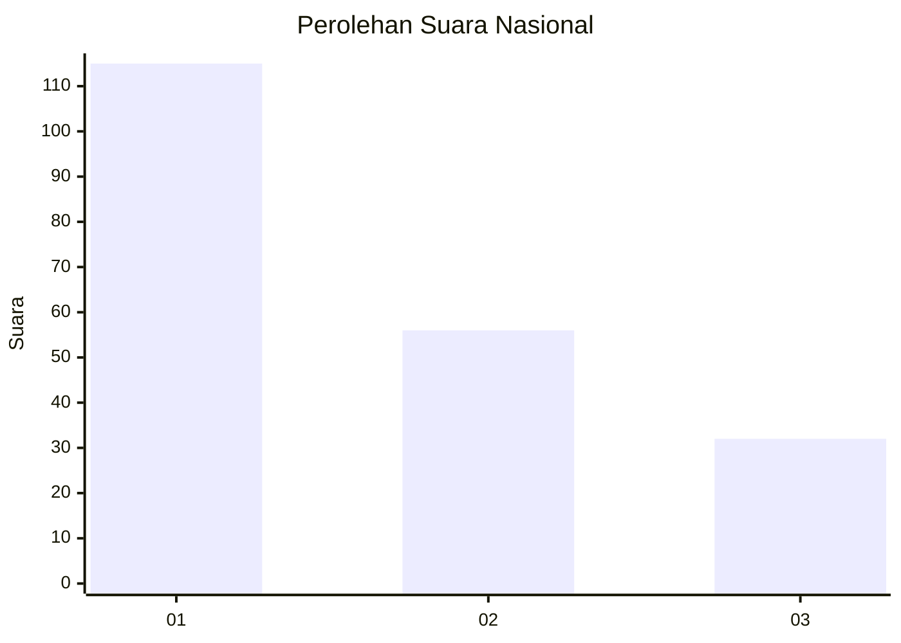
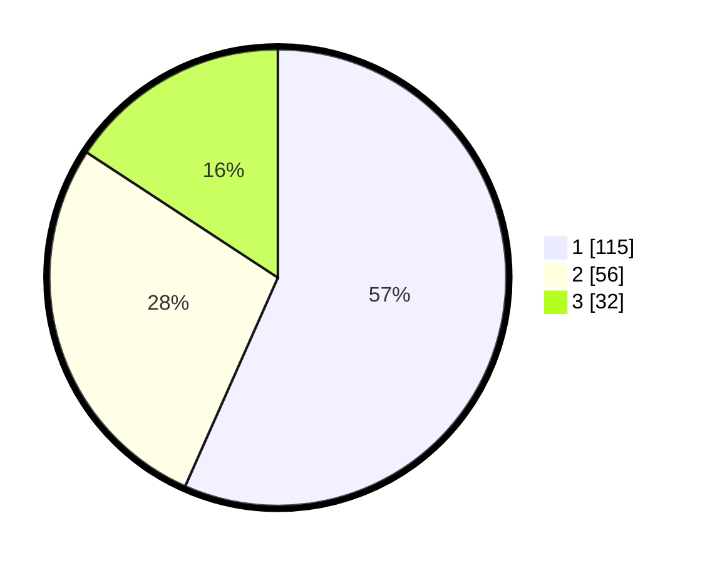

# Hasil

## Grafik

## Tabel

| No.    | Nama Paslon    | Suara | Suara (raw) | Persentase |
|:------ |:-------------- | -----:| -----------:| ----------:|
| 100025 | ANIES MUHAIMIN | 115   | [115][p-1]  | 56,65      |
| 100026 | PRABOWO GIBRAN | 56    | [56][p-2]   | 27,59      |
| 100027 | GANJAR MAHFUD  | 32    | [32][p-3]   | 15,76      |

[p-1]: https://github.com/gigit-pemilu/pemilu-2024/blob/main/pilpres/hitung-suara/sub/31-dki-jakarta/sub/75-jakarta-timur/sub/01-matraman/sub/1002-utan-kayu-utara/sub/083-tps/sub/paslon-1.txt
[p-2]: https://github.com/gigit-pemilu/pemilu-2024/blob/main/pilpres/hitung-suara/sub/31-dki-jakarta/sub/75-jakarta-timur/sub/01-matraman/sub/1002-utan-kayu-utara/sub/083-tps/sub/paslon-2.txt
[p-3]: https://github.com/gigit-pemilu/pemilu-2024/blob/main/pilpres/hitung-suara/sub/31-dki-jakarta/sub/75-jakarta-timur/sub/01-matraman/sub/1002-utan-kayu-utara/sub/083-tps/sub/paslon-3.txt

## Foto C Plano

https://sirekap-obj-formc.kpu.go.id/6df1/pemilu/ppwp/31/75/01/10/02/3175011002083-20240215-000230--bbd2fcb7-8659-4e5d-aaaa-242d57d98bcc.jpg

https://sirekap-obj-formc.kpu.go.id/6df1/pemilu/ppwp/31/75/01/10/02/3175011002083-20240215-000741--d550533e-b64e-4e66-b9a5-b83490417cca.jpg

https://sirekap-obj-formc.kpu.go.id/6df1/pemilu/ppwp/31/75/01/10/02/3175011002083-20240215-000447--0c92dad7-47a3-43c6-a707-af7d8cdebc22.jpg

## Metadata

| Key        | Value               |
| ---------- | ------------------- |
| Time Stamp | 2024-02-15 15:30:25 |

