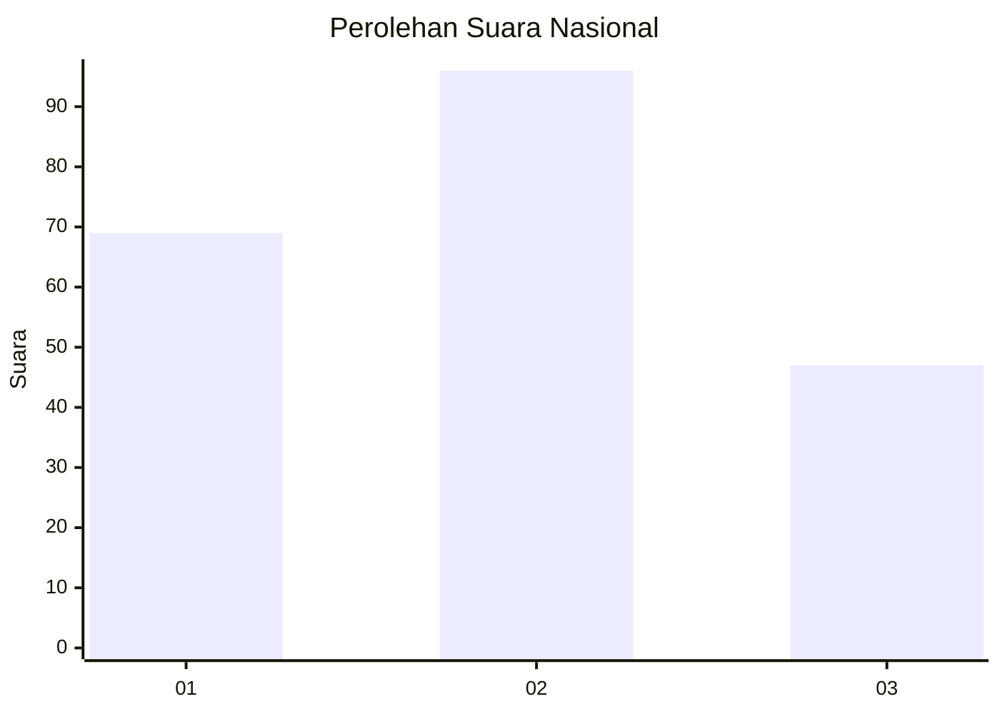
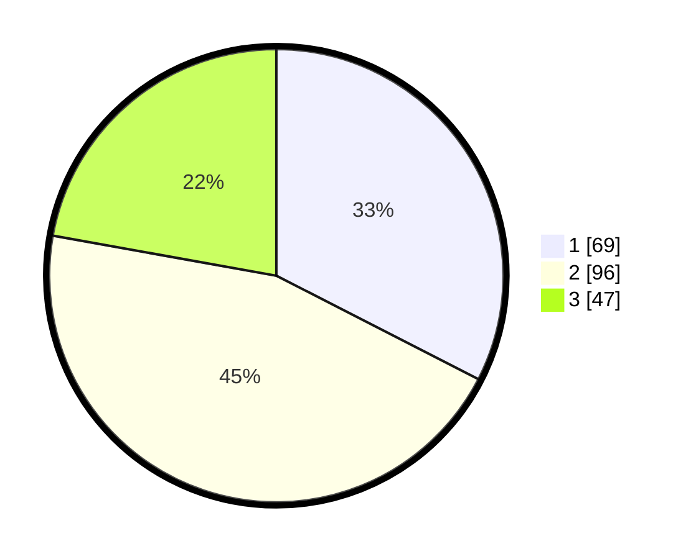

# Hasil

## Grafik

## Tabel

| No.    | Nama Paslon    | Suara | Suara (raw) | Persentase |
|:------ |:-------------- | -----:| -----------:| ----------:|
| 100025 | ANIES MUHAIMIN | 69    | [69][p-1]   | 32,55      |
| 100026 | PRABOWO GIBRAN | 96    | [96][p-2]   | 45,28      |
| 100027 | GANJAR MAHFUD  | 47    | [47][p-3]   | 22,17      |

[p-1]: https://github.com/gigit-pemilu/pemilu-2024/blob/main/pilpres/hitung-suara/sub/31-dki-jakarta/sub/75-jakarta-timur/sub/01-matraman/sub/1003-kayu-manis/sub/009-tps/sub/paslon-1.txt
[p-2]: https://github.com/gigit-pemilu/pemilu-2024/blob/main/pilpres/hitung-suara/sub/31-dki-jakarta/sub/75-jakarta-timur/sub/01-matraman/sub/1003-kayu-manis/sub/009-tps/sub/paslon-2.txt
[p-3]: https://github.com/gigit-pemilu/pemilu-2024/blob/main/pilpres/hitung-suara/sub/31-dki-jakarta/sub/75-jakarta-timur/sub/01-matraman/sub/1003-kayu-manis/sub/009-tps/sub/paslon-3.txt

## Foto C Plano

https://sirekap-obj-formc.kpu.go.id/7d5b/pemilu/ppwp/31/75/01/10/03/3175011003009-20240214-204957--50fe00fd-ac63-4408-9f95-cec04166aaf7.jpg

https://sirekap-obj-formc.kpu.go.id/7d5b/pemilu/ppwp/31/75/01/10/03/3175011003009-20240214-200136--0e6401b3-5c63-4073-b558-40ab7cd43ad3.jpg

https://sirekap-obj-formc.kpu.go.id/7d5b/pemilu/ppwp/31/75/01/10/03/3175011003009-20240214-210251--09c478db-163f-4115-8758-54c2f1f4f76a.jpg

## Metadata

| Key        | Value               |
| ---------- | ------------------- |
| Time Stamp | 2024-02-15 15:30:25 |

